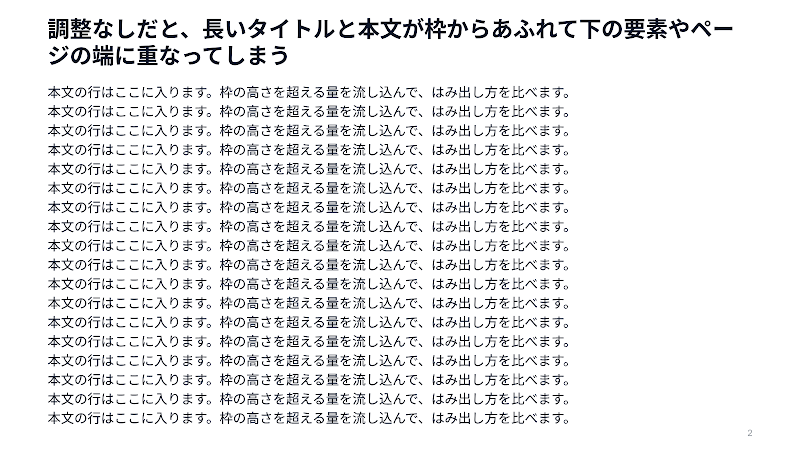
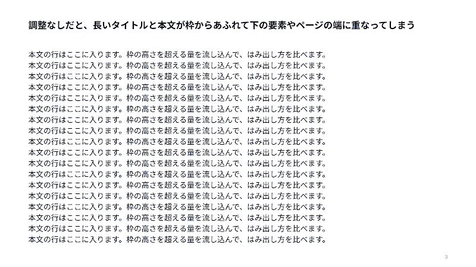
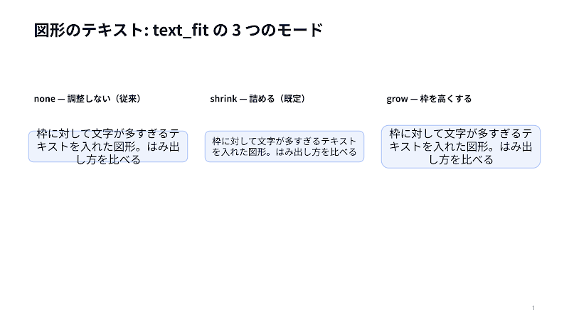

*[日本語](README.ja.md)*

# slide-forge

Claude-first, agent-driven Google Slides deck generation with the same shared
skills available to Codex and Antigravity through thin host adapters: twenty-four
generation/support skills plus one end-to-end workflow on a shared Python
engine. Claude Code's plugin commands and the shared `skills/` are the behavior
source of truth; host files do not duplicate workflow logic. It covers corporate-template decks, from-scratch architecture
diagrams, template creation from a design spec, validation before generation,
optional thumbnail-based visual QA (on by default), PowerPoint (`.pptx`)
export, and line-item spreadsheets (Excel / Google Spreadsheet) for estimates
and BOMs.

```
intake → author (spec JSON or Python) → validate (offline, free) → generate → visual QA (opt-in, default on) → cleanup → PPTX export (opt-in)
                                            ↑____________fix_____________________|
```

## Contents

- **Set up a machine** — [Requirements](#requirements) · [Setup](#setup) · [Install as a Claude Code plugin](#install-as-a-claude-code-plugin) · [Use with Codex](#use-with-codex)
- **Make a deck** — [Quick start: template-driven](#quick-start-template-driven) · [code-first](#quick-start-code-first) · [slide templates](#quick-start-slide-templates) · [End-to-end workflow](#end-to-end-workflow)
- **Choose what to build** — [Skills](#skills) · [Slide pattern catalog](#slide-pattern-catalog) · [Examples](#examples)
- **How it behaves** — [Text fitting](#text-fitting) · [Repository layout](#repository-layout) · [License](#license)

New here? [Setup](#setup) first — or paste the
[guided setup prompt](#guided-setup--copy-this-prompt) into an agent session
and answer its four questions.

Two pages sit outside this file:
[`references/commands.md`](references/commands.md) for the `/forge`, `/account`
and `/visit` commands, and [`references/README.md`](references/README.md), the
index of all 65 reference documents.

## Skills

Twenty-four skills. Each one's full contract — inputs, rules and guardrails —
is in `skills/<name>/SKILL.md`; the rows below say what it is for and what
makes it different.

**Generating decks**

| Skill | What it does |
|---|---|
| `google-slides-template` | Generate a deck from a registered Google Slides master: intake, template analysis and registration (`template.json`), spec authoring with `--dry-run` validation, page-fragment authoring for large decks, generation. **The main workflow.** |
| `google-slides` | Decks without a corporate master — the spec path (`templates/blank-16x9.json`, same engine) or the code-first path (`deckkit.py` plus offline layout validation for connector-heavy diagrams). |
| `nexus-report-slides` | Turn a **nexus-architect** project's reports and UI mocks into an explanation deck, including while the pipeline is unfinished. Structure diagrams via mermaid, UI mocks via headless Chrome. Reads the project, never writes to it. |
| `scalar-product-slides` | Scalar Inc. company / product / feature decks on the `scalar-2026` templates. |
| `scalar-proposal-slides` | Customer-specific Scalar solution proposals driven by the customer's challenges: hearing checklist, challenge → product mapping, and a problem-solving structure with a rewritable worked example. |

**Templates and frameworks**

| Skill | What it does |
|---|---|
| `template-forge` | Create and register a **new template (master)** from a design spec — brand colours, fonts, logo, footer. The Slides API cannot create masters, so a base is copied and restyled; the result lands in `templates/<id>.json`. Ships 3 design presets. |
| `slide-template-creator` | Create and register reusable **single-slide content templates** with semantic input slots, examples, offline validation and catalog previews. These live under `slide-templates/` and are independent of Slides masters. |
| `current-state-analysis` | Run **current-state and problem-identification frameworks** on supplied material: PEST, Five Forces, process pain-points, logic and KPI trees, why-why, fishbone, Pareto, As-Is/To-Be gap analysis, impact-effort matrix. Facts go in the figure, interpretation in the insight, and sources are mandatory. |
| `analysis-template-creator` | Build and maintain the **analysis-framework templates** themselves (`slide-templates/analysis/`) and their drawing primitives — one question per template, fact/interpretation slot split, required sources, misuse guardrails. |
| `calendar-slides` | Turn dated tasks and events into **calendar slides**, and maintain the `slide-templates/calendar/` pack: month grid, day gantt, day agenda, week timetable, sprint calendar, year at a glance, deadline countdown, daily heatmap, shift roster. Japanese national holidays ship with the repo; long periods split across pages. Not for month-level plans (`planning/gantt-schedule`) or milestone timelines. |

**Sales workflows (internal)**

| Skill | What it does |
|---|---|
| `b2b-account-maps` | The two maps a B2B software deal turns on: an **influence map** of the buying committee (influence × for/against) and a **discovery map** colouring each MEDDPICC item confirmed / partly known / still assumed, plus the committee table, approval path, pain chain and gaps. Internal working artifacts, not customer-facing. |
| `scalar-account-plan` | Keep one **sales ledger per customer** — facts labelled said / observed / assumed, the buying committee, MEDDPICC, the pain chain, stage exit criteria with customer-side evidence — and render it as a nine-page activity plan **whose URL never changes**. Unanswered review questions become dated actions. |
| `scalar-account-planning-session` | The annual **Account Planning Session** decks for an account the ledger already covers: a full plan document and a nine-page executive review, from one `aps.json`. Ties each proposal to the customer's own mid-term plan and works out who to meet next. |
| `scalar-ae-materials` | Build **one visit's materials**, routed by deal phase (0–6) × audience × purpose, so the customer-facing one-pager, the internal visit plan, the win plan and the approval packet are never the same file. Includes a pre-generation check that nothing unconfirmed reaches a customer-facing page. |
| `scalar-deal-intake` | Turn raw deal material — minutes, email, Slack, CRM exports — into **per-stage records (0–6), a hearing sheet and a deal log**. Every fact carries a source and a confidence; a gate passes only on customer-side evidence. Markdown only: it generates no slides. |
| `scalar-nurture-intake` | Turn **pre-deal signals** — webinars, inbound enquiries, downloads, event notes — into segment definitions, five-stage nurture tracks and a content ledger. Works on segment *types*: no personal or company names ever enter these files. Markdown only. |
| `hearing-sheet` | The hearing sheet as data: one JSON of record rendered to **Markdown, Excel and Google Spreadsheet**, each readable back through a stable question ID. Reads answers back with conflict detection rather than a silent overwrite, and lists what is still unconfirmed. |
| `hearing-slides` | Slides whose job is to **collect** information rather than deliver it, built from the gaps in a hearing sheet: the agenda, our understanding put up to be corrected, a fill-in sheet, a poll, and where to send answers. A page with no material refuses to build. Customer-facing only. |

**Figures, QA and delivery**

| Skill | What it does |
|---|---|
| `drawio-diagrams` | Dense cloud architecture / data-flow / network diagrams authored as draw.io files, exported to PNG headlessly, QA'd, and inserted into decks. The editable `.drawio` is archived beside the deck. |
| `image-slots` | Fill an **existing** deck's empty picture frames with AI-generated images. Finds frames the same three ways template registration does, and works on any deck URL — including decks slide-forge did not generate. |
| `slide-qa` | Thumbnail-based **visual QA** of a generated deck: inspect every page against a defect checklist, drive the fix-and-regenerate loop, then delete the local QA files. The first pass is delegated in 6–8-slide ranges that return findings as text, so the page images stay out of the main context. |
| `pptx-export` | Export a generated deck to **PowerPoint** as a delivery format, with automatic fallback past Drive's 10MB export limit. From-scratch PPTX authoring stays with `document-skills:pptx`. |
| `spreadsheets` | Line-item **estimates, BOMs and cost breakdowns** as Excel and/or Google Spreadsheet from one JSON spec: typed columns, real formulas, `--dry-run` validation, and in-place updates that keep the URL stable. |
| `settings` | Read and change the two toolkit switches in `config/settings.json` through a multiple-choice dialogue: whether Gemini generates images at all, and whether the deliverable is Drive / Slides or a local `.pptx`. Never touches credentials. |

## End-to-end workflow

The `forge` workflow runs the whole pipeline as one continuous flow: route to
the right generation skill → interactive intake (including visual-QA and
output-format choices) → outline approval → spec + offline validation →
generation → visual QA via `slide-qa` (when chosen) → QA-file cleanup → PPTX
export via `pptx-export` (when chosen) → final report.

- Codex: invoke the `forge` skill by name.
- Claude Code: use `/forge` or `/slide-forge:forge`.
- Antigravity: use the matching shared skill through `.agents/skills/`.

All three hosts follow `references/workflow-contract.md`. They load one selected
generation skill completely, then only the reference sections activated by the
task.

Validate the shared prompt contracts after changing a host adapter, command,
skill, or workflow reference:

```bash
.venv/bin/python scripts/validate_agent_contracts.py
```

To regenerate only selected pages of an existing slide-forge deck, keep the
complete spec as the source of truth and run strict dry-run before the live call:

```bash
.venv/bin/python scripts/build_deck.py --template templates/<id>.json \
  --spec out/<deck>/deck.json --into <deck-url> --update-slides 3,7 \
  --dry-run --strict
```

Snapshot the deck before removing `--dry-run`. Unselected pages, the deck URL,
title, and Drive folder stay unchanged. Replaced pages receive new slide IDs,
so their comments and links to the old IDs are not preserved. Bare `--into`
remains the explicitly approved full-deck replacement mode.

### Account Executive workflow

Two more commands cover the sales side, where the deliverable is not a deck but
the AE's next action:

- `/account <customer name>` — create or update a customer's activity plan. Reads the
  ledger, records what came out of the last meeting, checks the playbook's ten
  review questions, turns the unanswered ones into dated actions, and replaces
  the contents of the same activity-plan deck (the shared link keeps working).
- `/visit <customer name>` — prepare one visit. Routes phase × audience to the right
  material type, keeps customer-facing and internal artifacts in separate
  files and folders, generates and files them, then writes the visit back to
  the ledger and refreshes the activity plan.

Both keep the source of truth in `accounts/<AE name>/<customer name>/account.json`
(git-ignored) and file the output under `<Drive root>/<AE name>/<customer name>/`.
The Drive root is asked once and remembered in `config/sales.json`. The phases,
gate IDs, five material types and ten checkpoints all live in
`references/scalar/sales-playbook.md`.

Scalar product facts and prices — capability, edition, version, release status,
billing model, list price, Pod counting — come from the OKF bundle
([OKF-ScalarDB-ScalarDL](https://github.com/wfukatsu/OKF-ScalarDB-ScalarDL)), not
from memory or a web search. `references/scalar/okf-bundle.md` says where to find
it and how to cite it; the bundle is public, so its list prices are citable as 定価
(tax-excluded) reference-estimate material — never as a confirmed price, and never
for the items it marks 非公開.

## Quick start (template-driven)

```bash
.venv/bin/python scripts/list_templates.py                 # registered templates
.venv/bin/python scripts/build_deck.py \
    --template templates/scalar-2026.json --spec deck.json --dry-run --strict
.venv/bin/python scripts/build_deck.py \
    --template templates/scalar-2026.json --spec deck.json
.venv/bin/python scripts/fetch_thumbnails.py <URL> --out out/qa   # visual QA (slide-qa skill)
.venv/bin/python scripts/cleanup_qa.py                            # delete QA files when done
.venv/bin/python scripts/export_pptx.py <URL> --folder <FOLDER>   # optional PPTX delivery (pptx-export skill)
```

A clean `--dry-run` prints a three-line summary. Add `--verbose` when you need
the per-slide layout list or every auto-fitted text; on failure, problems that
differ only by their slide index are reported once with the slides named.

Register a new master: `scripts/inspect_template.py <URL> --emit templates/<id>.json --name <id>`,
then review the guessed roles by hand (see the google-slides-template skill).

## Quick start (code-first)

A deck is one Python module; a function is one slide. See
`examples/pattern-gallery/deck.py` and `references/diagram-cookbook.md`.

```bash
.venv/bin/python scripts/validate_layout.py mydeck.py --quiet   # offline checks, no API calls
.venv/bin/python scripts/render_deck.py     mydeck.py           # validates, then generates
```

With `--quiet` a clean deck prints nothing at all; drop the flag to see which
text was auto-fitted. Either way the exit code is 1 when problems are found,
and the problems themselves always print.

`validate_layout.py` catches footer intrusion, off-slide geometry, title
wrapping, floating/buried connector endpoints, text hidden behind
later-drawn shapes, and text overflow — before any API call. What it cannot
judge (arrow routing, contrast, whether the figure communicates) is what the
thumbnail QA of the `slide-qa` skill is for: see `references/validation.md`.

## Quick start (slide templates)

`slide-templates/` holds 101 ready-made one-page templates in fourteen packs. A
template takes semantic input slots (not coordinates) and renders one slide
into a deck spec, so it works with any registered master.

```bash
.venv/bin/python scripts/list_slide_templates.py --pack analysis   # what's registered
.venv/bin/python scripts/validate_slide_templates.py --pack analysis   # offline validation
.venv/bin/python scripts/render_slide_template.py \
    --template swot-analysis --data my-swot.json --out out/swot.json \
    --density print                                # print handout / presentation slide
```

`--density` applies to templates that declare `$density` variants (the
`read-alone` and `business-plan` packs); others ignore it. Every template is
catalogued with a rendered image in
[`references/slide-template-catalog.md`](references/slide-template-catalog.md).

**Name a template from a deck spec.** Write `$template` on a slide and that
template expands into one slide. The keys under `data` are the slot names from
the template's **Inputs** table in the catalog, which also gives each slot's
type, whether it is required, and its limits.

```json
{
  "slides": [
    {
      "$template": "swot-analysis",
      "data": {
        "title": "Our strategic position",
        "quadrants": ["Strength: …", "Weakness: …", "Opportunity: …", "Threat: …"],
        "insight": "…",
        "source": "Board meeting, March 2026"
      },
      "notes": "Speaker notes (optional)"
    }
  ]
}
```

Keys other than `$template` / `data` / `density` / `lang` are merged over the
rendered slide, so a spec can attach `notes` or retarget `layout`. Density comes
from the slide, then the spec, then the template's own default. Expansion runs
before validation, generation and `--into` alike, so `--dry-run --strict` checks
the inputs and fails before anything is created.

**`lang` picks the language of the words the slide prints for itself.** Table
headers, axis ends and furniture like `Source:` come from
`slide-templates/i18n/<lang>.json`. What you wrote under `data` is never
translated — your copy is printed as given.

```json
{ "lang": "en", "slides": [{ "$template": "gap-analysis", "data": { … } }] }
```

`lang` can sit on a slide or on the spec (slide, then spec, then the `ja`
default). The drawing primitives read the same resource — `source_note`'s
`Source`, the calendar weekday heads — so a template and the figures around it
cannot end up in different languages on one page. A key with no translation is
printed in the default language, so a gap shows up as a Japanese word rather
than a blank. For a single slide, `render_slide_template.py --lang en`.

## Install as a Claude Code plugin

The repo doubles as a plugin marketplace (`.claude-plugin/marketplace.json`,
one plugin bundling all twenty-four skills):

```
/plugin marketplace add wfukatsu/slide-forge
/plugin install slide-forge@slide-forge
```

Skills become available as `slide-forge:<skill-name>`, and the pipeline
command as `/slide-forge:forge`. After installing,
run the Setup below inside the plugin root (`${CLAUDE_PLUGIN_ROOT}`) — the
venv, OAuth credentials, and cloud icons are machine-local and not bundled.
The [guided setup prompt](#guided-setup--copy-this-prompt) walks through it
interactively.
Alternatively, clone the repo and symlink `skills/*` into `~/.claude/skills/`
(the layout used during development); pick one of the two, not both, or the
skills will be listed twice.

## Use with Codex

Codex uses the same skills and Python engine. In a repository clone, the
`.agents/skills/` entries expose all twenty-four generation/support skills plus the
end-to-end `forge` skill. Start Codex from the repository root and invoke
`forge` by name; the Claude-specific `/slide-forge:forge` command and plugin
marketplace manifest are not required.

Project-wide Codex instructions live in `AGENTS.md`. Host-tool mappings,
sequential fallback for environments where agent delegation is unavailable,
and setup details are documented in
[`references/codex-compatibility.md`](references/codex-compatibility.md).

The `.agents/skills/*` symlinks point back to `skills/*`, so Codex and Claude
Code read the same skill definitions rather than maintaining two copies.

Verify discovery from the repository root by asking Codex to list or use the
`forge`, `google-slides`, and `slide-qa` skills. No Claude plugin installation
is needed for Codex.

## Requirements

- **Python 3.10+** (macOS / Linux)
- A Google account that can create Google Slides / Drive files
- **draw.io desktop** — only for the `drawio-diagrams` skill:
  `brew install --cask drawio` (the export script also finds the app-bundle
  binary at `/Applications/draw.io.app`)
- **mermaid CLI** — only for the `nexus-report-slides` skill, to render a
  report's structure diagrams: `npm i -g @mermaid-js/mermaid-cli` (needs
  Node.js; the export script looks for `mmdc` on `PATH`)
- **Google Chrome** — only for the `nexus-report-slides` skill, to screenshot
  product UI mocks: any of `google-chrome` / `chromium` / `chrome` on `PATH`,
  `/Applications/Google Chrome.app` on macOS, or `$CHROME_BINARY`
- A Gemini API key — only for optional AI image generation

## Setup

All commands run from the slide-forge root: the clone directory for Codex or a
local Claude setup, and `${CLAUDE_PLUGIN_ROOT}` for a Claude plugin install.

**Some things are generated on your machine rather than committed** — the
vendor cloud icons and the slide masters. They are large (a master is 6–8MB),
machine-specific, or not ours to redistribute, so the repository ships the
means to produce them instead of the files. A clone is not fully usable until
you have run the steps below that you need.

| Generated here | Why not committed | Step |
|---|---|---|
| `assets/cloud-icons/` | AWS / Google Cloud / Azure do not permit redistribution | [4](#4-cloud-vendor-icons-only-for-cloud-architecture-figures) |
| `templates/masters/*.pptx` | 6–8MB each; the master has to live in *your* Drive to be copied | [5](#5-slide-masters-for-the-copy-mode-templates) |

### Guided setup — copy this prompt

Steps 1–8 below are the reference. If you would rather be walked through them,
start an agent session (Claude Code, Codex, …) with the slide-forge root as the
working directory and paste this prompt. It asks what you actually intend to
use, runs only the steps that follow from your answers, and hands the browser
work back to you.

```text
Set up slide-forge on this machine for the first time.

Work from the slide-forge root — the clone directory, or ${CLAUDE_PLUGIN_ROOT}
for a Claude plugin install — and read the "Setup" section of README.md there.
Steps 1-8 are the source of truth: follow them, don't improvise. If you cannot
find README.md, ask me for the path before doing anything else.

First, ask me with AskUserQuestion — one call, all four questions, your
recommended option first; if your host has no such tool, ask the same four as
a numbered list and wait for my answers:
1. What I plan to use, so you know which optional steps apply — multi-select,
   with a "just the basics" option: decks from a corporate template (needs a
   slide master — an existing one, or one you build for me),
   cloud architecture diagrams (vendor icons + draw.io),
   nexus-architect explanation decks (mermaid CLI + Chrome), AI-generated
   images (Gemini API key).
2. Where the deliverable should go — Google Drive / Slides, or a local .pptx.
3. Whether Gemini image generation is allowed at all.
4. Whether CLI messages should be English or Japanese (GSLIDES_LANG).

Then work in this order, skipping whatever my answers made unnecessary:
- Step 1, Python environment: create .venv and install requirements.txt. If
  .venv already exists, verify it rather than recreating it.
- Step 2, OAuth client: mine to do in the browser. Do NOT try to automate the
  Google Cloud Console. Check whether config/credentials.json is already
  there; if not, print the numbered console steps from the README, wait until
  I have saved the file, then continue.
- Step 3, verify: run scripts/list_templates.py and let me complete the
  consent screen. A printed template list means auth works.
- Step 8, settings: apply my answers via scripts/settings.py, then --show the
  result. Tell me how to set GSLIDES_LANG if I chose Japanese.
- Step 5, slide master — only if I said I want decks from a corporate
  template. Start with scripts/check_template_access.py: it reports which
  registered masters this account can actually copy. Templates it marks OK
  need nothing further. For the rest, do not assume I have access to a master
  someone else owns — ask which of these three fits, offering (a) first:
  a. I have no master to point at — build one from my own brand with the
     template-forge skill (scripts/build_template.py). This route needs
     nobody else's permission, and it ends with the template registered.
  b. I can open a master in Drive — I give you the URL, you register it with
     scripts/inspect_template.py --emit templates/<id>.json --name <id>.
  c. Someone handed me a .pptx — I save it to templates/masters/<id>.pptx,
     you run scripts/import_template_master.py --id <id>.
  Re-run check_template_access.py afterwards to show what changed. Leaving a
  master unreachable is an acceptable outcome: say which templates stay
  blocked, and that blank-16x9 works without one.
- Steps 4 and 7, only for what I selected: cloud icons, a Gemini key. The
  pattern-catalog images (step 6) are committed — that step is for
  regenerating them, not for setup, so skip it.

Rules:
- Check before you install. Report what is already in place and leave it be.
- Never print, echo, or cat anything under config/ — credentials, tokens, API
  keys. Report only whether a file exists.
- Anything that needs my browser or my account — Google Cloud Console, the
  consent screen, the Gemini key, uploading a master to Drive — stops and asks
  me. Never create accounts or enter credentials on my behalf.
- A failing step doesn't end the run: finish the independent ones, then say
  what is left.

Finish with a short table — each step done / skipped (why) / waiting on me —
plus one command I can run to prove it works, and which skills are usable now
versus still blocked.
```

### 1. Python environment

The repo expects `.venv` at its root. A local environment is the simplest
cross-host setup:

```bash
python3 -m venv .venv
.venv/bin/pip install -r requirements.txt
```

For Claude plugin installations that can be replaced during upgrades, keeping
the real environment outside the plugin root is useful. Create a shared venv
and point `.venv` at it with an absolute symlink. The historical
`~/.claude/venvs/gslides` location remains supported but is not required by
Codex or by the engine.

### 2. Google Cloud OAuth client (one-time)

The engine calls the Slides + Drive APIs as **you**, via an OAuth desktop
client (scopes: `auth/presentations`, `auth/drive`). In
[Google Cloud Console](https://console.cloud.google.com/):

1. Create (or pick) a project.
2. **APIs & Services → Library** — enable **Google Slides API** and
   **Google Drive API**.
3. **APIs & Services → OAuth consent screen** — configure the app
   (Internal for a Workspace org; External works too — add yourself as a
   test user while the app is in Testing).
4. **APIs & Services → Credentials → Create credentials → OAuth client ID →
   Desktop app** — download the JSON and save it as `config/credentials.json`
   (`chmod 600`). Override the directory with `$GSLIDES_CONFIG_DIR` if you
   keep credentials elsewhere.

### 3. First run / verify

```bash
.venv/bin/python scripts/list_templates.py
```

CLI messages are English by default; set `GSLIDES_LANG=ja` for Japanese
(`export GSLIDES_LANG=ja`, or per command). This affects only the scripts'
terminal output — never the generated deck or spreadsheet content.

The first call opens a browser consent screen and writes `config/token.json`
(refreshed automatically afterwards). If a template list prints, auth works.

### 4. Cloud vendor icons (only for cloud architecture figures)

AWS / Google Cloud / Azure icon sets are vendor assets and are **not
committed**; fetch them once:

```bash
.venv/bin/python scripts/fetch_cloud_icons.py
```

### 5. Slide masters (for the `copy`-mode templates)

`scalar-2026`, `scalar-2026-boilerplate`, `corporate` and `aixdevops` are
`generationMode: copy` templates: generating duplicates a real Google Slides
presentation. `templates/<id>.json` only *points* at one, so on a fresh clone
those templates cannot work until the master exists in your own Drive.

The masters themselves are **not committed** — 6–8MB each, and a master is only
useful once it lives in your own Drive. **Access to someone else's master is not
a prerequisite**: route (a) below builds one for you, and it is the whole of
this step if you have nothing to start from.

Ask first which of the registered templates this account can actually copy
(needs step 2's credentials; `--json` for the machine-readable form, exit code 1
when something is unusable):

```bash
.venv/bin/python scripts/check_template_access.py
```

Anything it marks `OK` already generates. For each one it does not — the master
belongs to an organization you are not in, was never shared with you, or was
deleted — pick a route:

**a. No master to point at? Build your own.** The `template-forge` skill creates
a new master from a design spec — brand colours, fonts, logo, footer — and
registers it, ready for `google-slides-template`. Nothing and nobody else is
needed; this is the path if you are not working with an existing corporate deck,
or if the corporate one is out of reach.

```bash
.venv/bin/python scripts/build_template.py --help
```

**b. Can you open a master in Drive?** Register it — analyse it once and review
the guessed roles by hand:

```bash
.venv/bin/python scripts/inspect_template.py <URL> --emit templates/<id>.json --name <id>
```

**c. Were you handed a `.pptx` of a master?** Save it as
`templates/masters/<id>.pptx`, then upload and re-register it in one step:

```bash
.venv/bin/python scripts/import_template_master.py --all
# or one at a time
.venv/bin/python scripts/import_template_master.py --id scalar-2026
```

Importing a `.pptx` makes Slides mint new object IDs for every layout, master
and decoration, so the script re-runs `inspect_template.py` over the imported
presentation and writes the result over `templates/<id>.json`. The
human-verified **role assignment is preserved** — only the identifiers move.
Expect `templates/*.json` to show as locally modified afterwards; that is your
machine's copy of the registration and is not meant to be committed back.

If you have edit access to a master already, write it out for a teammate with
`scripts/export_template_master.py --all`. Drive refuses to export a
Docs-editors file over 10MB (`exportSizeLimitExceeded`), so larger masters have
to be downloaded by hand from the Slides UI (File > Download > Microsoft
PowerPoint). Do **not** delete slides to get under the limit: Slides drops any
layout that no slide uses — `aixdevops` loses three registered layouts that way
— and the bundled slides listed in `existingSlideIds` are part of what those
templates offer. See [`templates/masters/README.md`](templates/masters/README.md).

Whichever route you took, re-run `scripts/check_template_access.py` to confirm
the registration now points at something you can copy.

`blank-16x9` is `generationMode: create` and needs no master, so the
`google-slides` spec path and every `--dry-run` validation work on a bare clone.
Leaving the out-of-reach templates unusable is a legitimate end state — nothing
else in the repository depends on them.

### 6. Slide pattern catalog images

[`references/slide-pattern-catalog.md`](references/slide-pattern-catalog.md)
shows all 52 page patterns as rendered images. Both the text and the images
(~2MB, under `references/images/slide-patterns/`) are committed, so a bare
clone reads with pictures. When a pattern is added or its rendering changes,
regenerate the catalog and commit the images with it:

```bash
.venv/bin/python scripts/build_deck.py \
    --template templates/scalar-2026.json --spec examples/slide-pattern-index.json
.venv/bin/python scripts/fetch_thumbnails.py <URL printed above> --out out/patterns --size MEDIUM
.venv/bin/python scripts/build_pattern_catalog.py --thumbs out/patterns
```

Regeneration needs a working `scalar-2026` master (step 5) and, for the three
cloud-architecture patterns, the vendor icons (step 4).

Both catalog generators are bilingual: one run writes the English document at
the original path and the Japanese one at its `.ja.md` sibling. Japanese text
comes from the source data (the pattern spec / each `template.json`); English
text comes from the sidecars under `references/i18n/`. A new pattern or
template with no sidecar entry falls back to Japanese with a warning, so add
its English strings there when you add one.

The slide-template catalog
([`references/slide-template-catalog.md`](references/slide-template-catalog.md),
images under `references/images/slide-templates/`, also committed) works the
same way: build each pack's catalog spec with
`scripts/build_slide_template_catalog.py`, generate the deck, fetch
thumbnails, and run `scripts/build_template_catalog_doc.py` — the regeneration
commands are at the top of that document.

### 7. Optional: AI image generation

For `scripts/images.py`, set `GEMINI_API_KEY` or save the key to
`config/gemini_api_key` (gitignored, like the OAuth files). The key must
belong to a **billed** project — the image model has zero free-tier quota.

### 8. Settings — image generation and where the deliverable goes

Two switches, set once in `config/settings.json` (gitignored; copy
`config/settings.example.json` to start) and applied to every run. Ask the
`settings` skill (`/slide-forge:settings`) to change them through a
multiple-choice dialogue, or run the commands directly:

```bash
.venv/bin/python scripts/settings.py --show                  # current values

.venv/bin/python scripts/settings.py --image-generation off  # no Gemini images at all
.venv/bin/python scripts/settings.py --output local          # deliverable = local .pptx
.venv/bin/python scripts/settings.py --output google         # deliverable = Drive / Slides (default)
```

| Key | Values | Effect |
|---|---|---|
| `imageGeneration` | `true` / `false` | `false` refuses `aiImage` figures, `images.py`, and `fill_image_slots.py` — offline, before anything is spent |
| `output` | `"google"` / `"local"` | `local` exports the generated deck to `.pptx` under `localOutputDir` (default `out/pptx`) after generation |

The defaults match the behaviour from before this file existed, so an absent
`settings.json` changes nothing. `GSLIDES_IMAGE_GENERATION` / `GSLIDES_OUTPUT` /
`GSLIDES_LOCAL_DIR` override it for one run, and `build_deck.py --output` for one
command. `output: local` still builds through the Slides API — it changes the
deliverable, not the build — and the generated deck is left in Drive as the
editable source. Details: `references/settings.md`.

### What each skill needs

| Skill | venv + OAuth | Slide master | Cloud icons | External CLI | Gemini key |
|---|---|---|---|---|---|
| `google-slides-template` | ✔ | ✔ for the copy-mode templates | when drawing cloud diagrams | — | optional |
| `google-slides` | ✔ | — (blank-16x9 needs none) | when drawing cloud diagrams | — | optional |
| `scalar-product-slides` | ✔ | ✔ scalar-2026 | when drawing cloud diagrams | — | — |
| `scalar-proposal-slides` | ✔ | ✔ scalar-2026 | — | draw.io, to edit the bundled environment diagram | — |
| `drawio-diagrams` | ✔ (for deck insertion) | — | — | draw.io | — |
| `slide-qa` | ✔ | — | — | — | — |
| `pptx-export` | ✔ | — | — | — | — |
| `spreadsheets` | ✔ (OAuth only for Google Spreadsheet output) | — | — | — | — |
| `settings` | — (reads/writes a local JSON file) | — | — | — | — |
| `nexus-report-slides` | ✔ | — (blank-16x9 needs none) | — | mermaid (`mmdc`) for structure diagrams, Chrome for UI mocks | — |
| `template-forge` | ✔ | base master, if copying one | — | — | — |
| `slide-template-creator` | ✔ (to render catalog previews) | — | — | — | — |
| `current-state-analysis` | ✔ | ✔ for the copy-mode templates | — | — | — |
| `analysis-template-creator` | ✔ (to render catalog previews) | — | — | — | — |
| `calendar-slides` | ✔ (to generate decks and render catalog previews) | — | — | — | — |
| `b2b-account-maps` | ✔ | ✔ for the copy-mode templates | — | to edit the exported maps | — |
| `scalar-account-plan` | ✔ | ✔ scalar-2026 | — | — | — |
| `scalar-account-planning-session` | ✔ | ✔ scalar-2026 | — | — | — |
| `scalar-ae-materials` | ✔ | ✔ scalar-2026 | — | — | — |
| `scalar-deal-intake` | — (only to read Drive / Gmail sources) | — | — | — | — |
| `scalar-nurture-intake` | — (only to read Drive / Gmail sources) | — | — | — | — |
| `hearing-sheet` | ✔ (OAuth only for Google Spreadsheet output) | — | — | — | — |
| `hearing-slides` | ✔ | ✔ for the copy-mode templates | — | — | — |
| `image-slots` | ✔ | — (works on any deck URL) | — | — | ✔ |

"✔ for the copy-mode templates" in the *Slide master* column is satisfied by
any master you can copy, including one `template-forge` builds for your own
brand — see [step 5a](#5-slide-masters-for-the-copy-mode-templates), and run
`scripts/check_template_access.py` to see where you stand. The rows naming
`scalar-2026` are the exception: those skills carry Scalar-specific content and
assume that master.

Secrets hygiene: `config/` (credentials, tokens, API keys), `out/`, `cache/`,
and `assets/cloud-icons/` are gitignored — nothing machine-local is ever
committed. Keep Drive sharing on your master decks restricted; their file IDs appear in
`templates/*.json`. Masters are not committed either: `templates/masters/` is gitignored, so a
master .pptx you drop there stays local. Review what a master contains before
sharing one — `scalar-2026-boilerplate` carries company and customer-facing
slides.

## Repository layout

```
.agents/      Codex skill discovery links and the Codex-native forge skill
AGENTS.md     Codex project rules and host-tool compatibility mappings
skills/       shared SKILL.md definitions used by Codex and Claude Code
commands/     Claude Code slash commands (/forge, /account, /visit)
accounts/     per-customer sales ledgers (git-ignored; never committed)
scripts/      shared engine — one importable package
  _auth.py        OAuth helper (Slides + Drive)
  settings.py     image-generation and output switches (config/settings.json)
  build_deck.py   template-driven generator (TemplateDeck); --dry-run validation
  diagrams.py     Canvas drawing hub (aggregates the mixins below)
  charts.py illustrations.py patterns.py pages.py events.py calendars.py   figure libraries
  icons.py cloud_icons.py images.py                 pictograms, vendor icons, AI images
  inspect_template.py assemble_spec.py layout_sample.py list_templates.py
  build_template.py               design spec -> new master (template-forge)
  slide_templates.py render_slide_template.py list_slide_templates.py validate_slide_templates.py
                                  slide-templates/ pack engine, renderer, registry, offline validation
  build_slide_template_catalog.py build_pattern_catalog.py build_template_catalog_doc.py
                                  catalog specs and the generated catalog docs
  fill_image_slots.py             fill an existing deck's empty picture frames (image-slots)
  nexus/collect.py nexus/build_nexus_deck.py   nexus-architect coverage + deck spine
  html_shot.py mermaid_export.py  HTML / mermaid -> PNG for slide insertion
  validate_agent_contracts.py     shared prompt-contract eval for hosts/commands/skills
  account_graph.py build_account_graph.py   influence / discovery graphs -> .drawio
  scalar/account_ledger.py       per-customer sales ledger: validate, gaps, slot data
  scalar/account_workspace.py    Drive tree <root>/<AE>/<customer>/… (idempotent)
  scalar/build_account_plan.py   ledger -> activity-plan deck (same URL on update)
  scalar/build_account_planning.py   aps.json -> Account Planning Session decks
  scalar/export_ledger_md.py     ledger -> Markdown for the CRM
  hearing/hearing_sheet.py hearing/model.py   hearing sheet of record <-> Markdown / xlsx / Google Spreadsheet
  hearing/hearing_slots.py hearing/qr.py      gaps -> collection-slide slots, answer-destination QR
  export_template_master.py import_template_master.py   bundled masters <-> Drive
  fetch_thumbnails.py cleanup_qa.py fetch_cloud_icons.py export_pptx.py
  build_sheet.py  line-item spreadsheets (xlsx + Google Spreadsheet)
  deckkit.py render_deck.py validate_layout.py      code-first path (offline checks)
  drawio_export.py drive_folder.py snapshot_version.py   draw.io export, Drive folders, version snapshots
  scalar/         Scalar deck builders
templates/    registered masters (scalar-2026*, aixdevops, corporate) + blank-16x9 + themes/ + presets/ (template-forge design presets)
  masters/        drop a master .pptx here and import it (gitignored; see its README)
  sales/ nurture/ marketing/   Markdown forms: stage records and hearing sheet, nurture tracks and segments, content brief and event plan (each has its own README; these are forms, not slide templates)
slide-templates/ reusable single-slide content templates + registry (101 in 14 packs; manifest.json)
assets/       scalar/ (brand: pictograms, logos, product-logos), holidays/ (Japanese national holidays CSV), cloud-icons/ (gitignored)
references/   engine, workflow, and host compatibility documentation
  images/slide-patterns/  pattern catalog images (committed; regenerate via Setup 6)
  i18n/           English sidecar strings for the two generated catalogs
examples/     runnable spec catalogs and code-first example decks
config/       credentials.json + token.json (gitignored, 0600) + settings.json (switches)
cache/ out/   transient render cache and QA output (gitignored)
```

## Text fitting

The Slides API cannot switch on Slides' own "shrink text on overflow"
(`autofitType` accepts only `NONE`), and text that overflows is drawn outside
its box — over the element below it or off the page. slide-forge therefore
fits text **before** sending the requests: it tightens the inner margin on the
side the text is not aligned to, then shrinks the font in 0.5pt steps down to
70% of its size (never below 8pt). Text that already fits is drawn exactly as
written.

| Without fitting (`"textFit": "none"`) | With fitting (the default) |
|---|---|
|  |  |



- Title, subtitle and body slots and every figure shape are fitted. Table
  cells are not; their rows grow on their own.
- `textFit` (`shrink` / `grow` / `none`) and `minFontSize` go on a slide or in
  `defaults`. A `"density": "print"` deck may shrink text down to 8pt, since
  8–10pt reads fine on paper.
- `--dry-run` and generation print every adjustment as `fit:`. Text that
  still overflows at the floor is a finding, so `--strict` fails on it.

Details: [`references/api-notes.md`](references/api-notes.md) §14b and
[`references/validation.md`](references/validation.md).

## Slide pattern catalog

Which page shapes can this build? See
[`references/slide-pattern-catalog.md`](references/slide-pattern-catalog.md) —
52 patterns in 9 groups, each with a rendered image, when to use it, and the
`figures` type names to write in the spec. The layout rules behind them are in
[`references/slide-patterns.md`](references/slide-patterns.md).

| Group | Patterns | Picks |
|---|---|---|
| Skeletons (6 types) | 6 | How the page itself is laid out |
| Scaffolding pages | 4 | Deck scaffolding — summary, agenda, storyline, ghost |
| Quantitative pages | 7 | Arguing with numbers |
| Comparison/evaluation pages | 6 | Putting options side by side |
| Structure/logic pages | 7 | Making a relationship visible |
| Planning/org pages | 5 | Time and people |
| Calendar pages | 9 | Dates — a month, days, a week, sprints, a year, a deadline, daily volume, a roster |
| Qualitative/technical pages | 5 | Everything that isn't a number |
| Closing/appendix pages | 3 | The decision and what follows |

Beyond these page patterns, `slide-templates/` registers 101 ready-made
one-page templates in fourteen packs (marketing-analysis, b2b-sales, scalar-ae,
planning, calendar, analysis, read-alone, business-plan, nexus, hearing, case-studies,
proposal, marketing, partner). Each is catalogued with a rendered image, the
question it answers, and its guardrails in
[`references/slide-template-catalog.md`](references/slide-template-catalog.md).
The read-alone and business-plan packs' templates carry `$density` variants: the same template
renders as a dense handout (`print`) or a sparse stage slide (`presentation`),
chosen by the intake's Purpose question or `render_slide_template.py --density`.

## Examples

Every spec under `examples/` is authored against **`templates/scalar-2026.json`**
and validates cleanly against it. They are not portable to
`templates/blank-16x9.json` — that template has no TITLE placeholder and
declares no `CLOSING` role, so the same spec reports dozens of findings.
`corporate` and `aixdevops` accept some of them; `scalar-2026` accepts all.

```bash
.venv/bin/python scripts/build_deck.py \
    --template templates/scalar-2026.json --spec examples/<name>.json --dry-run --strict
```

| Example | Slides | Shows |
|---|---|---|
| `charts-demo.json` | 5 | Tables and graphs — the `charts.py` catalog |
| `patterns-demo.json` | 7 | Layout patterns from `patterns.py` |
| `illustration-gallery.json` | 13 | Concept figures from `illustrations.py` |
| `icon-gallery.json` | 10 | The pictogram library (`icons.py`) |
| `code-blocks-demo.json` | 2 | Syntax-highlighted code blocks |
| `event-announcement.json` | 4 | Seminar / conference announcement parts |
| `read-alone-guide.json` | 30 | Density patterns for print / read-alone decks |
| `design-catalog.json` | 49 | The full design-pattern catalog †|
| `slide-pattern-index.json` | 71 | One page per pattern — 52 are patterns, the rest are cover, section and divider pages †|
| `cloud-architecture.json` | 6 | Cloud architecture figures †|
| `b2b-account-review.json` | 13 | A worked account review built from all eight `b2b-sales` templates — cover, exec summary, both maps in their two-axis/MEDDPICC and structural forms, and their supporting pages |
| `estimate-sample.json` | 2 sheets | Line-item estimate for the `spreadsheets` skill ‡|

† Draws `cloud_icon*` / `cloud_zone` figures, so it needs the vendor icons
first — they are excluded from the repository because AWS, Google Cloud and
Azure do not permit redistribution. Without them `--dry-run` reports
`Cloud icons have not been fetched yet`; run
`.venv/bin/python scripts/fetch_cloud_icons.py` once (see
[`assets/cloud-icons/README.md`](assets/cloud-icons/README.md)). Every other
example above validates on a bare clone.

‡ A spreadsheet, not a deck — run it through `build_sheet.py` instead:
`.venv/bin/python scripts/build_sheet.py --dry-run examples/estimate-sample.json`

Code-first decks are Python modules rather than specs, and generate against
`scalar-2026` directly:

| Example | Shows |
|---|---|
| `examples/scalardb-architecture.py` | ScalarDB architecture — cloud icons, pictograms, brand logos and connectors on one slide † |
| `examples/scalardl-architecture.py` | ScalarDL architecture, same mix † |
| `examples/pattern-gallery/deck.py` | The `deckkit.py` code-first path |
| [`examples/scalardb-scalardl/`](examples/scalardb-scalardl/README.md) | A 55-slide product walkthrough, one feature per page — the largest worked example |

## License

MIT. Cloud vendor icons remain the property of their vendors and are fetched
locally under their respective terms (see `references/cloud-icons.md`).
