# スライドパターン カタログ（実物 43 種）

`examples/slide-pattern-index.json` を実際に生成して 1 枚ずつ書き出した画像カタログ。
**どのページが作れるかを見て選ぶ**ためのもので、組み方の規則そのものは
[slide-patterns.md](slide-patterns.md)、図表部品の詳細は
[patterns.md](patterns.md) / [charts.md](charts.md) / [diagrams.md](diagrams.md) にある。

各パターンの **figures** 行が、デッキ仕様（JSON）の `figures` にそのまま書く `type` 名。

> **画像はリポジトリに含めていません**（43 枚で約 2MB）。下のコマンドで手元に
> 生成します。生成するまで、このページの画像はリンク切れとして表示されます。
> 文章だけでも、どのパターンが何のためにあるか・どの `type` を書くかは読めます。

```bash
# このカタログを作る（パターンを足したときも同じ手順）
.venv/bin/python scripts/build_deck.py \
    --template templates/scalar-2026.json --spec examples/slide-pattern-index.json
.venv/bin/python scripts/fetch_thumbnails.py <生成された URL> --out out/patterns --size MEDIUM
.venv/bin/python scripts/build_pattern_catalog.py --thumbs out/patterns
```

| 分類 | 数 | 何を選ぶための章か |
|---|---|---|
| [1. 骨格 6 種](#1-骨格6種) | 6 | ページの組み方 |
| [2. 構成ページ](#2-構成ページ) | 4 | デッキの骨組み |
| [3. 定量ページ（推移・構成・増減）](#3-定量ページ推移構成増減) | 7 | 数字で主張する |
| [4. 比較・評価ページ](#4-比較評価ページ) | 6 | 案を並べて選ばせる |
| [5. 構造・論理ページ](#5-構造論理ページ) | 7 | 関係を図にする |
| [6. 計画・体制ページ](#6-計画体制ページ) | 5 | 時間と人を示す |
| [7. 定性・技術ページ](#7-定性技術ページ) | 5 | 数値以外で語る |
| [8. 締め・付録ページ](#8-締め付録ページ) | 3 | 意思決定とその後 |

> 「システム構成」だけはクラウドベンダーの公式アイコンを描くため、
> 事前に `.venv/bin/python scripts/fetch_cloud_icons.py` が必要。
> アイコンは再配布が許されないためリポジトリには含めていない
> （[assets/cloud-icons/README.md](../assets/cloud-icons/README.md)）。

## 1. 骨格 6 種

ページの**組み方**そのもの。どの図を使うかより先に、この 6 種のどれで組むかを決める。
標準は骨格B（左図＋右示唆）。座標は [slide-patterns.md](slide-patterns.md) の「骨格の標準座標」にそのまま使える値がある。

### 骨格A｜全幅 1 図

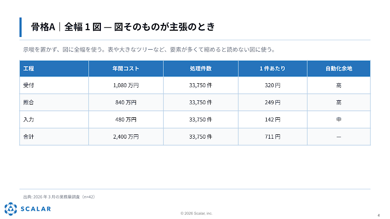

示唆を置かず、図に全幅を使う。表や大きなツリーなど、要素が多くて縮めると読めない図に使う。

**figures**: `governing_message` / `lead_in` / `table` / `source_note`

### 骨格B｜左図＋右示唆

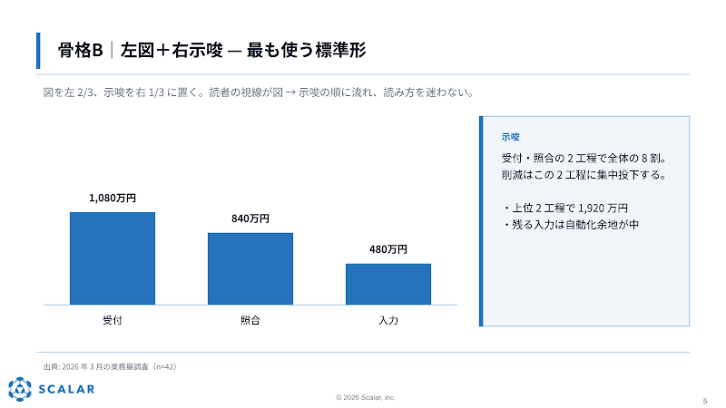

図を左 2/3、示唆を右 1/3 に置く。読者の視線が図 → 示唆の順に流れ、読み方を迷わない。

**figures**: `governing_message` / `lead_in` / `vbars` / `so_what` / `source_note`

### 骨格C｜左右 2 図

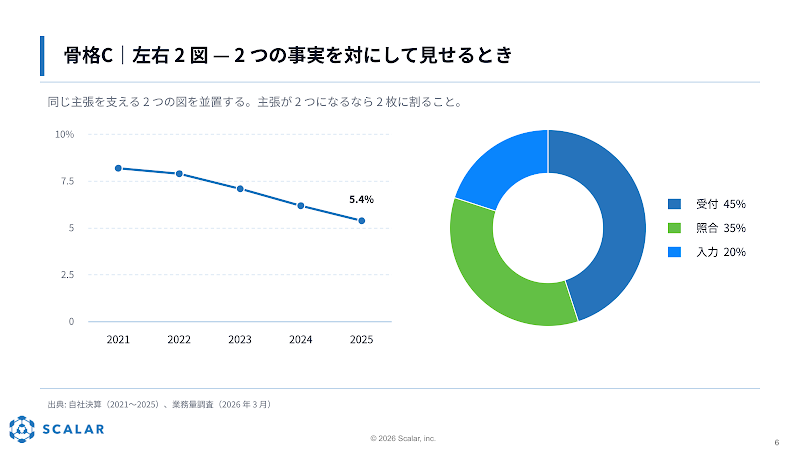

同じ主張を支える 2 つの図を並置する。主張が 2 つになるなら 2 枚に割ること。

**figures**: `governing_message` / `lead_in` / `linechart` / `pie` / `source_note`

### 骨格D｜上下 2 段

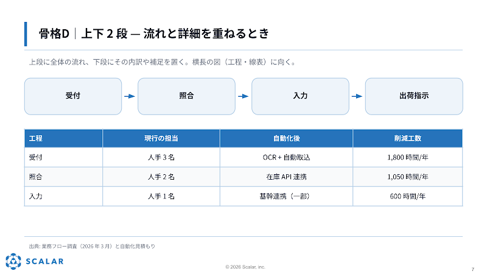

上段に全体の流れ、下段にその内訳や補足を置く。横長の図（工程・線表）に向く。

**figures**: `governing_message` / `lead_in` / `flow` / `table` / `source_note`

### 骨格E｜全幅の図＋下示唆帯

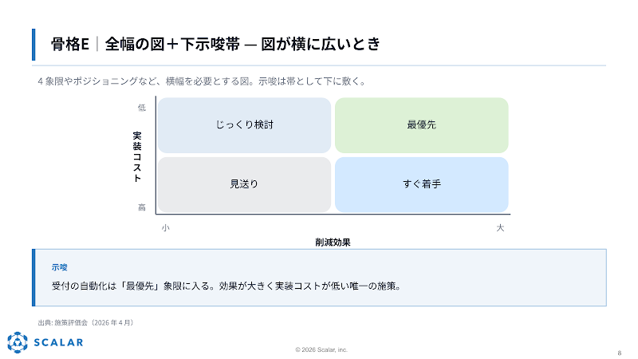

4 象限やポジショニングなど、横幅を必要とする図。示唆は帯として下に敷く。

**figures**: `governing_message` / `lead_in` / `matrix` / `so_what` / `source_note`

### 骨格F｜文字のみ

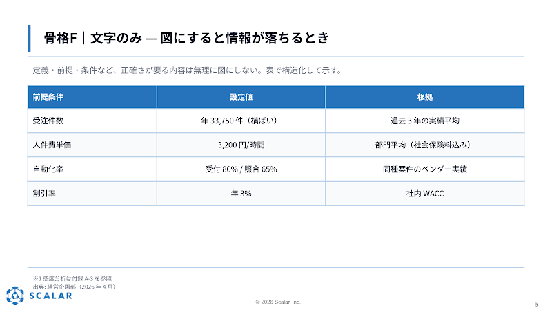

定義・前提・条件など、正確さが要る内容は無理に図にしない。表で構造化して示す。

**figures**: `governing_message` / `lead_in` / `table` / `source_note`

## 2. 構成ページ

デッキ全体の骨組みを作るページ。`storyline` と `ghost` は成果物であると同時に、清書前に論旨を検証する設計の道具でもある。

### エグゼクティブサマリー

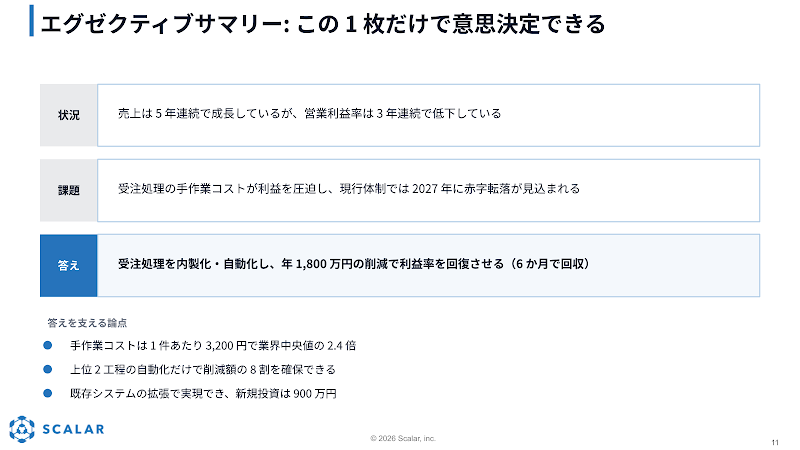

冒頭専用。SCR（状況 → 課題 → 答え）で、この 1 枚だけ読めば意思決定できる状態にする。論点は 5 個まで。

見出しの例: 「この 1 枚だけで意思決定できる」

**figures**: `exec_summary`

### アジェンダ

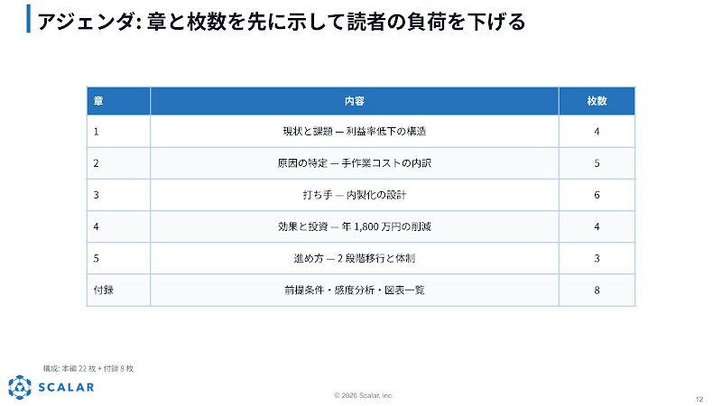

章と枚数を先に示し、読者が全体量を把握できるようにする。行数が多いなら分野で割る。

見出しの例: 「章と枚数を先に示して読者の負荷を下げる」

**figures**: `table` / `source_note`

### ストーリーライン

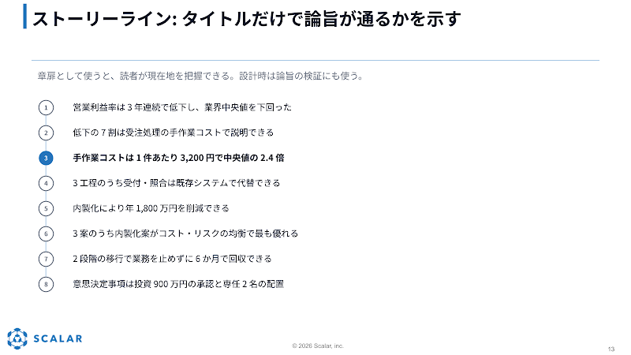

章扉として使うと、読者が現在地を把握できる。設計時は論旨の検証にも使う。

見出しの例: 「タイトルだけで論旨が通るかを示す」

**figures**: `lead_in` / `storyline`

### ゴーストデッキ

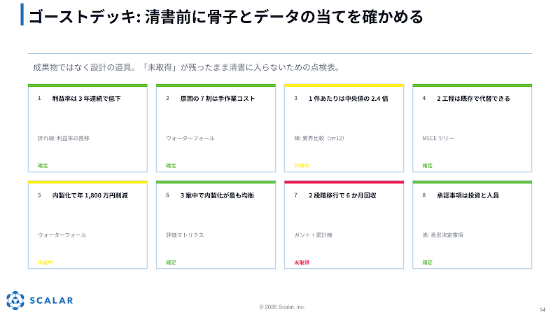

成果物ではなく設計の道具。「未取得」が残ったまま清書に入らないための点検表。

見出しの例: 「清書前に骨子とデータの当てを確かめる」

**figures**: `lead_in` / `ghost`

## 3. 定量ページ（推移・構成・増減）

数字で主張するページ。**すべて出典行が要る**（`source_note` は空出典で `ValueError`）。二重軸・基線ずらしは部品が拒否する。

### 推移

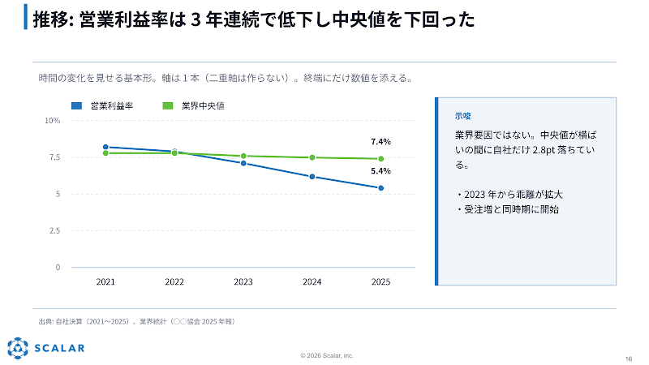

時間の変化を見せる基本形。軸は 1 本（二重軸は作らない）。終端にだけ数値を添える。

見出しの例: 「営業利益率は 3 年連続で低下し中央値を下回った」

**figures**: `lead_in` / `linechart` / `so_what` / `source_note`

### 増減分解

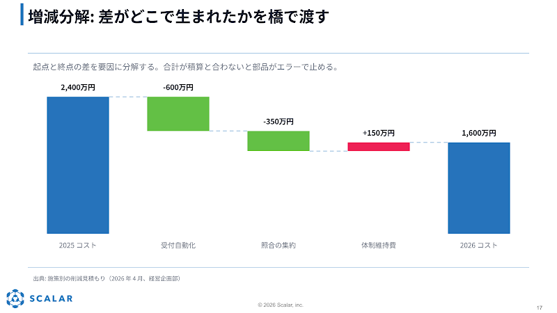

起点と終点の差を要因に分解する。合計が積算と合わないと部品がエラーで止める。

見出しの例: 「差がどこで生まれたかを橋で渡す」

**figures**: `lead_in` / `waterfall` / `source_note`

### 構成比

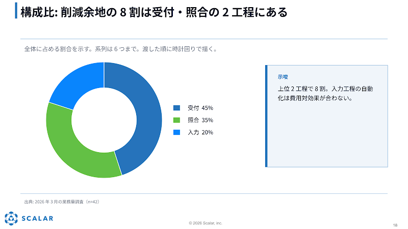

全体に占める割合を示す。系列は 6 つまで。渡した順に時計回りで描く。

見出しの例: 「削減余地の 8 割は受付・照合の 2 工程にある」

**figures**: `lead_in` / `pie` / `so_what` / `source_note`

### 内訳の推移

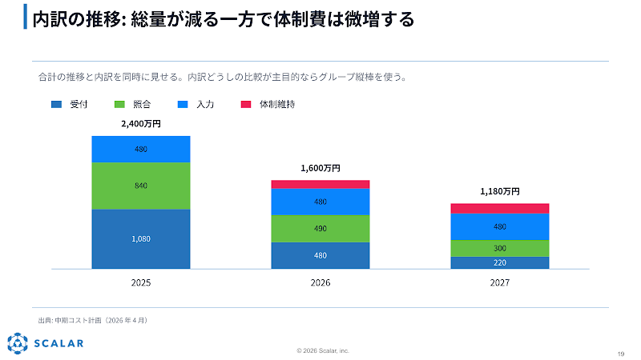

合計の推移と内訳を同時に見せる。内訳どうしの比較が主目的ならグループ縦棒を使う。

見出しの例: 「総量が減る一方で体制費は微増する」

**figures**: `lead_in` / `vbars_stacked` / `source_note`

### 系列比較

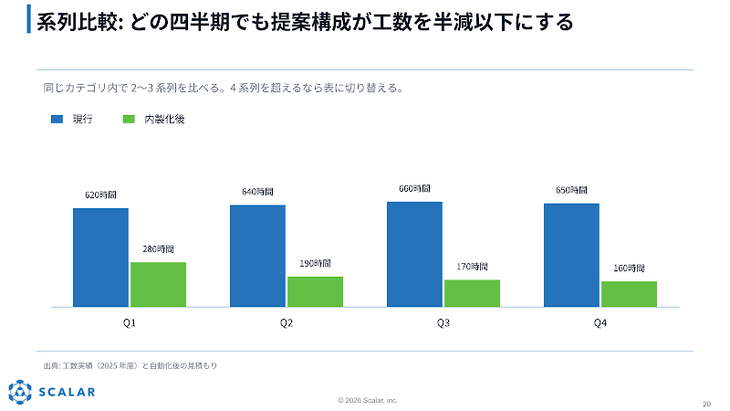

同じカテゴリ内で 2〜3 系列を比べる。4 系列を超えるなら表に切り替える。

見出しの例: 「どの四半期でも提案構成が工数を半減以下にする」

**figures**: `lead_in` / `vbars_grouped` / `source_note`

### KPI

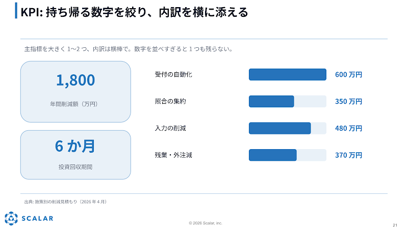

主指標を大きく 1〜2 つ、内訳は横棒で。数字を並べすぎると 1 つも残らない。

見出しの例: 「持ち帰る数字を絞り、内訳を横に添える」

**figures**: `lead_in` / `metric` / `hbars` / `source_note`

### 図表番号つき

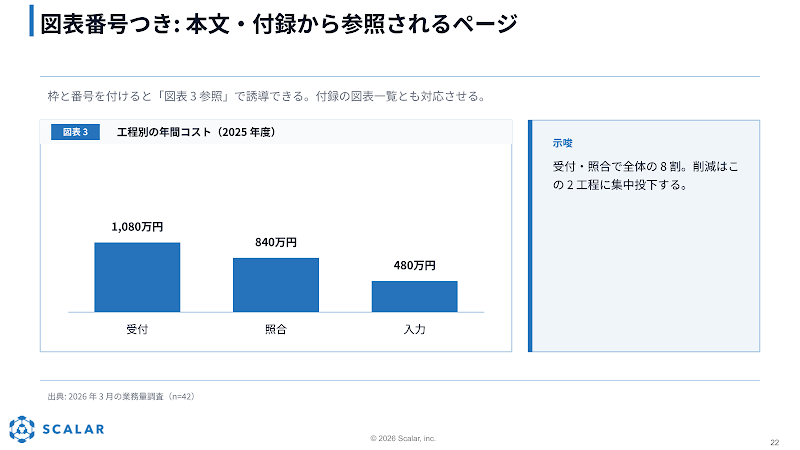

枠と番号を付けると「図表 3 参照」で誘導できる。付録の図表一覧とも対応させる。

見出しの例: 「本文・付録から参照されるページ」

**figures**: `lead_in` / `exhibit_frame` / `vbars` / `so_what` / `source_note`

## 4. 比較・評価ページ

案を並べて選ばせるページ。2 案なら対置、3 案以上なら `comparison`、3 案前後 × 基準 4 前後なら評価マトリクス、正確さが要るなら表。

### 2 案比較

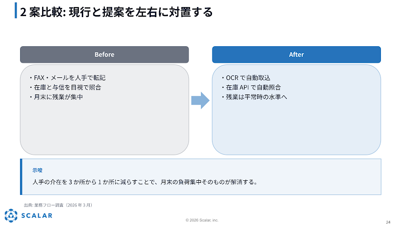

現行と提案を左右に対置する。2 案ならこれで足り、評価マトリクスは要らない。

**figures**: `before_after` / `so_what` / `source_note`

### 多案比較

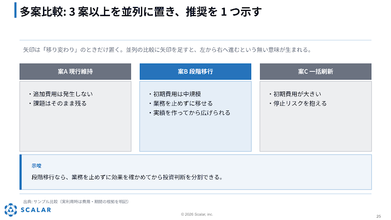

矢印は「移り変わり」のときだけ置く。並列の比較に矢印を足すと、左から右へ進むという無い意味が生まれる。

見出しの例: 「3 案以上を並列に置き、推奨を 1 つ示す」

**figures**: `lead_in` / `comparison` / `so_what` / `source_note`

### 多案 × 基準

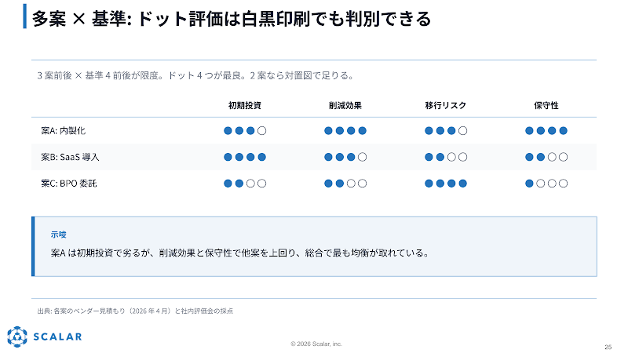

3 案前後 × 基準 4 前後が限度。ドット 4 つが最良。2 案なら対置図で足りる。

見出しの例: 「ドット評価は白黒印刷でも判別できる」

**figures**: `lead_in` / `rating_matrix` / `so_what` / `source_note`

### ポジショニング

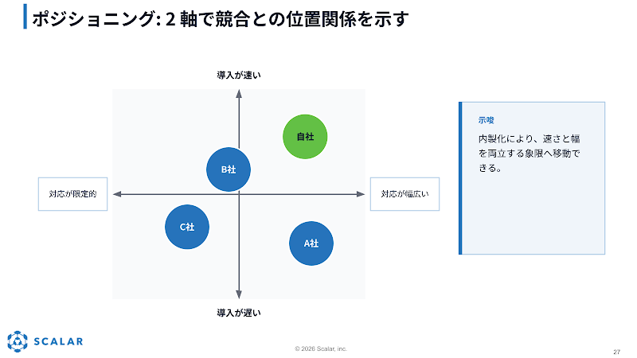

2 軸上の位置関係を見せる。4 象限への「分類」を見せたいなら `matrix` を使う。

見出しの例: 「2 軸で競合との位置関係を示す」

**figures**: `posmap` / `so_what`

### 天秤

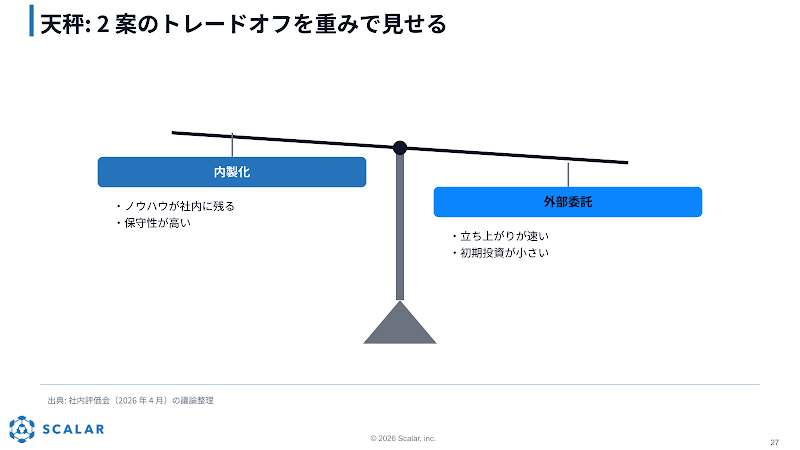

2 案のトレードオフを重みとして見せる。定量比較ではなく、判断の傾きを示す図。

**figures**: `balance` / `source_note`

### 仕様比較表

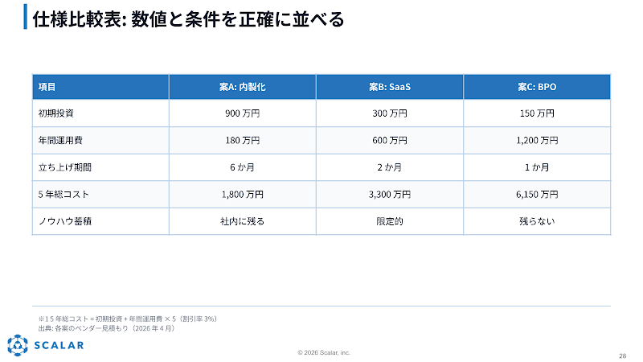

数値と条件を正確に並べる。図にすると精度が落ちる内容は表のままにする。

**figures**: `table` / `source_note`

## 5. 構造・論理ページ

関係を図にするページ。数値ではなく**構造**が主張になる。

### ロジックツリー

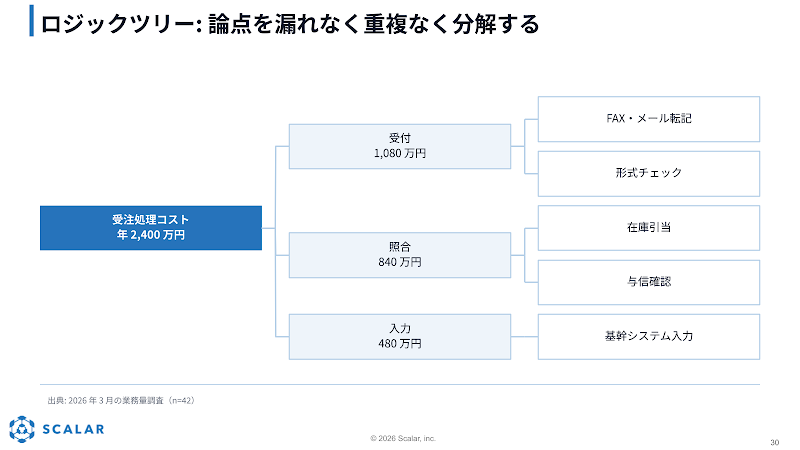

論点を漏れなく重複なく分解する。深さ 4 超はエラー。MECE かどうかは描く側の責任。

**figures**: `mece_tree` / `source_note`

### 階層と絞り込み

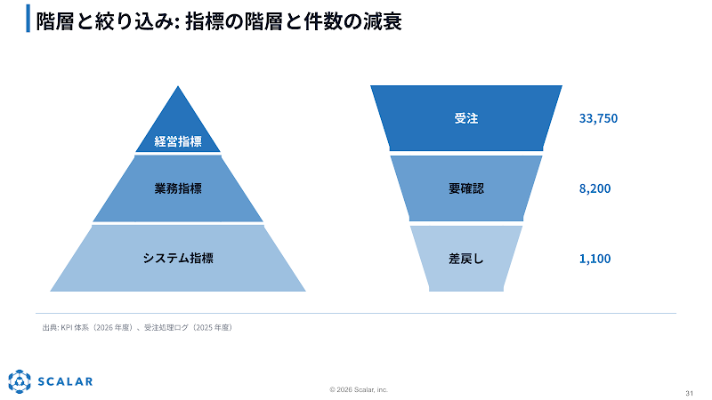

指標の階層（ピラミッド）と件数の減衰（ファネル）を並べる。

見出しの例: 「指標の階層と件数の減衰」

**figures**: `pyramid` / `funnel` / `source_note`

### 積層

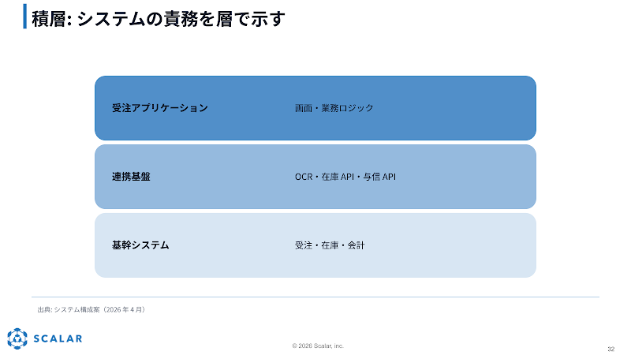

システムの責務を層で示す。層の順序そのものが主張になる。

**figures**: `layers` / `source_note`

### プロセス

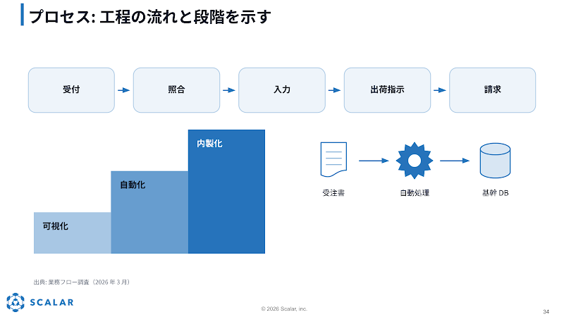

工程の流れと段階を示す。`flow` / `steps` / `icon_flow` を粒度で使い分ける。

**figures**: `flow` / `steps` / `icon_flow` / `source_note`

### 中心と放射

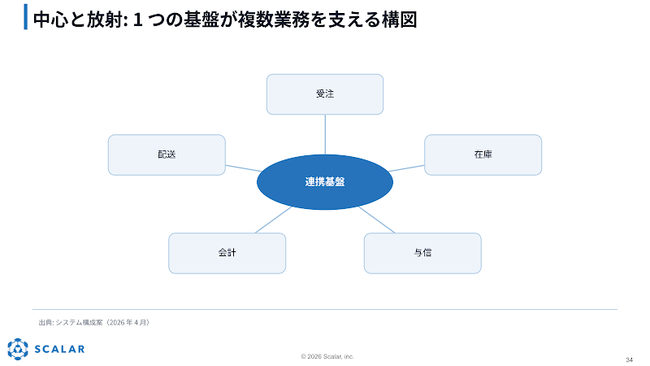

1 つの基盤が複数業務を支える構図。放射の本数は 6 本前後まで。

**figures**: `hub` / `source_note`

### 4 象限

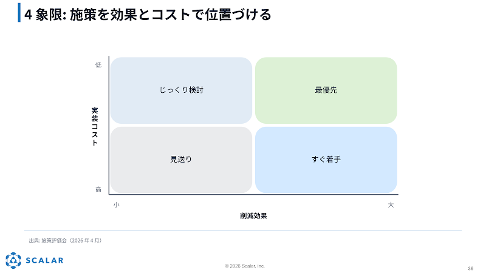

施策を 2 軸で位置づけて優先順位を作る。競合との位置関係なら `posmap`。

見出しの例: 「施策を効果とコストで位置づける」

**figures**: `matrix` / `source_note`

### 重なりと深層

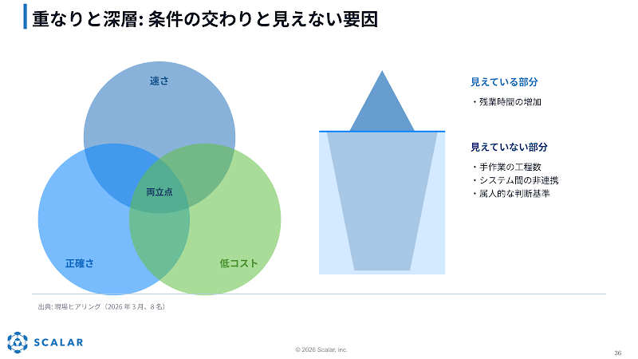

条件の交わり（ベン図）と、表に出ない要因（氷山）を組み合わせる。

見出しの例: 「条件の交わりと見えない要因」

**figures**: `venn` / `iceberg` / `source_note`

## 6. 計画・体制ページ

時間と人を示すページ。いつ・誰が・どの範囲かを扱う。

### スケジュール

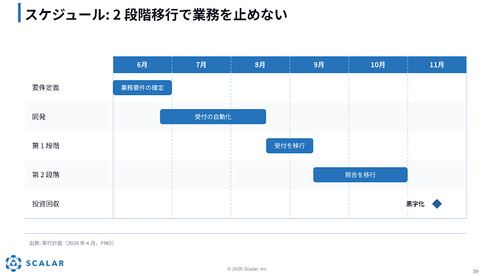

工程を時間軸に並べる。段階移行など「止めない」計画の説明に向く。

見出しの例: 「2 段階移行で業務を止めない」

**figures**: `gantt` / `source_note`

### ロードマップ

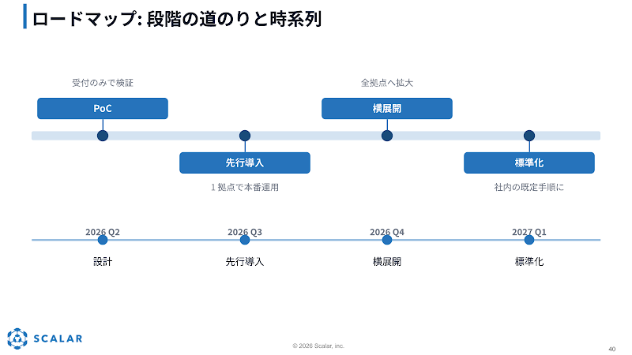

段階の道のりを示す。`journey` は体験の起伏、`timeline` は時点の列。

見出しの例: 「段階の道のりと時系列」

**figures**: `journey` / `timeline`

### 体制図

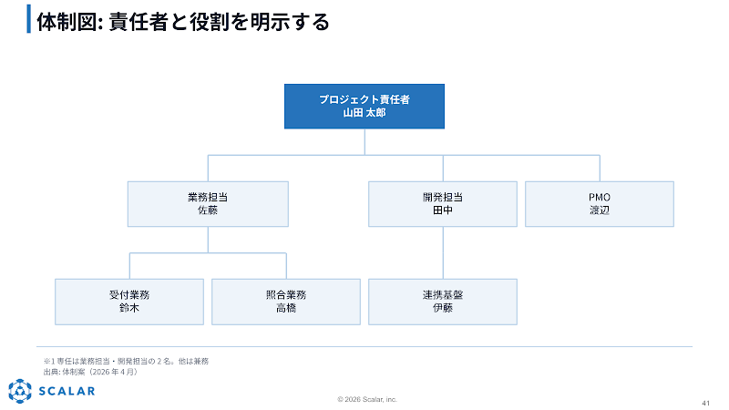

責任者と役割を明示する。論点の分解は `mece_tree` で、体制はこちら。

**figures**: `orgchart` / `source_note`

### 市場規模

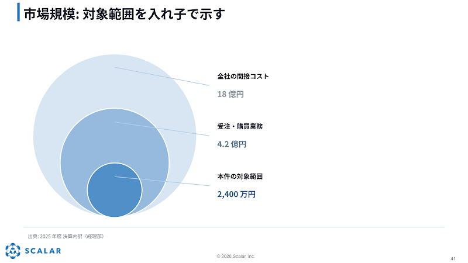

対象範囲を入れ子で示す（TAM / SAM / SOM）。外側から順に渡す。

**figures**: `nested_circles` / `source_note`

### リーンキャンバス

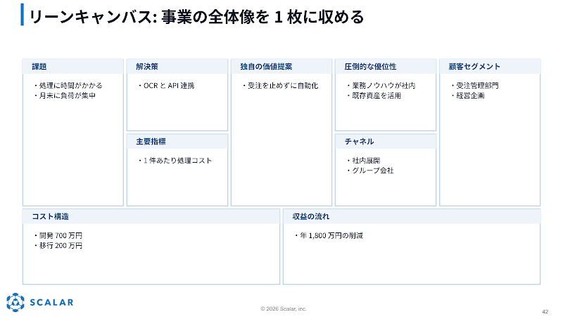

事業の全体像を 1 枚に収める。項目を埋めきれない段階では使わない。

**figures**: `lean_canvas`

## 7. 定性・技術ページ

数値以外で語るページ。引用・事例・構成図・コードなど。

### 現場の声

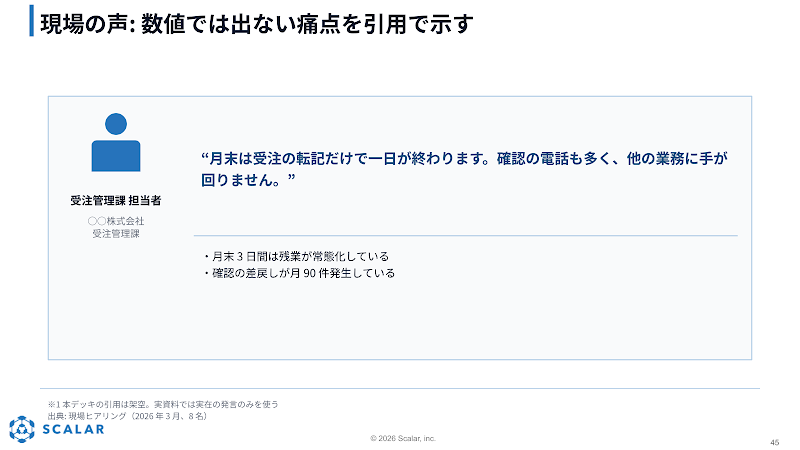

数値では出ない痛点を引用で示す。定量ページの後ろに置くと効く。

**figures**: `testimonial` / `source_note`

### 事例カード

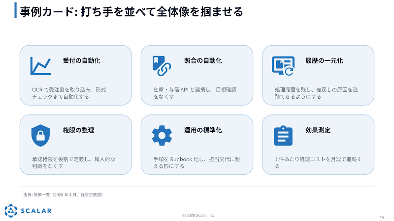

打ち手をカードで並べ、全体像を掴ませる。個々の詳細は付録へ。

見出しの例: 「打ち手を並べて全体像を掴ませる」

**figures**: `asset_icon_cards` / `source_note`

### システム構成

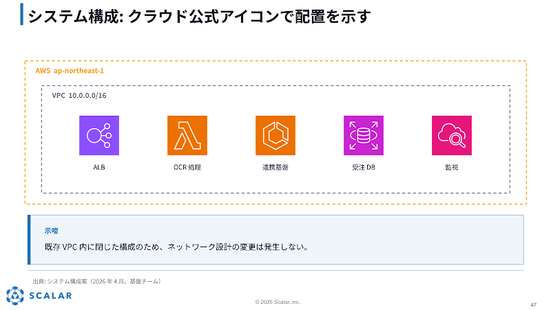

クラウド公式アイコンで配置を示す。**ベンダーアイコンの取得が必要**（下記参照）。

**figures**: `cloud_zone` / `cloud_icon_row` / `so_what` / `source_note`

### コードサンプル

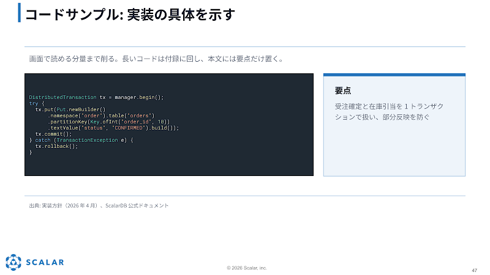

画面で読める分量まで削る。長いコードは付録に回し、本文には要点だけ置く。

見出しの例: 「実装の具体を示す」

**figures**: `lead_in` / `code_block` / `cards` / `source_note`

### ピクトグラム一覧

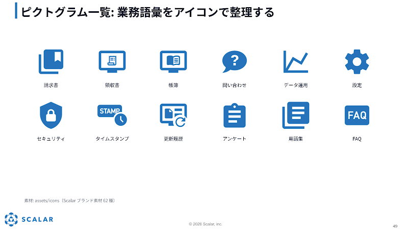

業務語彙をアイコンで整理する。用語集の代わりに冒頭へ置ける。

**figures**: `asset_icon_grid` / `source_note`

## 8. 締め・付録ページ

意思決定と、その後を扱うページ。本編を薄く、付録を厚くするのが原則。

### 意思決定事項

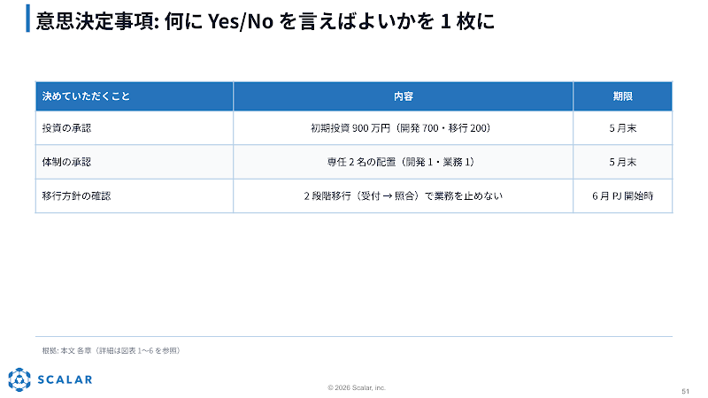

何に Yes/No を言えばよいかを 1 枚に。会議の出口をここで定義する。

**figures**: `table` / `source_note`

### 次のステップ

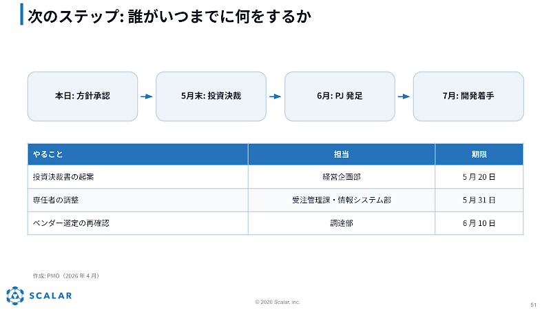

誰がいつまでに何をするか。主語と期限の無い行は書かない。

**figures**: `flow` / `table` / `source_note`

### 付録

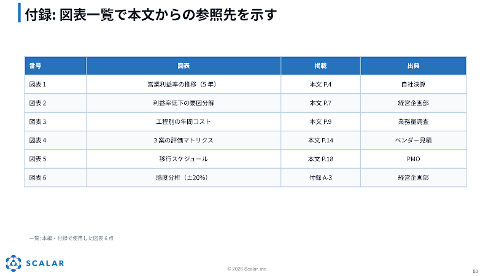

図表一覧で本文からの参照先を示す。`exhibit_frame` の番号と対応させる。

**figures**: `table` / `source_note`

---

画像は `examples/slide-pattern-index.json` の生成結果（`scalar-2026` テンプレート、MEDIUM サムネイル）。
パターンを足すときは、そのスペックにページを 1 枚足してから上のコマンドで作り直す。
