*[日本語](slide-template-catalog.ja.md)*

# Slide Template Catalog (All 92 Types)

An image catalog generated by actually rendering each template registered under
`slide-templates/` one page at a time. Its purpose is to **let you look at the output and choose which template to use for a given slide**.
For how to write the schema, see [template-schema.md](template-schema.md);
for generic page patterns (skeletons and figure composition), see
[slide-pattern-catalog.md](slide-pattern-catalog.md).

Each template's **figures** line lists the `type` names of the drawing components used on that page.
Templates are used via `render_slide_template.py` or the `$template` field in a deck spec.

```bash
# Rebuild this catalog (same steps when adding a template)
for pack in marketing-analysis b2b-sales scalar-ae planning analysis read-alone business-plan nexus hearing case-studies proposal marketing partner; do
  .venv/bin/python scripts/build_slide_template_catalog.py \
      --pack $pack --out out/template-catalog/$pack.json
done
# Merge every spec's slides into one deck, generate with build_deck.py,
# then place the fetch_thumbnails.py PNGs at references/images/slide-templates/<id>.png
.venv/bin/python scripts/build_template_catalog_doc.py
```

> `architecture-exhibit`, `ui-mock-flow` and `ui-mock-detail` have no catalog
> image: they embed screenshots that only a real nexus-architect run produces.

| Pack | Count | What this section is for |
|---|---|---|
| [Marketing Analysis Pack](#marketing-analysis) | 8 types | Pages for analyzing markets, customers, and campaign effectiveness |
| [B2B Sales Pack](#b2b-sales) | 8 types | Pages that visualize deal stakeholder structure and discovery (issue exploration) |
| [Scalar AE Pack](#scalar-ae) | 10 types | Standard pages Scalar account executives use for deal reviews and activity plans |
| [Planning Pack](#planning) | 3 types | Pages that show time-based plans |
| [Current-State Analysis Pack](#analysis) | 10 types | Pages built from consulting current-state analysis and issue-identification frameworks |
| [Read-Alone Pack](#read-alone) | 8 types | Pages of high-density slides that can be read to completion on a single page |
| [Business Plan Pack](#business-plan) | 8 types | Pages covering what an approver looks at first in a business plan or investment proposal: revenue, investment, risk, and the team |
| [Nexus Report Pack](#nexus) | 14 types | Pages that turn an architecture analysis run into slides |
| [Hearing Pack](#hearing) | 6 types | Pages that ask the customer or an audience for what is still missing |
| [Case Study Pack](#case-studies) | 3 types | Pages that carry published customer cases into a deck |
| [Proposal Pack](#proposal) | 6 types | The sections of a problem-solving proposal that had no reusable page |
| [Marketing Pack](#marketing) | 6 types | Pages aimed at people who are not yet in a deal |
| [Partner Pack](#partner) | 2 types | Partner-facing value and the joint-proposal policy |

<a id="marketing-analysis"></a>

## Marketing Analysis Pack (`marketing-analysis`)

Pages for analyzing markets, customers, and campaign effectiveness. Formats range from strategy (SWOT / 3C / TAM-SAM-SOM / positioning) through customer understanding (RFM / cohort), behavior (funnel), to effect verification (A/B testing) — one page per format.

### SWOT Analysis (`swot-analysis`)

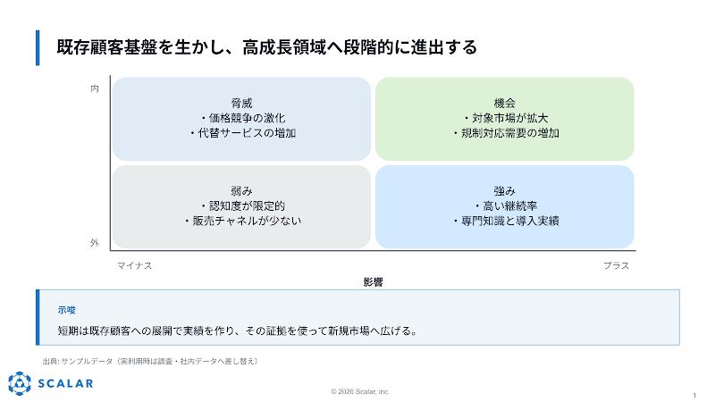

Organizes internal and external environment into four positive/negative quadrants and shows priority actions

**Answers**: What are our strategic strengths, weaknesses, opportunities, and threats?

**figures**: `governing_message`, `matrix`, `so_what`, `source_note`  
**Inference level**: Strategic (evaluation and direction-setting)  
**status**: experimental

Guardrails:

- Distinguish between facts and interpretations
- Do not assert causal relationships based on SWOT wording alone

### 3C Analysis (`three-c-analysis`)

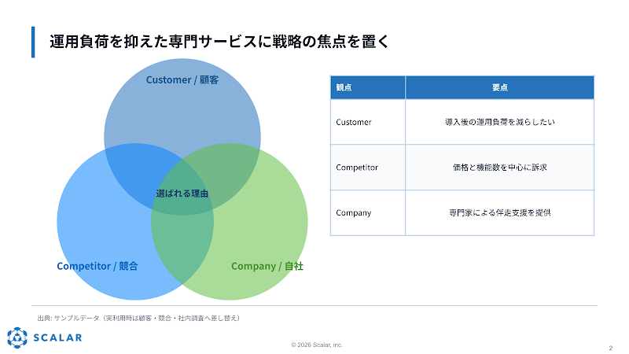

Shows the strategic focus arising from the overlap of Customer, Competitor, and Company

**Answers**: Where is the strategic territory where customer value and competitive advantage overlap?

**figures**: `governing_message`, `venn`, `table`, `source_note`  
**Inference level**: Strategic (evaluation and direction-setting)  
**status**: experimental

### TAM / SAM / SOM (`market-sizing`)

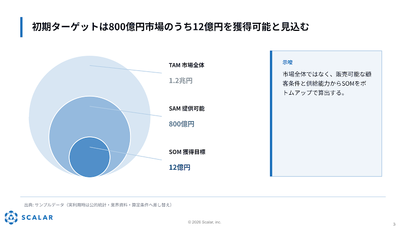

Shows the total market down to the obtainable market as nested circles

**Answers**: How large is the market, and what is the realistic obtainable range?

**figures**: `governing_message`, `nested_circles`, `so_what`, `source_note`  
**Inference level**: Descriptive (organizing facts)  
**status**: experimental

### Positioning Map (`positioning-map`)

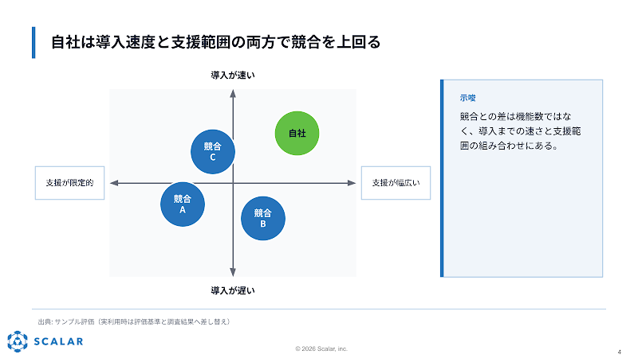

Shows the positional relationship between us and competitors on two axes

**Answers**: Are we delivering value that differs from competitors?

**figures**: `governing_message`, `posmap`, `so_what`, `source_note`  
**Inference level**: Diagnostic (identifying factors and structure)  
**status**: experimental

### RFM Segments (`rfm-segments`)

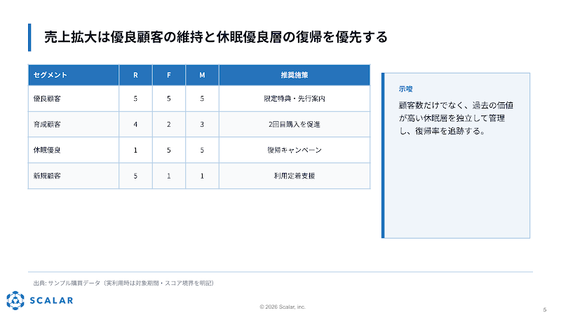

Compares customer segments and measures based on purchase recency, frequency, and monetary value

**Answers**: Who are the loyal, developing, and dormant customers, and which measures should be applied to each?

**figures**: `governing_message`, `table`, `so_what`, `source_note`  
**Inference level**: Diagnostic (identifying factors and structure)  
**status**: experimental

### Cohort Retention (`cohort-retention`)

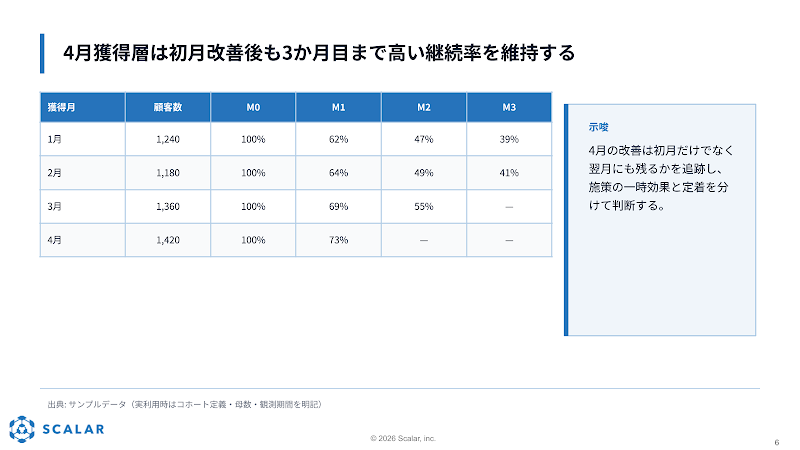

Compares retention rates by acquisition cohort across periods

**Answers**: Is the retention rate of newly acquired customers improving?

**figures**: `governing_message`, `table`, `so_what`, `source_note`  
**Inference level**: Diagnostic (identifying factors and structure)  
**status**: experimental

Guardrails:

- Do not naively compare bottom-right cells that cover different observation periods
- Note cohorts with small sample sizes

### Conversion Funnel (`conversion-funnel`)

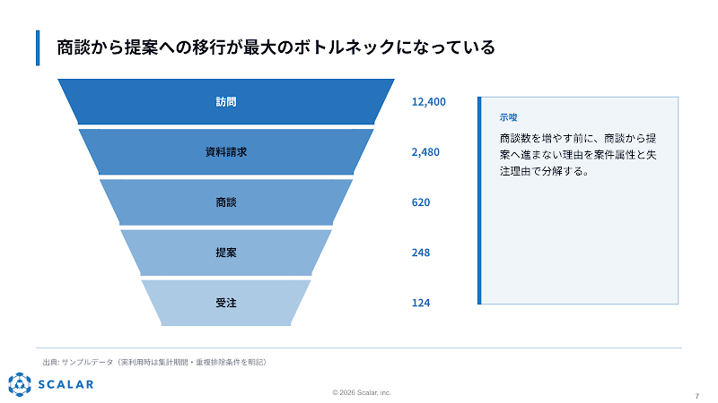

Shows counts at each stage of the purchase process and the biggest drop-off point

**Answers**: Which stage's drop-off should be prioritized for improvement?

**figures**: `governing_message`, `funnel`, `so_what`, `source_note`  
**Inference level**: Diagnostic (identifying factors and structure)  
**status**: experimental

### A/B Test Results (`experiment-result`)

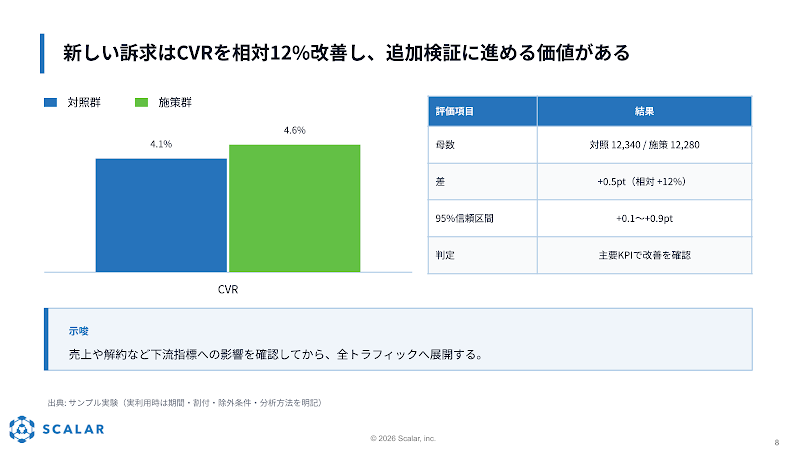

Shows control and treatment group results, sample sizes, the difference, and the verdict on a single page

**Answers**: How much did the key KPI change as a result of the measure?

**figures**: `governing_message`, `vbars_grouped`, `table`, `so_what`, `source_note`  
**Inference level**: Causal (asserting causes)  
**status**: experimental

Guardrails:

- Do not conclude that a non-significant result means zero effect
- State the pre-defined primary KPI and analysis period

<a id="b2b-sales"></a>

## B2B Sales Pack (`b2b-sales`)

Pages that visualize a deal's stakeholder structure and discovery (issue exploration). Each page shares, on one slide, who influences the decision and what has not yet been learned.

### Influence Map (`influence-map`)

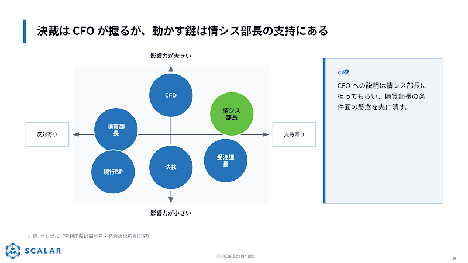

Places buying-committee members on two axes — influence and stance — to show whom to move to win the deal

**Answers**: Whom do we need to move to close this deal, and is influence skewed toward the opposing side?

**figures**: `governing_message`, `posmap`, `so_what`, `source_note`  
**Inference level**: Diagnostic (identifying factors and structure)  
**status**: experimental

Guardrails:

- Base positions on statements confirmed in meetings. Do not place sales' own hopes as if they were the stakeholder's stance
- Do not place uncontacted stakeholders as "neutral." Put unknowns into discovery-gaps instead
- Base influence on whether the person actually mattered in past approvals, not on job title
- Keep bubble labels to 6 characters or fewer. Put job-title and name details in buying-committee instead
- Bubbles are 0.95in in diameter. If placed too close together, labels get hidden (the --dry-run figure audit stops on "Text is hidden behind a shape drawn later"). Merge stakeholders that appear at the same position, or split them out into buying-committee

### Buying Committee (`buying-committee`)

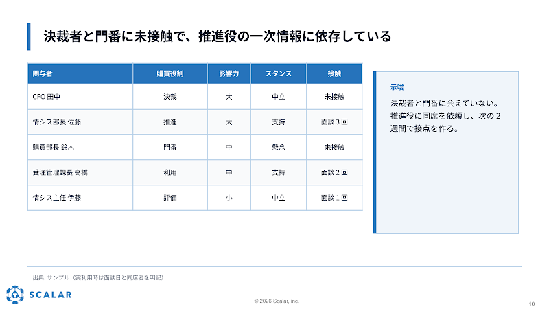

Lists each buying-committee member's role, influence, stance, and contact status

**Answers**: Who is involved in the purchase, and how much access have we gained so far?

**figures**: `governing_message`, `table`, `so_what`, `source_note`  
**Inference level**: Descriptive (organizing facts)  
**status**: experimental

Guardrails:

- Write the buying role as the function this person serves in this deal (approver, champion, evaluator, user, gatekeeper, opponent), not their job title
- Write contact status based on actual meetings held. Do not count a mere business-card exchange as "contacted"

### Decision Structure (`decision-structure`)

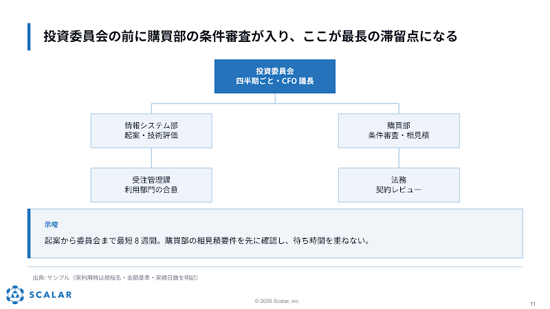

Shows, as a tree, which path an approval request follows and where it could stall

**Answers**: In what order does approval move up, and where might it stop?

**figures**: `governing_message`, `orgchart`, `so_what`, `source_note`  
**Inference level**: Descriptive (organizing facts)  
**status**: experimental

Guardrails:

- Draw this deal's approval route, not the org chart. Do not include departments that are not involved
- If the route changes depending on the amount, state in the source line that this is the route for the assumed amount
- Depth of 4 or more, or more than 8 leaves, causes text to become crushed. Split by department

### Discovery Map (`discovery-map`)

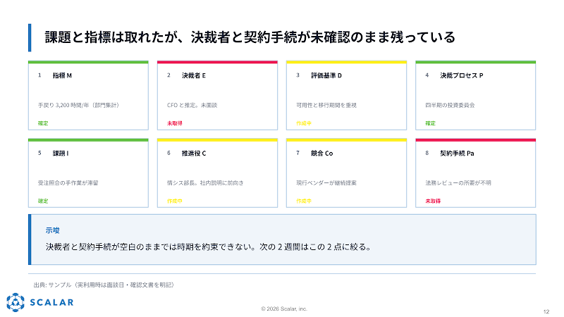

Lists the items to confirm during the deal and color-codes each as confirmed, hypothesis, or unconfirmed

**Answers**: What do we know in this deal, and what is still just a hypothesis?

**figures**: `governing_message`, `ghost`, `so_what`, `source_note`  
**Inference level**: Diagnostic (identifying factors and structure)  
**status**: experimental

Guardrails:

- State is one of three values: confirmed (verified by the customer's statement or a document), wip (partially confirmed), or missing (unconfirmed)
- Do not mark sales' own guesses as confirmed. Anything whose corroborating source cannot be named is wip or lower
- Do not move on to drafting the proposal while red (missing) items remain

### Pain Chain (`pain-chain`)

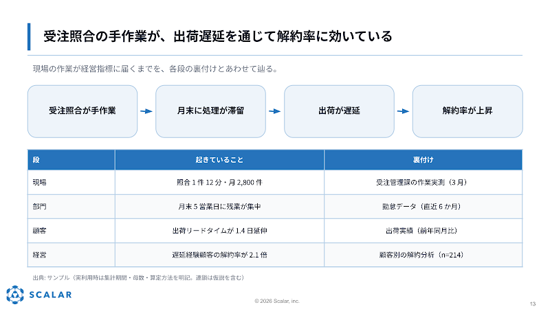

Traces how a frontline problem cascades into departmental and executive metrics

**Answers**: Which executive-level number is the frontline issue actually affecting?

**figures**: `governing_message`, `lead_in`, `flow`, `table`, `source_note`  
**Inference level**: Causal (asserting causes)  
**status**: experimental

Guardrails:

- A chain link is a causal claim. Do not connect two stages with an arrow unless each stage has supporting evidence
- Describe the impact on executive metrics using the customer's own numbers. If it's our own estimate, label it clearly as an estimate
- Do not present correlation as causation

### Unconfirmed Items and Next Steps (`discovery-gaps`)

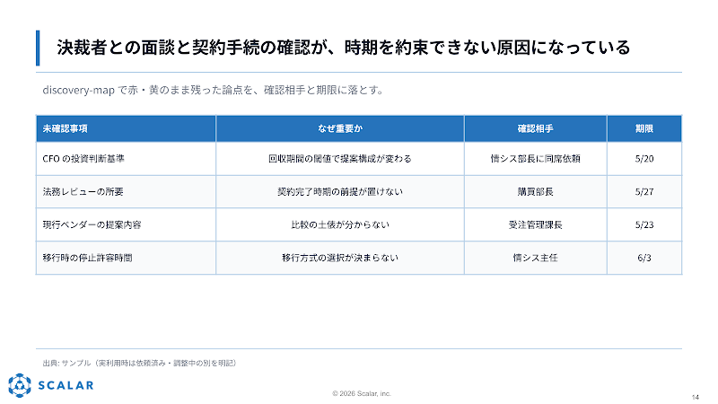

Breaks down the open questions that remain blank into who will confirm them and by when

**Answers**: Whom do we need to ask what, next, to move the deal forward?

**figures**: `governing_message`, `lead_in`, `table`, `source_note`  
**Inference level**: Descriptive (organizing facts)  
**status**: experimental

Guardrails:

- Do not ask about an item if you cannot state why it matters. What decides success is the order of questions, not the quantity
- Do not leave a row without a person to confirm with and a deadline
- Keep this aligned one-to-one with the missing / wip items in discovery-map

### Influence Map (Org Structure) (`influence-map-org`)

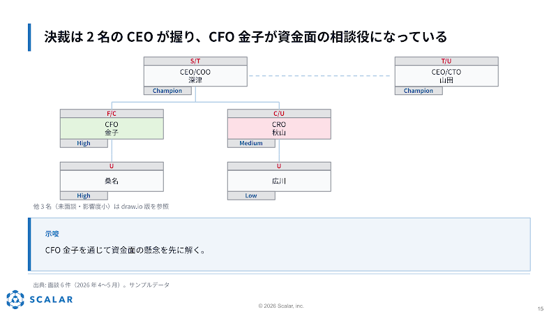

Arranges buying-committee members by organizational connections, showing role, influence, stance, and meeting status

**Answers**: Who reports to whom, and where is influence and support concentrated?

**figures**: `governing_message`, `influence_graph`, `so_what`, `source_note`  
**Inference level**: Diagnostic (identifying factors and structure)  
**status**: experimental

Guardrails:

- The contents of people / links are validated by scripts/account_graph.py. Duplicate ids, dangling reportsTo references, and cycles are caught there, so always pass data that has gone through account_graph.load()
- If there are more than 9 people, thin them out with account_graph.extract() and write "see the draw.io version for the other N people" in more. Do not cram everyone onto one slide
- Include unmet stakeholders with met: false (drawn as a dashed line). Not having met someone is itself information
- Base stance on statements made in meetings. Do not write sales' own hopes into stance

### Discovery Map (Hierarchy) (`discovery-map-tree`)

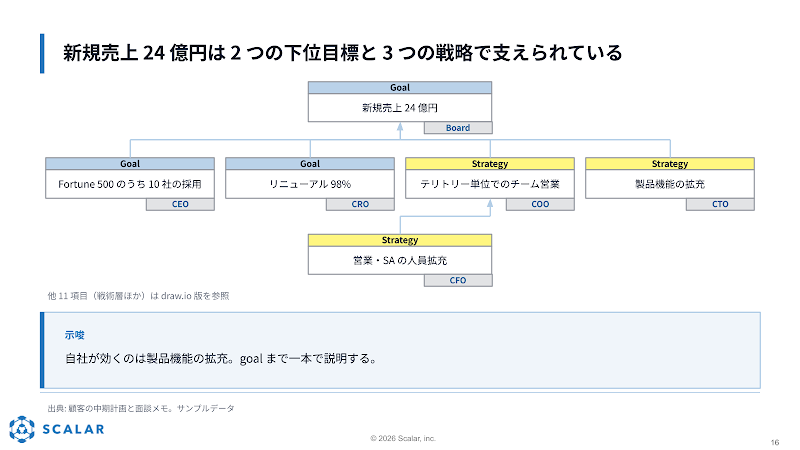

Connects Goal, Strategy, and Tactics by support relationships, showing what supports what

**Answers**: What supports the customer's goal, and where do we make a difference?

**figures**: `governing_message`, `outcome_tree`, `so_what`, `source_note`  
**Inference level**: Strategic (evaluation and direction-setting)  
**status**: experimental

Guardrails:

- The contents of nodes / edges are validated by scripts/account_graph.py. Cycles and downward-pointing edges are caught there, so always pass data that has gone through account_graph.load()
- The tier is determined by graph depth, not by a tier field. A lower-level goal that supports a higher-level goal is placed one level below it
- If there are more than 9 nodes, thin them out with account_graph.extract() and write "see the draw.io version for the other N items" in more
- Do not place a goal in Goal that the customer never stated. Treat guesses as wip items in the discovery map instead

<a id="scalar-ae"></a>

## Scalar AE Pack (`scalar-ae`)

Standard pages that Scalar account executives use for deal reviews and activity plans. Designed so the contents of account.json (the deal ledger) can be poured in directly. The only stable pack.

### Deal Snapshot (`account-snapshot`)

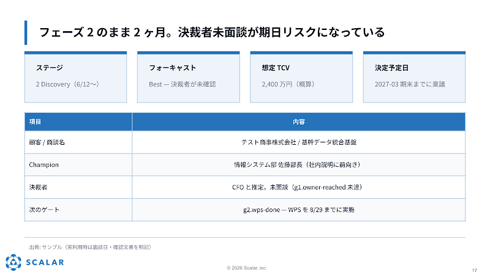

Shows, on one page, what stage this deal is in now, the amount, and when it will close

**Answers**: Where does this deal stand right now, for how much, and when will it close?

**figures**: `governing_message`, `cards`, `table`, `source_note`  
**Inference level**: Descriptive (organizing facts)  
**status**: stable

Guardrails:

- forecast is one of four values: Pipeline / Best / Commit / Closed. Demote a Commit to Best if you cannot state its basis
- Write an amount only if you can state how it was calculated. If you cannot, write "undetermined"
- Internal document. Do not share with customers or partners (it includes individuals' influence, stance, and internal politics)

### Stage-Gate Criteria (`phase-gate`)

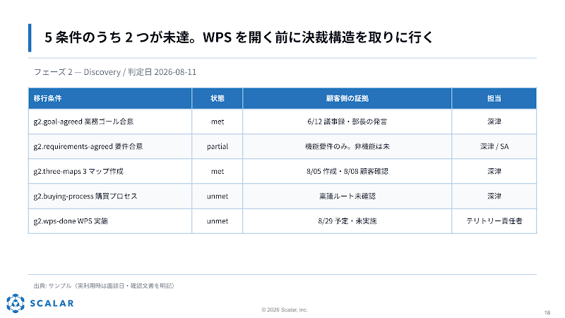

Lists the current stage's exit criteria and judges each by whether customer-side evidence has been obtained

**Answers**: What customer-side evidence shows that the current stage's exit criteria are met?

**figures**: `governing_message`, `lead_in`, `table`, `source_note`  
**Inference level**: Diagnostic (identifying factors and structure)  
**status**: stable

Guardrails:

- State is one of three values: met / partial / unmet. "We explained it" or "we sent the proposal" does not count as grounds for met
- Evidence must come from the customer side (statements, documents, approval records). Internal agreement is not evidence
- Map each exit criterion to a gate ID in references/scalar/sales-playbook.md §2
- Internal document. Do not share with customers or partners (it includes individuals' influence, stance, and internal politics)

### BANT Risk (`bant-risk`)

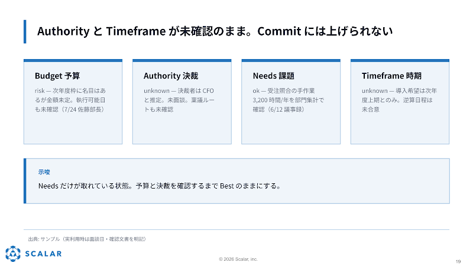

Identifies which of Budget / Authority / Needs / Timeframe is most likely to stall the deal

**Answers**: Where is the risk in this deal, and is the forecast reasonable?

**figures**: `governing_message`, `cards`, `so_what`, `source_note`  
**Inference level**: Diagnostic (identifying factors and structure)  
**status**: stable

Guardrails:

- Fix the order of the four items as Budget → Authority → Needs → Timeframe
- Open each item with ok / risk / unknown, and write the basis for that judgment in the same cell
- Send any item still marked unknown to action-plan with a person to confirm with and a deadline
- Internal document. Do not share with customers or partners (it includes individuals' influence, stance, and internal politics)

### Action Plan (`action-plan`)

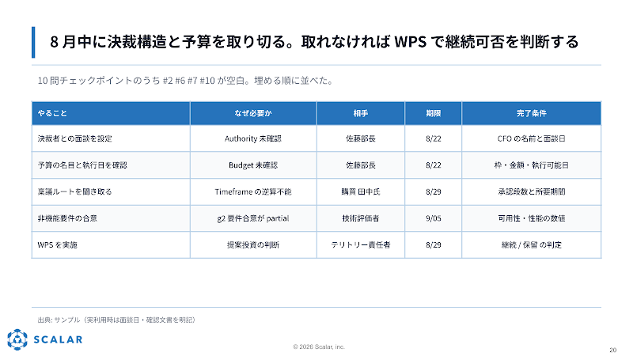

Breaks each unconfirmed issue down into who, asks whom, by when, and what completion looks like

**Answers**: To move this deal forward, who does what, by when?

**figures**: `governing_message`, `lead_in`, `table`, `source_note`  
**Inference level**: Strategic (evaluation and direction-setting)  
**status**: stable

Guardrails:

- Do not include a row whose completion criterion cannot be written. "Confirm it" is not a completion criterion
- Do not leave a row without a deadline. If the counterpart is internal, name the meeting body (WPS / Deal Desk)
- Map each row one-to-one to an unconfirmed item in discovery-gaps
- Internal document. Do not share with customers or partners (it includes individuals' influence, stance, and internal politics)

### Activity History (`activity-timeline`)

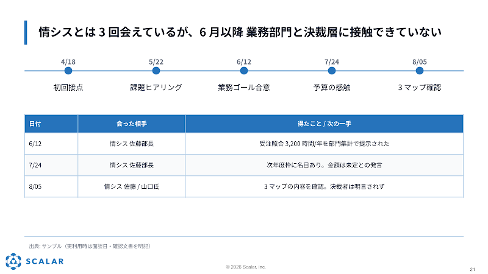

Lists, in chronological order, who we've met and what we learned

**Answers**: How much access have we gained with this customer, and what have we learned?

**figures**: `governing_message`, `timeline`, `table`, `source_note`  
**Inference level**: Descriptive (organizing facts)  
**status**: stable

Guardrails:

- Limit the table to the most recent 4 entries. Keep earlier history in the ledger (account.json); do not put it on the slide
- Write only the customer's own statements or documents under "what we learned." Do not write our own impressions
- Do not omit dates, so gaps where we had no contact remain visible
- Internal document. Do not share with customers or partners (it includes individuals' influence, stance, and internal politics)

### Visit Plan (`visit-plan`)

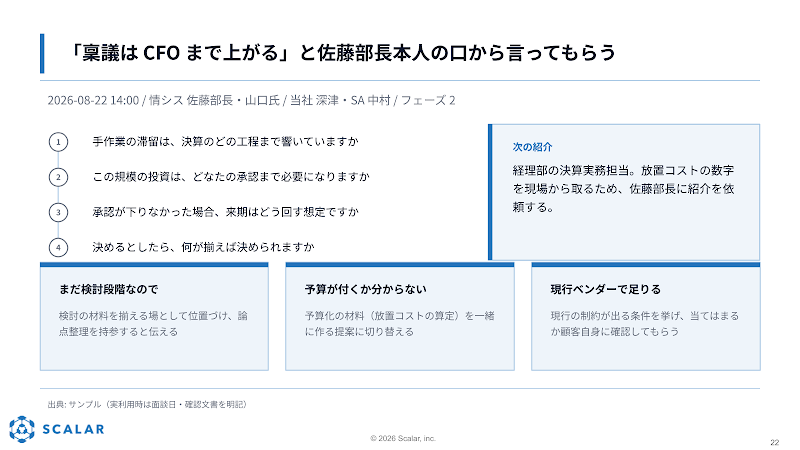

Decides, before the visit, what to get out of it, how to ask, and how to respond

**Answers**: What do we want to get from the customer on this visit, and how will we respond to expected objections?

**figures**: `governing_message`, `lead_in`, `storyline`, `so_what`, `cards`, `source_note`  
**Inference level**: Strategic (evaluation and direction-setting)  
**status**: stable

Guardrails:

- Make the title "the one thing we want to hear from the customer." "Explain X" is not an objective
- Always state in ask which person or department we want introduced next, and why
- Frame questions so the answer isn't just Yes/No (include SPIN's Implication and Need-payoff questions)
- Internal document. Do not share with customers or partners (it includes individuals' influence, stance, and internal politics)

### Win Plan (WPS) (`win-plan`)

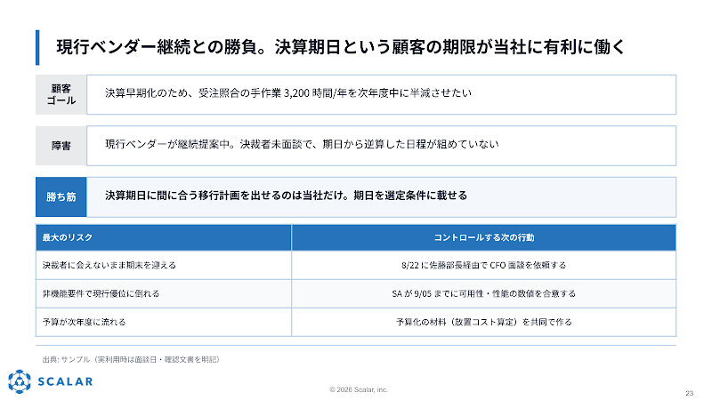

A one-page summary of the win strategy and risks used to decide stage advancement and proposal investment in WPS

**Answers**: Why can we win this deal, and how will we neutralize the biggest risk?

**figures**: `governing_message`, `exec_summary`, `table`, `source_note`  
**Inference level**: Strategic (evaluation and direction-setting)  
**status**: stable

Guardrails:

- Write in resolution why the customer would choose us, not a list of product names
- Pair each risk with a next action we can control. Anything without an actionable next step is capped at Best
- Always accompany this with a verbal request for a continue / hold / withdraw decision
- Internal document. Do not share with customers or partners (it includes individuals' influence, stance, and internal politics)

### Challenge Hypothesis One-Pager (`challenge-hypothesis`)

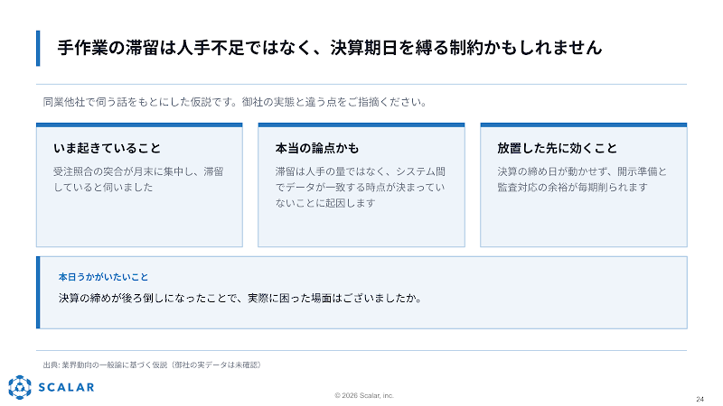

A one-pager that surfaces issues the customer hasn't yet articulated, to open a dialogue

**Answers**: What issue has the customer not yet noticed, and what happens if it's left unaddressed?

**figures**: `governing_message`, `lead_in`, `cards`, `so_what`, `source_note`  
**Inference level**: Diagnostic (identifying factors and structure)  
**status**: stable

Guardrails:

- **For customer presentation**. Do not write about individuals' influence, stance, internal politics, or competitors' weaknesses
- Fix the three cards in the order: groundwork → reframing → evidence (cost of inaction)
- Do not assert as fact. Phrase hypotheses so they read as hypotheses, and always end with a question to the customer
- Do not include figures without a source. Cite the source for any public case study

### License Estimate Summary (`license-estimate`)

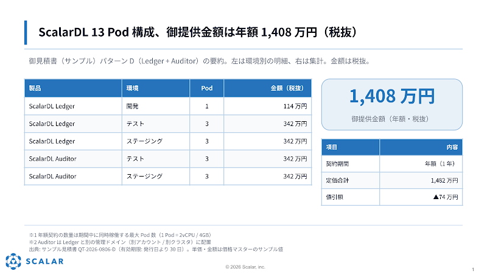

The cost page of a proposal: a Scalar license estimate's line items, list price → discount → offered price, and assumptions on one slide

**Answers**: How much does this configuration cost, and what are the breakdown and assumptions?

**figures**: `governing_message`, `lead_in`, `table`, `metric`, `source_note`  
**Inference level**: Descriptive (organizing facts)  
**densities**: print / presentation (default print)  
**status**: experimental

Guardrails:

- Transcribe unit prices and amounts from the price-master quotation; never compute them on this slide
- Never show the discount rate. Show only list total, discount amount, and offered price
- Always show the contract term (monthly / annual / 3-year) in the summary table; never state an amount without its term
- Pod counts must match the quotation and the architecture diagram. State the contract-Pod rule (annual contract = maximum concurrently running Pods) as an assumption

### License Pattern Comparison (`license-pattern-compare`)

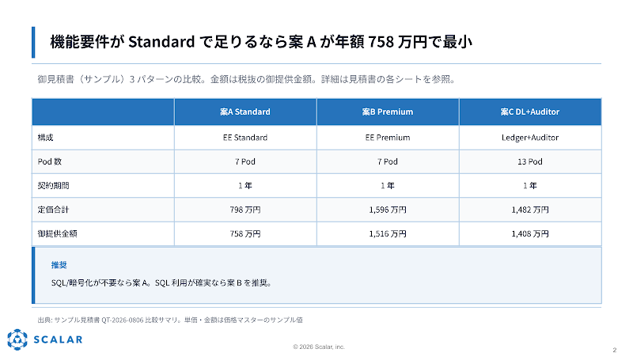

Compares quotation patterns (Standard / Premium, different configurations) side by side on configuration, Pod count, and offered price, with an explicit recommendation

**Answers**: Which license pattern fits this customer best, and how much do the options differ?

**figures**: `governing_message`, `lead_in`, `table`, `so_what`, `source_note`  
**Inference level**: Diagnostic (identifying factors and structure)  
**densities**: print / presentation (default print)  
**status**: experimental

Guardrails:

- Transcribe amounts from the price-master quotation's comparison summary; never show discount rates — compare offered prices
- Keep the row dimensions (configuration, Pods, term, price) aligned across patterns so each row reads straight across
- Write the recommendation from both functional fit and price; never push the cheapest option unconditionally

<a id="planning"></a>

## Planning Pack (`planning`)

Pages that present time-based plans. The three formats — Gantt chart, chronology, and milestone timeline — differ in granularity and use case.

### Gantt Chart (`gantt-schedule`)

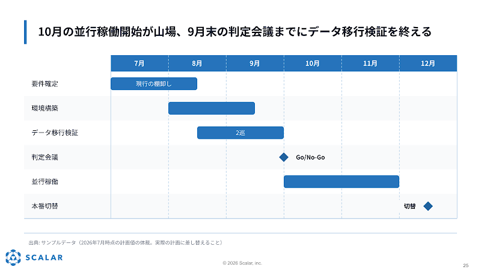

A period-by-task bar chart showing work streams running in parallel and their milestones

**Answers**: When does what run in parallel, and when is the next milestone?

**figures**: `governing_message`, `gantt`, `source_note`  
**Inference level**: Descriptive (organizing facts)  
**status**: experimental

Guardrails:

- Start and end are decimals in column units (0 is the left edge of the first column, the column count is the right edge). Values exceeding the column count raise an error at generation time
- A row where start == end is drawn as a milestone (◆). Give a row width if you want it drawn as a bar
- Dependency arrows are not represented. If you need to show fine-grained sequencing, write it as a table instead
- Limit to 8 rows. Bundle fine-grained tasks so each row is one workstream
- Do not mix planned values with actuals. For a planned schedule, state the planning date in source

### Chronology (`chronology`)

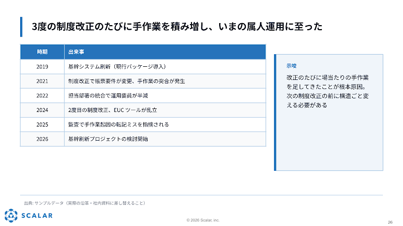

A vertical chronology of dates and events showing how we arrived at the current state

**Answers**: What has happened so far, and what sequence of events led to the current state?

**figures**: `governing_message`, `table`, `so_what`, `source_note`  
**Inference level**: Descriptive (organizing facts)  
**status**: experimental

Guardrails:

- Write only facts in the event column. Keep interpretation and evaluation separate, in "implications"
- Keep the date granularity consistent (all years, or all year-months, not mixed)
- Limit to 9 rows. Bundle earlier history or narrow the period covered
- If a quiet period is meaningful, don't omit the row — write "no change" to show it explicitly

### Milestone Timeline (`milestone-timeline`)

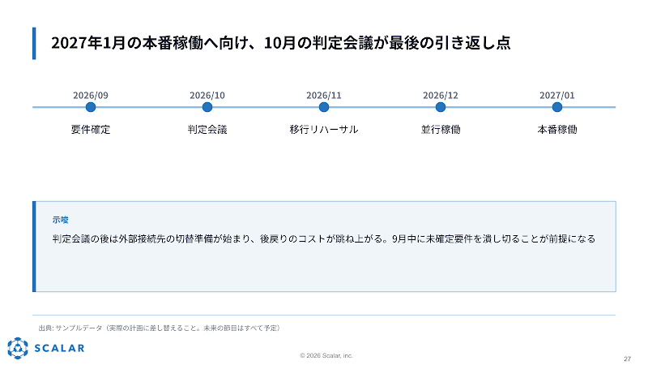

Arranges milestones at equal intervals along a single horizontal timeline, showing the next decision point

**Answers**: How are the milestones arranged, and when is the next point we need to act?

**figures**: `governing_message`, `timeline`, `so_what`, `source_note`  
**Inference level**: Descriptive (organizing facts)  
**status**: experimental

Guardrails:

- Limit to 6 milestones. The timeline is drawn at equal intervals and does not represent duration (use gantt-schedule if you need to show duration)
- State in source that future milestones are planned, not confirmed
- Keep date labels to 10 characters or fewer (e.g., 2026/09), with consistent granularity

<a id="analysis"></a>

## Current-State Analysis Pack (`analysis`)

Pages built from consulting current-state analysis and issue-identification frameworks. Covers structural decomposition (logic tree / KPI tree), root cause (why-why / fishbone diagram), quantitative narrowing (Pareto chart), gap and process flow, external environment (PEST / Five Forces), and prioritization. Used by the current-state-analysis skill.

### Logic Tree (`logic-tree`)

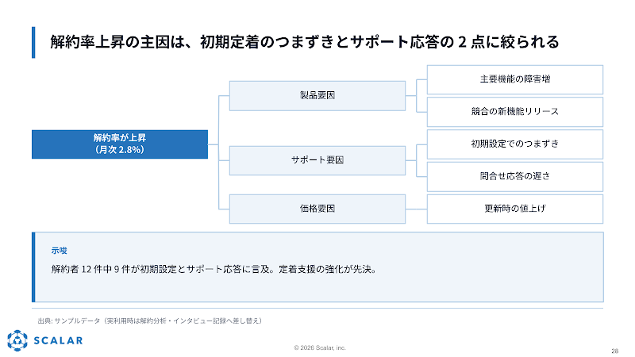

Decomposes an issue MECE-style, showing structurally where the problem (or the solution) lies

**Answers**: What elements can this problem be broken down into, and which one matters most?

**figures**: `governing_message`, `mece_tree`, `so_what`, `source_note`  
**Inference level**: Diagnostic (identifying factors and structure)  
**status**: experimental

Guardrails:

- tree is nested as [label, [children…]]. Each child is either the same shape or a string. Depth beyond 4, or insufficient column width, raises an error at render time
- Limit to 5 leaves (to preserve the 0.46in node height). Beyond that, split the tree across two slides
- MECE (mutually exclusive, collectively exhaustive) is not enforced by the component itself. Keep one decomposition criterion per level
- Do not mix a Why tree (cause decomposition) and a How tree (solution decomposition) into a single tree
- Write in insight which branch matters most, and the basis for that judgment

### KPI Tree (`kpi-tree`)

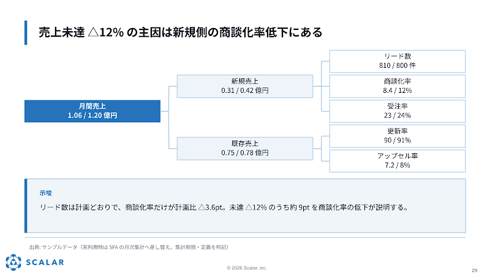

Decomposes the KGI into its component metrics, showing which metric is driving the gap (or the achievement) against target

**Answers**: Which component metric is producing the gap between target and actual?

**figures**: `governing_message`, `mece_tree`, `so_what`, `source_note`  
**Inference level**: Diagnostic (identifying factors and structure)  
**status**: experimental

Guardrails:

- The root is a single KGI. Write node labels as "metric name\nactual value" (or "actual / target" if showing the ratio to target)
- Only use parent-child relationships explainable by arithmetic (Revenue = New + Existing, New = Leads × Conversion rate, …). Do not include elements that can't be explained this way
- Every figure requires a source. State the period and aggregation definition in source
- Limit to 5 leaves (to preserve the 0.46in node height for two-line labels). When there are many metrics, expand only the bottleneck branch and collapse the rest at a higher level
- Write in insight which metric is the primary driver of the gap, quantified (e.g., of the -12% shortfall, -9% comes from the opportunity-conversion rate)

### Why-Why Analysis (`why-why`)

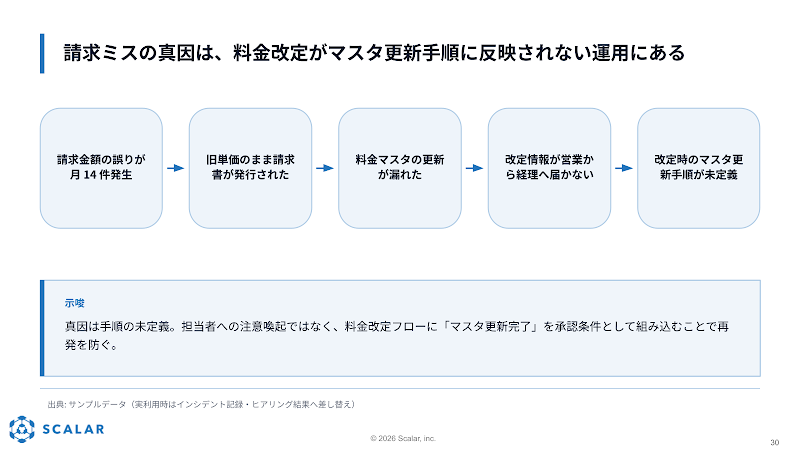

Shows the chain produced by repeatedly asking "why" from an observed event down to the root cause

**Answers**: What is the root cause of this event, and where should we act?

**figures**: `governing_message`, `flow`, `so_what`, `source_note`  
**Inference level**: Causal (asserting causes)  
**status**: experimental

Guardrails:

- chain[0] is the observed event, and the last entry is the root cause. Don't skip steps — dig one "why" at a time
- Don't stop at "the person in charge was careless" or "low awareness." Dig down to systemic and process-level factors
- Word each step as something verifiable by fact. Mark any step that hasn't been verified with (hypothesis)
- Limit to 6 steps due to width constraints. If the cause branches into multiple paths partway through, use fishbone-diagram instead
- Write in insight the countermeasure (recurrence-prevention action) aimed at the root cause, distinguished from a symptomatic fix

### Fishbone Diagram (`fishbone-diagram`)

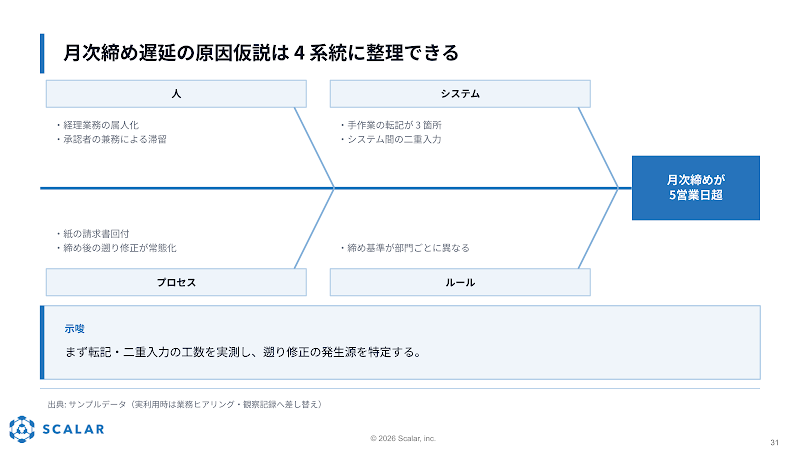

Lists hypothesized causes of a problem by category, to identify where to start verifying

**Answers**: Which category does the cause of this problem fall under, and where should verification start?

**figures**: `governing_message`, `fishbone`, `so_what`, `source_note`  
**Inference level**: Diagnostic (identifying factors and structure)  
**status**: experimental

Guardrails:

- Keep categories to a single consistent basis, such as the 4Ms (Man, Machine, Method, Material) or process names. Do not mix bases
- Limit to 4 causes per category. If there are more, consolidate them or move them to a supplementary document (this diagram is not meant to prove exhaustive coverage)
- What's included here are hypothesized causes. Identify the root cause via why-why or data verification; do not distinguish verified causes with bold or similar formatting (all causes are on equal footing in this diagram)
- State problem as a measurable event ("monthly defect rate above 3%," not "quality is bad")
- Write in insight which cause to verify next, and how

### Pareto Chart (`pareto-analysis`)

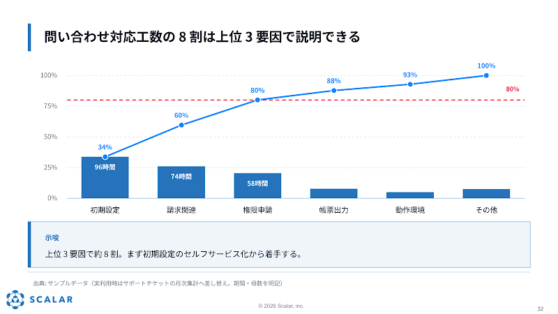

Overlays counts/amounts by cause with cumulative share, showing which cause to tackle first

**Answers**: Do a small number of causes account for most of the total, and where should we start?

**figures**: `governing_message`, `pareto`, `so_what`, `source_note`  
**Inference level**: Descriptive (organizing facts)  
**status**: experimental

Guardrails:

- Items are automatically sorted by descending value ("other" is always last). The order you pass them in carries no meaning
- Use only quantities where a sum is meaningful (counts, amounts, time). Do not mix in rates or indices
- State the aggregation period and sample size in source
- The 80% dashed line is a rough guide. When the top causes aren't dominant (the cumulative line is close to straight), "not concentrated" is itself the finding — don't force a conclusion that focuses on the top causes
- If "other" ends up the largest category, your classification is too coarse. Revisit the categories before using this chart

### Gap Analysis (As-Is / To-Be) (`gap-analysis`)

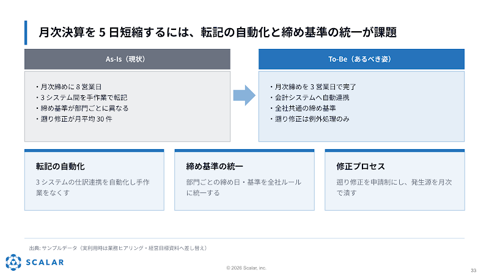

Shows the current state (As-Is) and the target state (To-Be) side by side, and defines the gap to be closed

**Answers**: Where does the current state diverge from the target state, and what should we set as the issue to solve?

**figures**: `governing_message`, `before_after`, `cards`, `source_note`  
**Inference level**: Strategic (evaluation and direction-setting)  
**status**: experimental

Guardrails:

- As-Is must be a verified fact; To-Be must be an agreed-upon goal. If placing an unagreed aspiration into To-Be, mark it explicitly as a hypothesis in the title
- List the same dimensions in the same order under asis and tobe, so the gap reads clearly row by row
- Write gaps as "the issue to be closed," not as "a description of the difference" (what needs to become what state). The issue cards carry this slide's conclusion
- Do not put the details of solutions (How) on this slide. Send prioritization of issues to priority-matrix
- For any numeric target in To-Be, state the basis (benchmark, management target) in source

### Process Flow and Pain Points (`process-painpoints`)

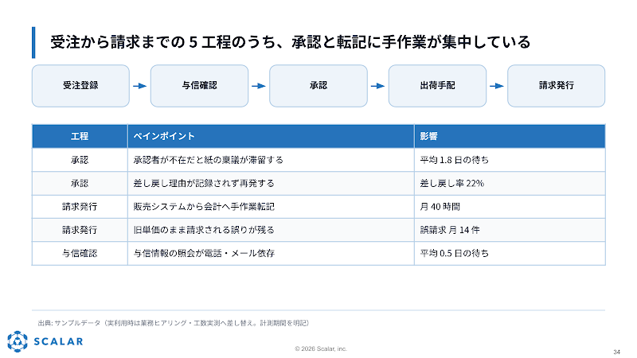

Shows the current process flow and maps which step has which pain point

**Answers**: How does the current process flow, and which step concentrates the problems?

**figures**: `governing_message`, `flow`, `table`, `source_note`  
**Inference level**: Descriptive (organizing facts)  
**status**: experimental

Guardrails:

- steps must be the current (As-Is) flow. Do not mix in an ideal flow or the post-improvement state
- Each row of pains is [step, pain point, impact]. Match the step name exactly to how it's written in steps
- List only pain points verified by observation or interviews as facts. State impact in measurable terms (effort, time, money) and record the source in source
- Limit to 5 rows. For a detailed flow with more than 6 steps, put it in a separate drawio-diagrams sheet and bundle the main steps here
- Do not put solutions on this slide (send issue structuring to logic-tree, prioritization to priority-matrix)

### PEST Analysis (`pest-analysis`)

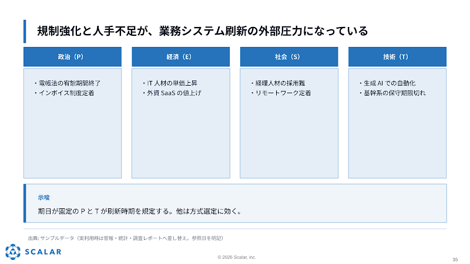

Lists macro-environment factors across Political, Economic, Social, and Technological dimensions, organizing external impacts on the business

**Answers**: What external factors are shaping our business environment?

**figures**: `governing_message`, `comparison`, `so_what`, `source_note`  
**Inference level**: Strategic (evaluation and direction-setting)  
**status**: experimental

Guardrails:

- Include only external factors that could actually affect our business (not a general news roundup)
- Distinguish facts (enacted regulations, published statistics) from expectations (under deliberation, early signs), and attach a timeframe to expectations
- Do not judge opportunity vs. threat here (pass that judgment to SWOT — this slide sticks to describing the environment)
- Include at least one item in each of the four quadrants. An empty quadrant reads as "not researched"
- Consolidate the source of each factor in source (official gazette, statistics, research report name)

### Five Forces Analysis (`five-forces`)

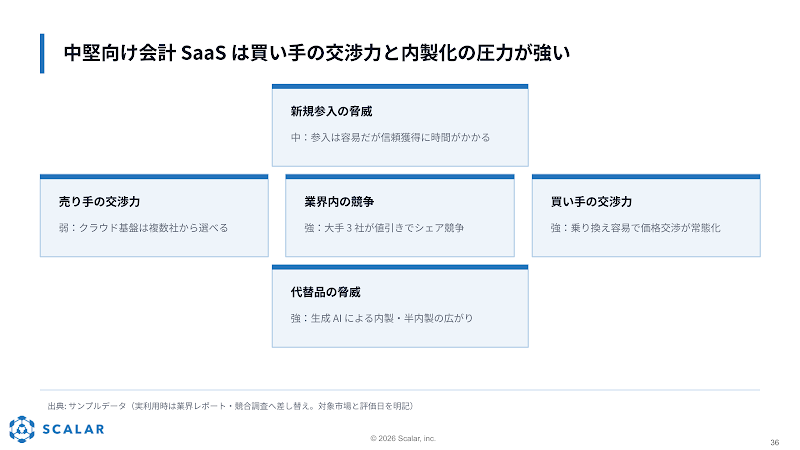

Evaluates industry competitive structure through five forces (rivalry, new entrants, substitutes, buyers, suppliers)

**Answers**: Where does competitive pressure in this industry come from, and how strong is it?

**figures**: `governing_message`, `cards`, `source_note`  
**Inference level**: Strategic (evaluation and direction-setting)  
**status**: experimental

Guardrails:

- Write each force as "Strong / Medium / Weak: rationale" (don't give just the rating or just the rationale). title carries the conclusion — which force squeezes profitability the most
- State clearly in title or source which industry (market scope) this covers. The rating changes if the scope changes
- The five forces describe industry structure. Do not write our own company-specific strengths or weaknesses (send those to swot-analysis)
- The rating includes the evaluator's judgment. State the source material for the rating and the evaluation date in source
- The center force (industry rivalry) is also a result of the other four. This diagram does not assert causal arrows

### Issue Priority Matrix (`priority-matrix`)

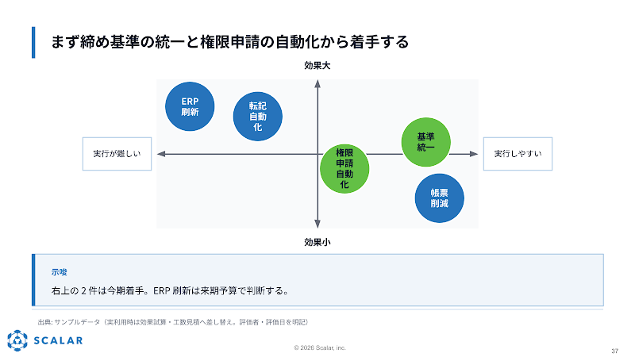

Plots issues on two axes — impact and ease of execution — showing where to start

**Answers**: Among the issues we've identified, which should we tackle first?

**figures**: `governing_message`, `posmap`, `so_what`, `source_note`  
**Inference level**: Strategic (evaluation and direction-setting)  
**status**: experimental

Guardrails:

- items is [issue name, x, y]. x / y are relative values from 0 to 1 (0 = left/bottom, 1 = right/top). State the basis for the rating (impact estimate, effort estimate), the evaluator, and the evaluation date in source
- Keep the issue name short enough to fit the bubble (0.8in diameter ≈ 4 characters/line). For 5 or more characters, mark the line break explicitly with \n, e.g. "Access request\nautomation"
- The top-right quadrant (easy to execute × high impact) is highest priority. But since the coordinates tend to be subjective, use this to agree on relative order rather than debating exact position
- Overlapping bubbles become unreadable. Limit to 8 issues, and merge issues that sit close together
- Use highlight only for issues we've decided to act on (too much emphasis emphasizes nothing)
- This slide does not explain the substance of each issue (what it solves). Define that in gap-analysis or logic-tree before bringing it here

<a id="read-alone"></a>

## Read-Alone Pack (`read-alone`)

Pages of high-density slides that can be read to completion on a single page (consulting-firm-style handouts). Each fits a governing message, lead-in, evidence, implication, and source onto one slide. Every template carries $density variants, so the same file renders at two densities: print (handout) and presentation (stage).

### Claim and Evidence Table (`claim-evidence-table`)

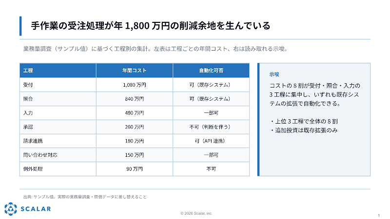

The standard read-alone form: claim, supporting evidence table, implication, and source, all closed on one page

**Answers**: Which facts support this claim?

**figures**: `governing_message`, `lead_in`, `table`, `so_what`, `source_note`  
**Inference level**: Descriptive (organizing facts)  
**densities**: print / presentation (default print)  
**status**: experimental

Guardrails:

- Write the title as "what can be said" in two lines or fewer; never as a caption describing the table
- Keep the implication within what the table shows. Never restate the title or introduce new information
- Never show a number without a source. Cut any row you cannot source

### Exhibit and Implication (`exhibit-analysis`)

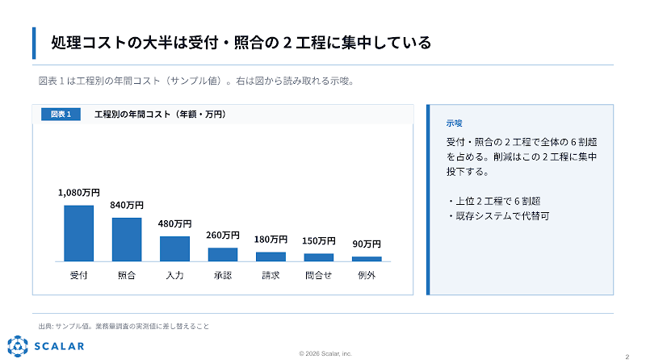

Puts a chart inside a numbered exhibit frame with the reading on the right, making one page referable from the body and appendix

**Answers**: What can be read from this exhibit?

**figures**: `governing_message`, `lead_in`, `exhibit_frame`, `vbars`, `so_what`, `source_note`  
**Inference level**: Diagnostic (identifying factors and structure)  
**densities**: print / presentation (default print)  
**status**: experimental

Guardrails:

- The exhibit number exists for cross-reference from the body and appendix; sequential numbering is the author's responsibility
- Keep the implication within what the chart shows; never add information that is not in the figure
- Bar chart baselines are fixed at zero. Never exaggerate an axis to inflate a difference

### Executive Summary (`exec-summary-readable`)

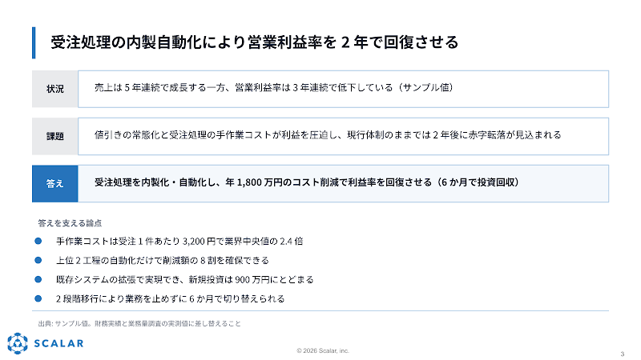

Situation, complication, and resolution in three tiers plus supporting points, so the first page alone enables a decision

**Answers**: What, in the end, is this document asking the reader to decide?

**figures**: `governing_message`, `exec_summary`, `source_note`  
**Inference level**: Strategic (evaluation and direction-setting)  
**densities**: print / presentation (default print)  
**status**: experimental

Guardrails:

- The condition is that this one page alone enables the decision; the body serves as supporting evidence
- Write the resolution tier as a conclusion with numbers; never end on "to be considered"
- If the supporting points exceed five, rework the body's chapter structure instead

### Conclusion, Rationale, and So What (`conclusion-rationale-implication`)

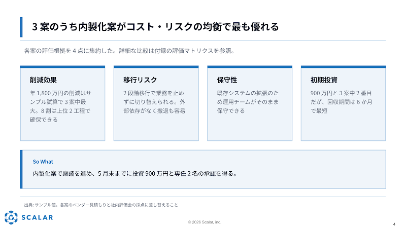

Leads with the conclusion, then rationale cards and the next action (So What), read as a one-page pyramid

**Answers**: What is the conclusion, why does it hold, and what happens next?

**figures**: `governing_message`, `lead_in`, `cards`, `so_what`, `source_note`  
**Inference level**: Strategic (evaluation and direction-setting)  
**densities**: print / presentation (default print)  
**status**: experimental

Guardrails:

- Put the conclusion in the title; never make the reader reach the end of the body to find it
- Limit the rationale to 3-4 non-overlapping points; split to another slide beyond five
- So What states the next action; never a restatement of the rationale or the title

### Option Comparison Matrix (`dense-comparison-table`)

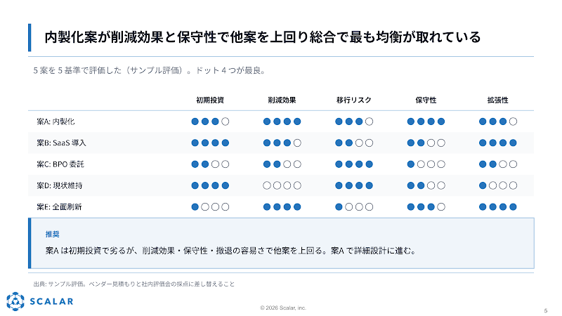

Compares options in a dot-rating matrix and shows the recommendation with its reasoning on one page

**Answers**: Which option is best, and why recommend it?

**figures**: `governing_message`, `lead_in`, `rating_matrix`, `so_what`, `source_note`  
**Inference level**: Diagnostic (identifying factors and structure)  
**densities**: print / presentation (default print)  
**status**: experimental

Guardrails:

- Limit criteria to those that affect the decision; never pad with filler criteria
- Always state the basis for the scoring (quotes, evaluation sessions) in the source
- Write the recommendation as an overall judgment that concedes weaknesses; never disguise it as a clean sweep

### Storyline (`key-message-storyline`)

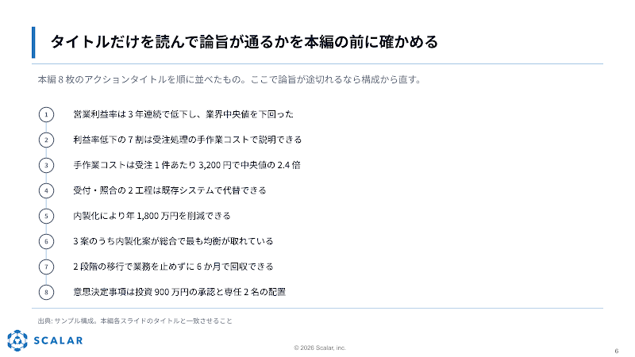

Lines up the body's action titles in order — the horizontal logic — showing on one page that the titles alone carry the argument

**Answers**: Does the argument hold when reading only the titles?

**figures**: `governing_message`, `lead_in`, `storyline`, `source_note`  
**Inference level**: Strategic (evaluation and direction-setting)  
**densities**: print / presentation (default print)  
**status**: experimental

Guardrails:

- Each row must match the action title of its body slide; never rewrite as a summary
- If the argument breaks here, fix the structure before building the slides
- Write each row as a claim ("what can be said"); never as a table-of-contents topic

### Anticipated Q&A (`faq-objection-handling`)

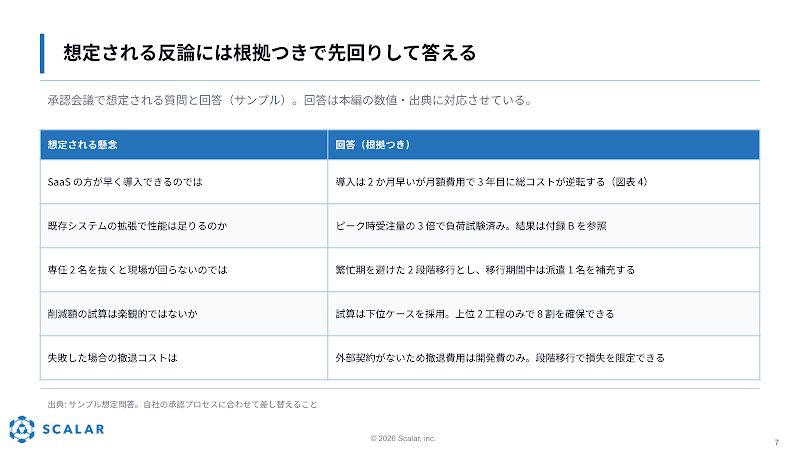

Pairs the objections expected at the approval meeting with sourced answers, preempting the Q&A on one page

**Answers**: How will we answer the expected objections?

**figures**: `governing_message`, `lead_in`, `table`, `source_note`  
**Inference level**: Descriptive (organizing facts)  
**densities**: print / presentation (default print)  
**status**: experimental

Guardrails:

- Every answer must carry its basis (exhibit numbers, appendix, test results)
- Leave unanswerable concerns visible; a glossed-over answer destroys the document's credibility
- Limit concerns to ones that will actually come up; never stage weak strawman objections

### One-Page Brief (`one-page-brief`)

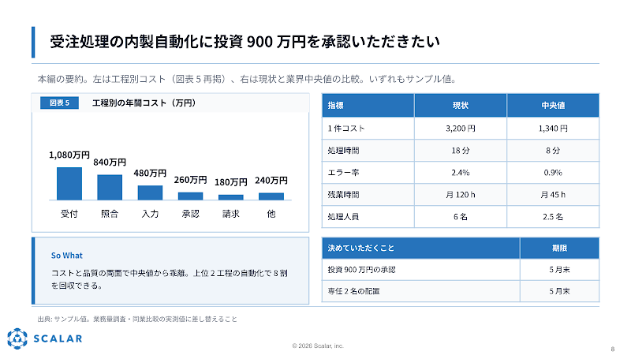

The densest page in the pack: exhibit chart, comparison table, implication, decision items, and source, all on one approval-ready page

**Answers**: Can the approver confirm the judgment and the decision items from this one page alone?

**figures**: `governing_message`, `lead_in`, `exhibit_frame`, `vbars`, `table`, `so_what`, `source_note`  
**Inference level**: Strategic (evaluation and direction-setting)  
**densities**: print / presentation (default print)  
**status**: experimental

Guardrails:

- This page is the final check for approval. The exhibit and table summarize the body; never introduce a first-appearance number here
- Write decision items so Yes/No can be said, with a deadline. "Continue considering" is not a decision item
- Pack in information, not text. Keep table cells short and nominal

<a id="business-plan"></a>

## Business Plan Pack (`business-plan`)

Pages covering what an approver looks at first in a business plan or investment proposal: revenue, investment, risk, and the team. Multi-year P/L, the revenue bridge, cost structure, break-even, scenario comparison, payback, the risk register with exit criteria, and the execution structure, each as a one-page format. Every template carries $density variants, so the same file renders as a written plan document (print) or a board-meeting slide (presentation).

### Revenue Plan (multi-year P/L) (`revenue-plan`)

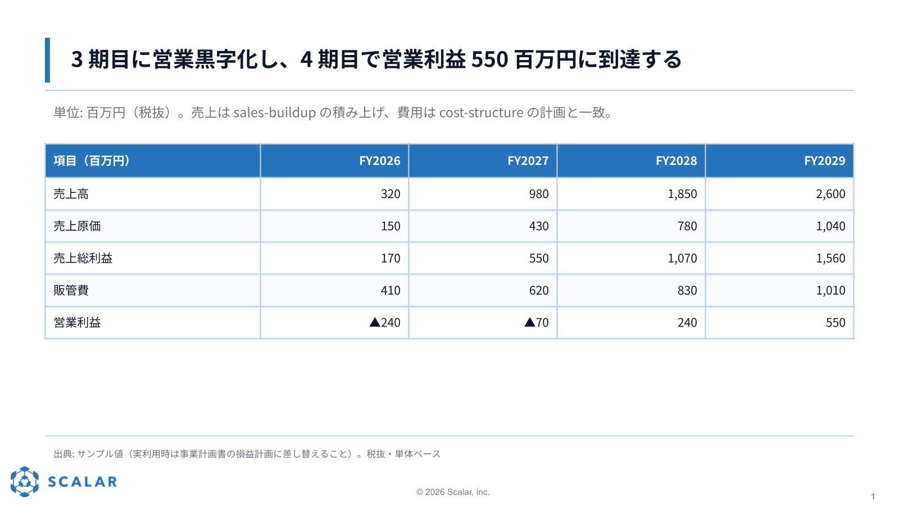

Shows the profit plan from revenue down to operating income as a year-by-year table, making the level and timing of profitability visible on one page

**Answers**: What revenue and profit will this business reach in each year, and when does it turn profitable?

**figures**: `governing_message`, `lead_in`, `table`, `source_note`  
**Inference level**: Predictive (projecting future values)  
**densities**: print / presentation (default print)  
**status**: experimental

Guardrails:

- Keep the title to roughly 30 full-width characters on one line. A second line collides with the lead-in below it
- The first column is the line item and the remaining four are periods. For a three-year plan, use the last column for a cumulative total or CAGR (never leave an empty column)
- State the unit (millions, thousands) and whether figures are tax-exclusive in the first header or the lead-in
- Revenue is substantiated by sales-buildup and costs by cost-structure. This slide carries only the result
- Ratio rows such as margins take pre-computed strings. Nothing is calculated on the slide
- These are plan values, not actuals. If actuals appear alongside, mark the row label so the two are distinguishable
- Every figure moves when the assumptions move. Show the range of assumptions separately in scenario-comparison

### Revenue Bridge (driver buildup) (`sales-buildup`)

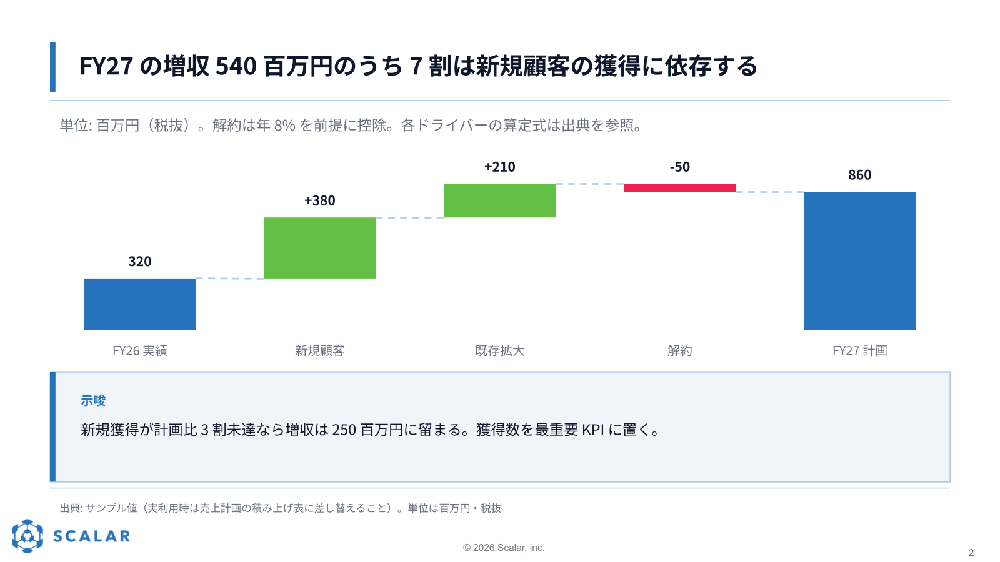

Bridges from a starting point to the planned figure driver by driver, showing what the growth is made of and what it depends on

**Answers**: Which drivers add up to the planned revenue, and which one does it depend on most?

**figures**: `governing_message`, `lead_in`, `waterfall`, `so_what`, `source_note`  
**Inference level**: Predictive (projecting future values)  
**densities**: print / presentation (default print)  
**status**: experimental

Guardrails:

- Keep the title to roughly 30 full-width characters on one line. A second line collides with the lead-in below it
- The third element of each item is total (a sum stacked from zero) or delta (a change from the previous total). The first item must be a total (the starting point)
- The final total must equal the accumulated deltas or generation fails. Transcribe the value from the spreadsheet
- A bridge whose running sum goes negative cannot be drawn. Split the starting point or use a separate slide when the decline is large
- Cut drivers at a granularity someone can act on (new, expansion, churn, price). Do not leave a large lump inside "other"
- State the unit in unit or the lead-in. Put the derivation of each driver in the source line
- The total of the buildup must match the revenue in revenue-plan

### Investment and Cost Structure (`cost-structure`)

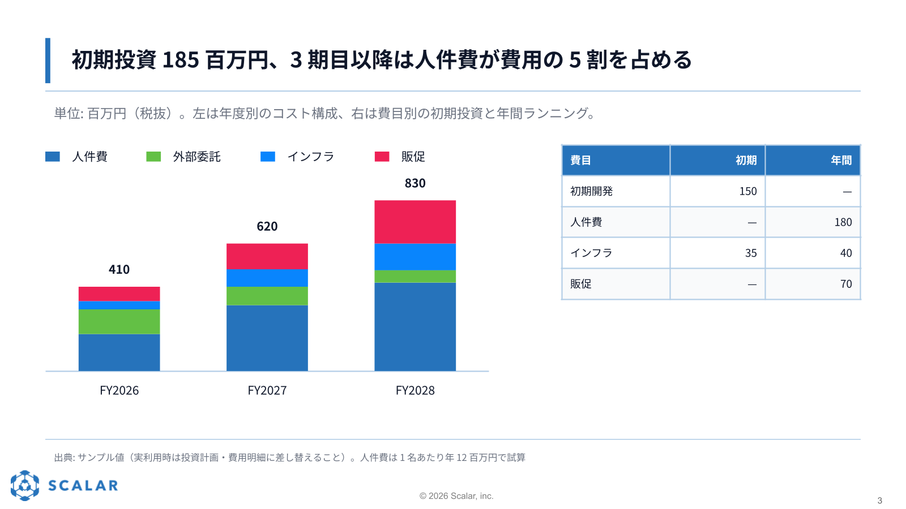

Places the year-by-year cost mix beside the up-front/recurring breakdown by line item to show how much the business needs

**Answers**: How much does this business need, and what is the money spent on and in what order?

**figures**: `governing_message`, `lead_in`, `vbars_stacked`, `table`, `source_note`  
**Inference level**: Predictive (projecting future values)  
**densities**: print / presentation (default print)  
**status**: experimental

Guardrails:

- Keep the title to roughly 30 full-width characters on one line. A second line collides with the lead-in below it
- At most four cost categories. Fold the fifth and beyond into "other" or the stack becomes unreadable
- The total of the stack must match cost of sales plus SG&A in revenue-plan
- Always split up-front (one-time) from annual recurring in the right-hand table. Never show only a combined total
- Put an em dash in cells that do not apply rather than leaving them blank, so they read as deliberate
- Write the headcount x unit-cost assumption behind personnel cost in the source line. An amount alone cannot be assessed
- State the unit and whether figures are tax-exclusive in the lead-in or unit
- At most four periods. Aggregate the years or split into two slides beyond that

### Break-Even Analysis (`break-even`)

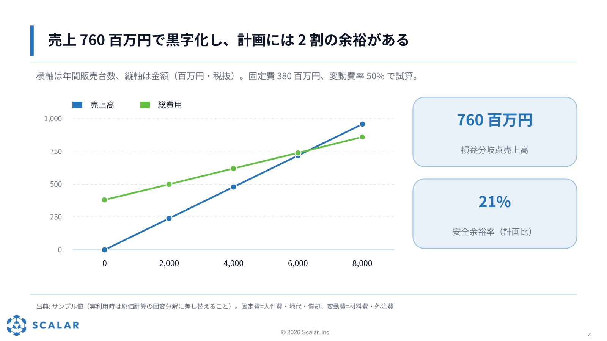

Marks the break-even point where the revenue line meets the total-cost line, with the margin of safety against plan alongside

**Answers**: How much must we sell to stop losing money, and how much room does the plan have?

**figures**: `governing_message`, `lead_in`, `linechart`, `metric`, `source_note`  
**Inference level**: Predictive (projecting future values)  
**densities**: print / presentation (default print)  
**status**: experimental

Guardrails:

- Keep the title to roughly 30 full-width characters on one line. A second line collides with the lead-in below it
- Always state the fixed/variable cost split definition in the source line. A different split moves the break-even point
- Draw the revenue and total-cost lines on the same horizontal axis (volume or revenue scale) and the same period
- This is a single-year static analysis and says nothing about cash. Payback and cash belong in roi-payback
- The straight-line approximation breaks down where the variable-cost ratio changes by volume band. State the applicable range in the lead-in
- Margin of safety is (plan revenue - break-even revenue) / plan revenue. Pass a pre-computed string
- Put the plan point (the current sales level) into words in the lead-in or source. Do not label the line ends: they always overlap near the crossing point

### Scenario Comparison (low / base / high) (`scenario-comparison`)

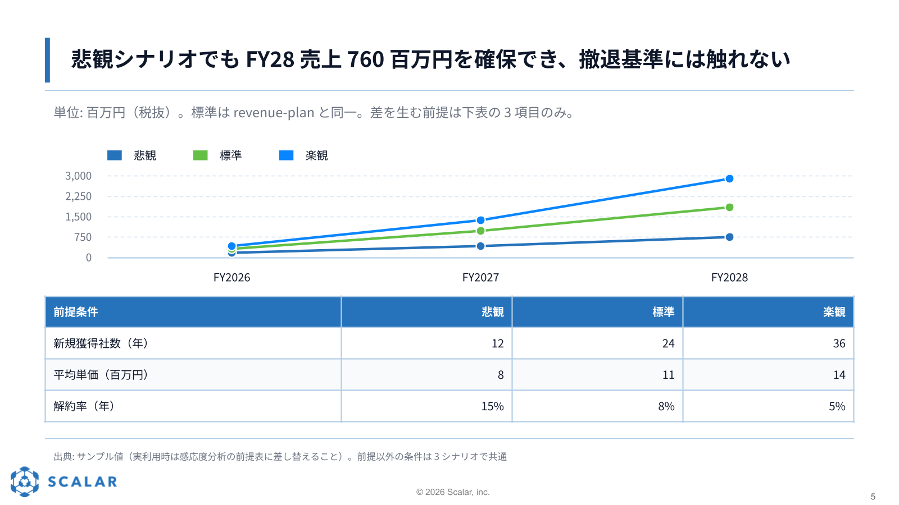

Shows several scenarios' trajectories with the assumptions that separate them, making the plan's range explicit

**Answers**: How far do results move when the assumptions move, and is the worst case acceptable?

**figures**: `governing_message`, `lead_in`, `linechart`, `table`, `source_note`  
**Inference level**: Predictive (projecting future values)  
**densities**: print / presentation (default print)  
**status**: experimental

Guardrails:

- Keep the title to roughly 30 full-width characters on one line. A second line collides with the lead-in below it
- Scenarios differ only by their assumptions. Never derive different results from the same assumptions
- List only the drivers that move the result. Do not include assumptions that stay fixed
- The low scenario must be bad enough to change a decision, not merely "a bit worse". Keep the high case at a defensible ceiling
- The base scenario's figures must match revenue-plan
- Do not weight the scenarios by probability. Argue likelihood on a separate slide with evidence
- When this drives an exit decision, tie the scenarios to the exit criteria in risk-register
- Set yMax to the round number just above the maximum. The automatic scale can reach 1.4x the maximum, squashing every line into the lower half of the plot

### Payback (ROI and payback period) (`roi-payback`)

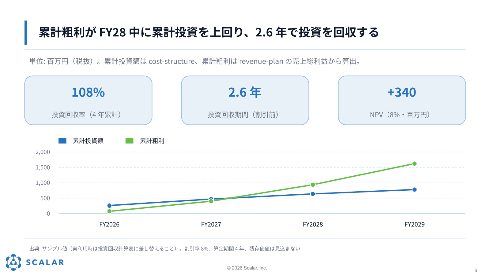

Shows when the investment is recovered at the crossing of cumulative investment and cumulative return, with return rate, payback period, and NPV alongside

**Answers**: When is the money recovered, and does this hold up as an investment decision?

**figures**: `governing_message`, `lead_in`, `metric`, `linechart`, `source_note`  
**Inference level**: Predictive (projecting future values)  
**densities**: print / presentation (default print)  
**status**: experimental

Guardrails:

- Keep the title to roughly 30 full-width characters on one line. A second line collides with the lead-in below it
- Compare cumulative against cumulative. Never mix a single-year figure into the same chart as a cumulative one
- Draw both series in a form that stays non-negative (cumulative investment and cumulative return) and read the crossing as the recovery point
- Always state the discount rate and horizon in npvLabel or the source line. An NPV without its assumptions cannot be compared
- State whether the payback period is undiscounted or discounted. The two can differ by more than a year
- Return rate and NPV take pre-computed strings. Nothing is calculated on the slide
- The investment must match cost-structure and the revenue behind the return must match revenue-plan
- Do not label the line ends: they overlap near the crossing point. Show the amounts in the metric tiles above instead

### Risks, Mitigations, and Exit Criteria (`risk-register`)

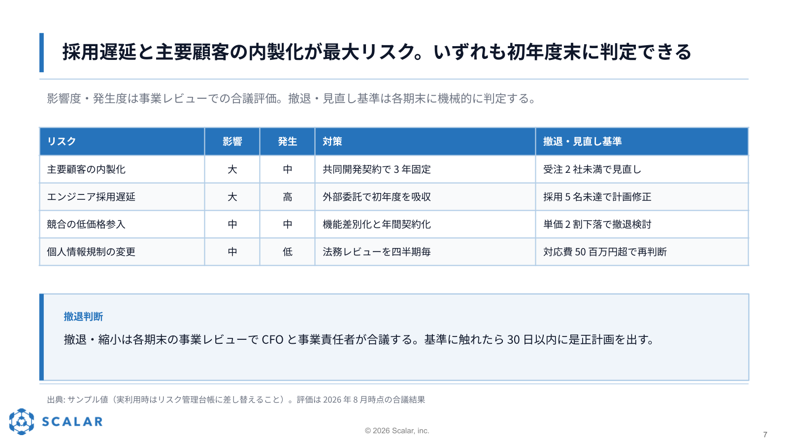

Lists the major risks with impact and likelihood, paired with the mitigation and the trigger for exiting or revisiting

**Answers**: What could break the plan, how is it handled, and what makes us stop?

**figures**: `governing_message`, `lead_in`, `table`, `so_what`, `source_note`  
**Inference level**: Strategic (evaluation and direction-setting)  
**densities**: print / presentation (default print)  
**status**: experimental

Guardrails:

- Keep the title to roughly 30 full-width characters on one line. A second line collides with the lead-in below it
- One row per risk. Use the same vocabulary for impact and likelihood across every row (high/medium/low)
- Exit and revisit criteria must be observable numbers. "Depending on the situation" is not a criterion
- A mitigation is a concrete action an owner can take. "Be careful" and "consider it" are not mitigations
- Leave out risks already mitigated down to a small residual. Keep only risks that could change an approver's decision
- Put who decides and when into decisionRule. Do not mix the per-row criteria with the division of responsibility
- When used with scenario analysis, align the exit criteria with the level of the low scenario

### Execution Structure and Roles (`execution-structure`)

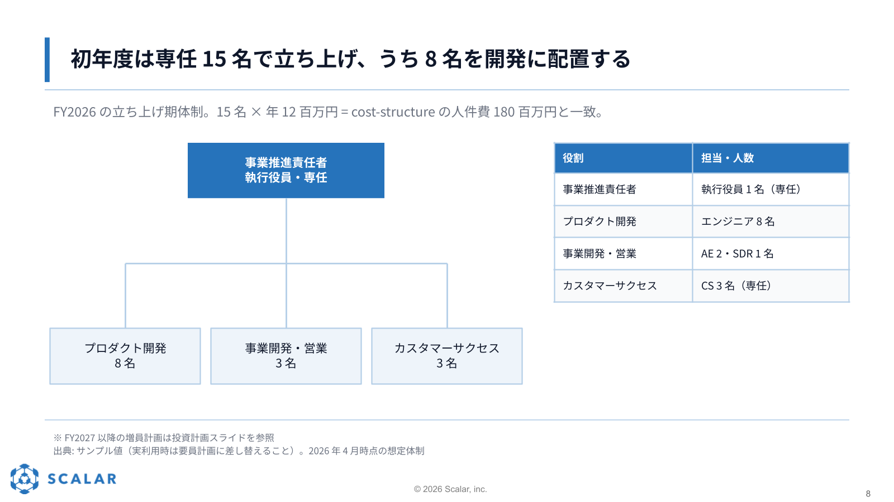

Places the delivery org chart beside the owner and headcount per role to substantiate that the plan can actually be executed

**Answers**: Who executes this business, and how many people does each role need?

**figures**: `governing_message`, `lead_in`, `orgchart`, `table`, `source_note`  
**Inference level**: Descriptive (organizing facts)  
**densities**: print / presentation (default print)  
**status**: experimental

Guardrails:

- Keep the title to roughly 30 full-width characters on one line. A second line collides with the lead-in below it
- Draw the structure for this business, not the company org chart. Leave out departments that are not involved
- Headcount must match the personnel cost in cost-structure. Do not add people here and forget them in the cost plan
- Always distinguish dedicated from shared assignments. A structure heavy on shared assignments draws feasibility challenges
- Depth of four or more, or over eight leaves, crushes the text. Split into a slide per department
- Two-line node labels ("role\nheadcount") read best. Mask individual names when the deck leaves the company
- When the structure differs between launch and scale-up, state the period and use two slides

<a id="nexus"></a>

## Nexus Report Pack (`nexus`)

Pages that turn a nexus-architect run into slides: what the analysis covered, what it found, what was decided and what is still open. Every page states the basis it rests on.

### Pipeline Coverage (`pipeline-coverage`)

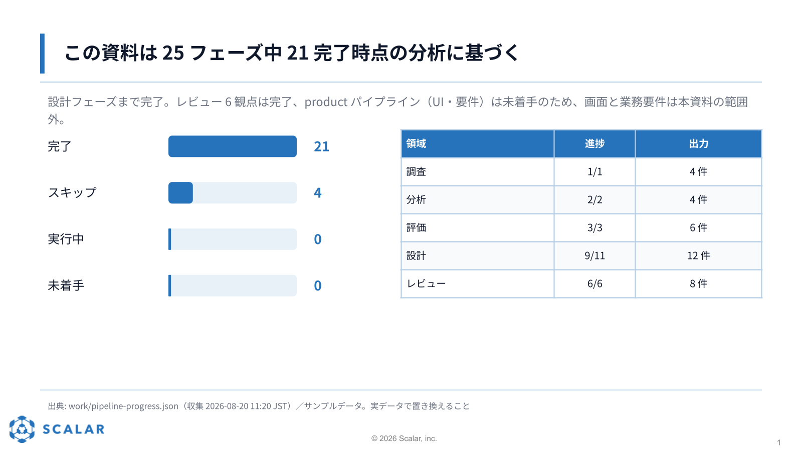

States up front how far the analysis behind this deck actually got (done / running / not started)

**Answers**: How much completed analysis is this proposal or report based on?

**figures**: `governing_message`, `lead_in`, `hbars`, `table`, `source_note`  
**Inference level**: Descriptive (organizing facts)  
**densities**: print / presentation (default print)  
**status**: experimental

Guardrails:

- Always the second slide. A deck explaining incomplete work misleads the reader unless the basis is disclosed first
- counts are actual phase counts. Do not reinterpret them as report pages or hours worked
- Do not relabel a not-started phase as 'out of scope'. skipped (deliberately passed over) and pending (not yet) are different
- Always put the collection time (asOf) in source. The pipeline keeps moving, so the deck is always a snapshot

### Phase Digest (section divider) (`phase-digest`)

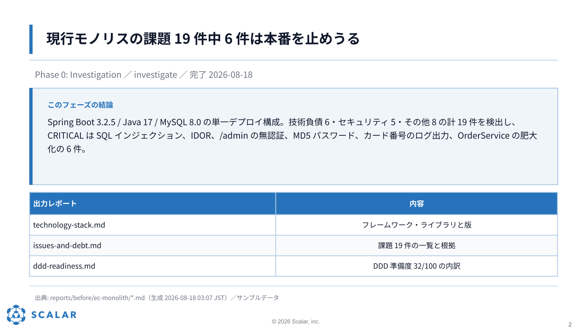

Shows what one phase established, using that phase's own summary and its output files

**Answers**: What did this phase establish, and which report says so?

**figures**: `governing_message`, `lead_in`, `so_what`, `table`, `source_note`  
**Inference level**: Descriptive (organizing facts)  
**densities**: print / presentation (default print)  
**status**: experimental

Guardrails:

- Base summary on what the phase recorded itself (the summary in pipeline-progress.json). Rewording for the reader is fine; adding a new claim is not
- outputs lists files that exist. Anything declared but unwritten goes to open-questions
- A section divider carries one conclusion. Split multiple findings onto following pages

### Technology Stack Inventory (`stack-inventory`)

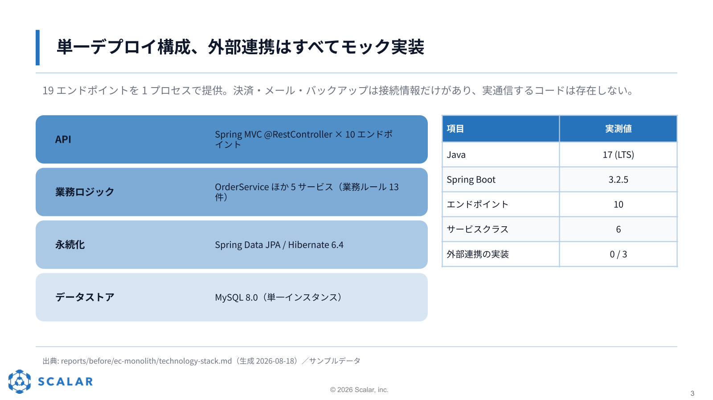

Shows what the current system is built on, layer by layer, with versions and constraints

**Answers**: What is this system standing on?

**figures**: `governing_message`, `lead_in`, `layers`, `table`, `source_note`  
**Inference level**: Descriptive (organizing facts)  
**densities**: print / presentation (default print)  
**status**: experimental

Guardrails:

- Layers are what actually runs. Anything present in config but never called is marked 'declared only' in the note
- Always give the version. Support windows and known vulnerabilities cannot be judged without it
- No judgement (good/bad) on this page. Problems go to issue-register

### Issue, Debt and Finding Register (`issue-register`)

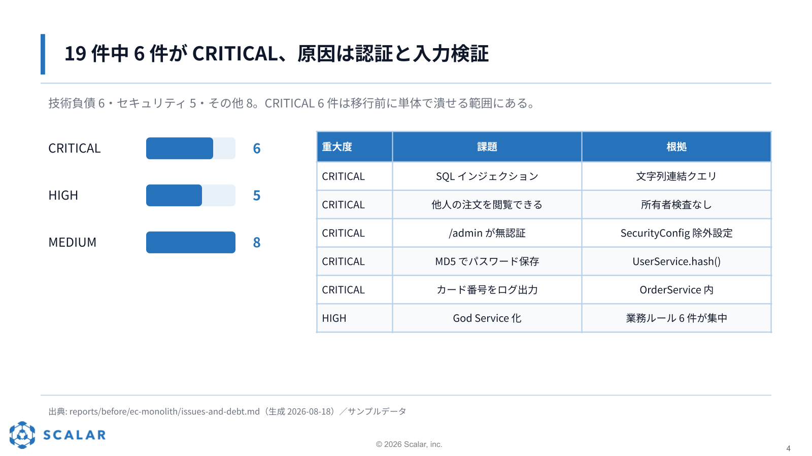

Shows the detected issues as a severity distribution plus individual entries

**Answers**: What has been found, and how bad is it?

**figures**: `governing_message`, `lead_in`, `hbars`, `table`, `source_note`  
**Inference level**: Diagnostic (identifying factors and structure)  
**densities**: print / presentation (default print)  
**status**: experimental

Guardrails:

- Use the severity the report assigned. Do not raise or lower it in the deck
- The total of counts and the number of issues must agree (say so in the lead if this is an extract)
- No remedies on this page. This page goes as far as 'what was found'
- Every entry keeps its evidence (file, line, endpoint)

### Evaluation Score (single measure) (`score-card`)

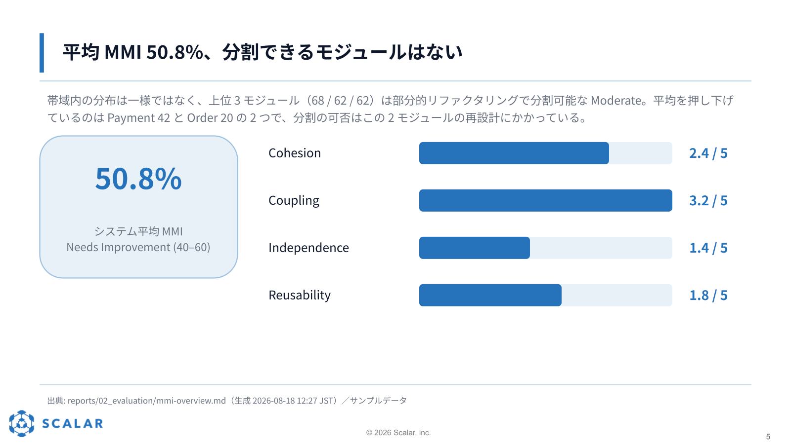

Shows a single maturity or readiness score with its bands, and lists the components

**Answers**: Where does this measure put us right now?

**figures**: `governing_message`, `lead_in`, `metric`, `hbars`, `source_note`  
**Inference level**: Diagnostic (identifying factors and structure)  
**densities**: print / presentation (default print)  
**status**: experimental

Guardrails:

- Always show the score with its bands (what a given score means). A number alone cannot be judged
- Component names and weights come from the report's definition. Do not add or round them in the deck
- verdict says only what the number supports. Improvements go to roadmap / decision-record

### Score Breakdown (subject x dimension) (`score-breakdown`)

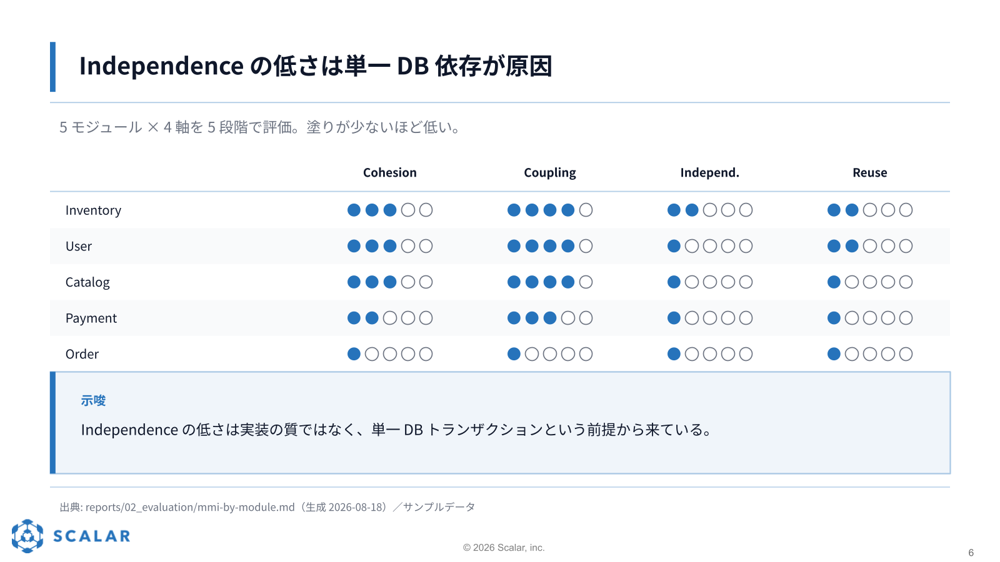

Compares scores per module and dimension as a surface, showing what is holding the total down

**Answers**: Which subject, on which dimension, is the low one?

**figures**: `governing_message`, `lead_in`, `rating_matrix`, `so_what`, `source_note`  
**Inference level**: Diagnostic (identifying factors and structure)  
**densities**: print / presentation (default print)  
**status**: experimental

Guardrails:

- Row and column order follows the report. If you sort by score, say so
- Scores are integers from 0 to levels. If you round a fractional score, put the rounding rule in source
- Do not make blank (not evaluated) look like 0. Either drop the row or label it in the row heading

### Context Map (`context-map`)

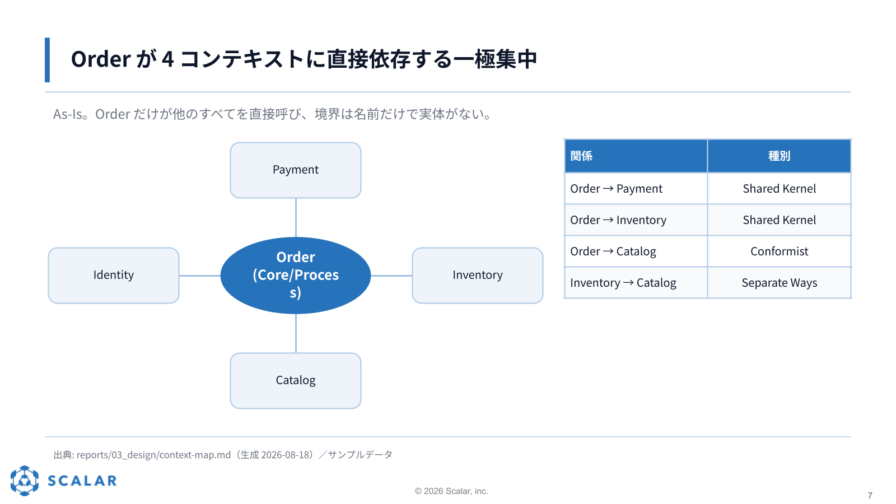

Shows the central context and its neighbours, with the relationship type on each edge

**Answers**: Which boundary is central, and how does it relate to its neighbours?

**figures**: `governing_message`, `lead_in`, `hub`, `table`, `source_note`  
**Inference level**: Strategic (evaluation and direction-setting)  
**densities**: print / presentation (default print)  
**status**: experimental

Guardrails:

- Relationship types (Shared Kernel / Conformist / Separate Ways ...) use the report's terms as they stand
- Do not mix As-Is and To-Be on one page. State which it is in the title
- Many-to-many relationships that the diagram cannot carry go into the table. Do not add lines until it is unreadable
- To paste the original mermaid as it is, use architecture-exhibit

### Architecture Exhibit (image plus what to read from it) (`architecture-exhibit`)

Pastes the report's structural diagram as an exhibit and adds three things to read from it

**Answers**: What am I supposed to read from this diagram?

**figures**: `governing_message`, `exhibit_frame`, `image`, `so_what`, `source_note`  
**Inference level**: Descriptive (organizing facts)  
**densities**: print / presentation (default print)  
**status**: experimental

Guardrails:

- Use an image exported by scripts/mermaid_export.py / drawio_export.py / html_shot.py, and inspect it with Read after generating
- The frame is about 2:1. An extremely tall or wide diagram leaves the page mostly margin, so split it or redraw it natively
- Do not paste a diagram that cannot be read at slide size. Split it or redraw it natively
- readings state only what the diagram shows. Do not slip a claim the diagram does not carry into the three points
- Number exhibits sequentially so the body text can refer to them

### Decision and Rationale (ADR) (`decision-record`)

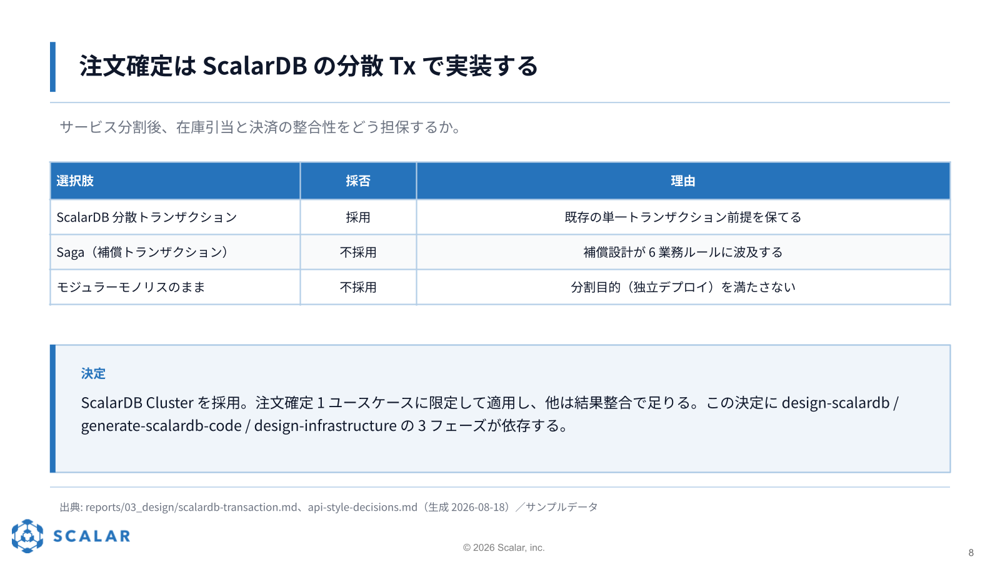

Keeps the options considered, what was adopted or rejected, and why, on one page

**Answers**: Why was this approach chosen, and on what grounds were the others dropped?

**figures**: `governing_message`, `lead_in`, `table`, `so_what`, `source_note`  
**Inference level**: Strategic (evaluation and direction-setting)  
**densities**: print / presentation (default print)  
**status**: experimental

Guardrails:

- Always show at least one rejected option. A table of the adopted option alone is advertising, not a decision record
- Tie the rationale to evaluation dimensions (performance, consistency, operations, cost). Not to preference
- If the decision is not settled, write 'undecided'. Do not make it look decided
- Include what the decision affects (which phases depend on it) in decision

### Migration and Implementation Roadmap (`roadmap`)

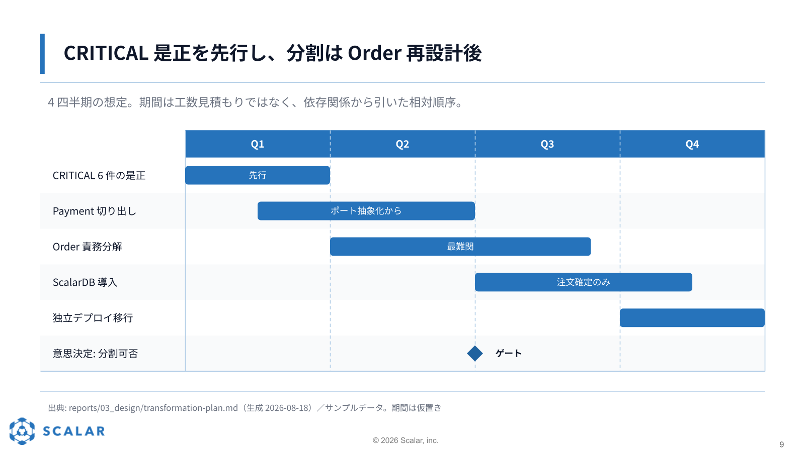

Shows the sequence, the durations and the dependencies as bands

**Answers**: What gets done, in what order, over what period?

**figures**: `governing_message`, `lead_in`, `gantt`, `source_note`  
**Inference level**: Strategic (evaluation and direction-setting)  
**densities**: print / presentation (default print)  
**status**: experimental

Guardrails:

- If there is no basis for a duration, do not give one. Make it a relative-order diagram instead
- Bands that run in parallel must actually be able to (no dependency between them)
- Milestones (start == end) mark decision points, not work
- If a step depends on a phase that has not started, say so in the lead

### Persona and Where the Experience Stalls (`persona-journey`)

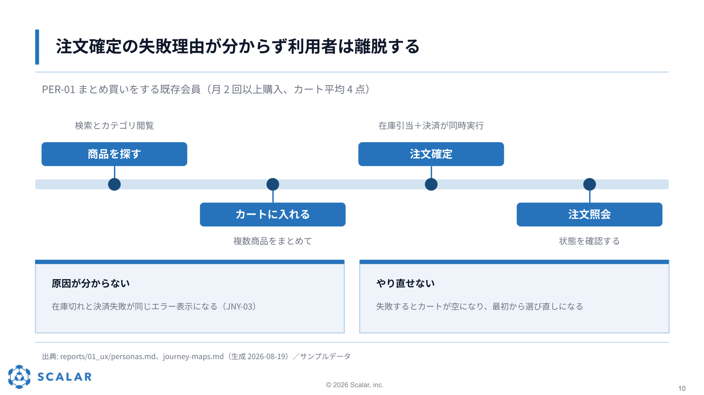

Lays out the target user's experience in sequence and shows where it stalls

**Answers**: Who stalls, in which experience, and where?

**figures**: `governing_message`, `lead_in`, `journey`, `cards`, `source_note`  
**Inference level**: Descriptive (organizing facts)  
**densities**: print / presentation (default print)  
**status**: experimental

Guardrails:

- Persona attributes are only what the research confirmed. Do not invent an age or an income to fill the card
- Tie each pain to an observed fact (something said, done, or measured). If it is inference, label it a hypothesis
- No solutions on this page. This page goes as far as the experience as it is

### Screen Flow (three UI mocks) (`ui-mock-flow`)

Shows the flow of an experience as screen mocks ordered by the domain story

**Answers**: Which screens does this work pass through, and in what order?

**figures**: `governing_message`, `lead_in`, `image`, `cards`, `source_note`  
**Inference level**: Descriptive (organizing facts)  
**densities**: print / presentation (default print)  
**status**: experimental

Guardrails:

- Order the mocks by the story ({STORY}-NN-{slug}.html, by NN). Do not reorder them for looks
- Capture with scripts/html_shot.py and inspect with Read before pasting (a capture succeeds even when the styles did not load)
- A mock is a specification, not an implementation. Do not word it so it reads as 'already built'
- A flow that does not fit in three screens is split across pages at a boundary that does fit

### Screen Detail (one UI mock) (`ui-mock-detail`)

Shows one screen mock large, with the points to notice and the specification beside it

**Answers**: What has been settled on this screen?

**figures**: `governing_message`, `lead_in`, `image`, `table`, `source_note`  
**Inference level**: Descriptive (organizing facts)  
**densities**: print / presentation (default print)  
**status**: experimental

Guardrails:

- The points to notice are only what is visible on the screen. Processing behind it does not go on this page
- Capture with scripts/html_shot.py and inspect with Read before pasting
- Mark anything unsettled as 'undecided' in the table. Do not present what the mock happens to draw as settled

### Open Questions and Next Actions (`open-questions`)

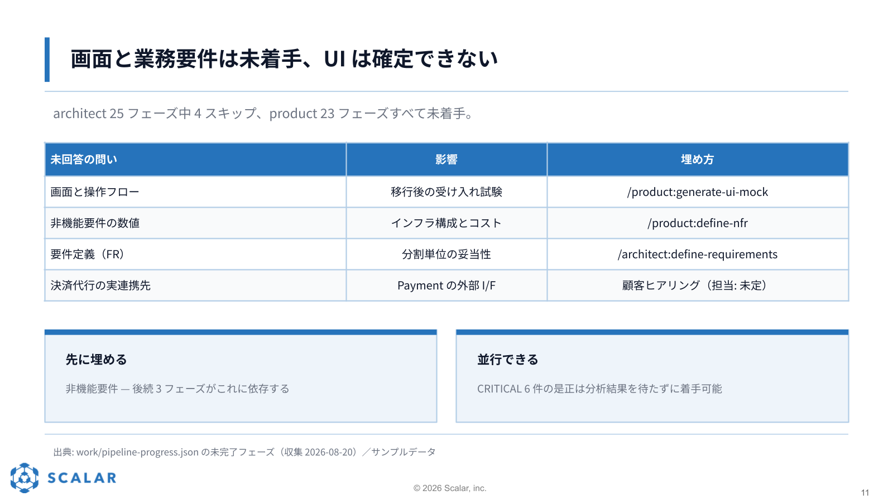

Shows the premises still unfilled and the phases not started, along with who fills them and how

**Answers**: What can this material not yet answer, and how does that get filled?

**figures**: `governing_message`, `lead_in`, `table`, `cards`, `source_note`  
**Inference level**: Descriptive (organizing facts)  
**densities**: print / presentation (default print)  
**status**: experimental

Guardrails:

- Do not remove an item from here by filling it with a guess. It is open because it is unfilled, not because nothing could be written
- Every row says who fills it and with which command. Do not leave it as a list of homework
- Do not mix open questions arising from unstarted phases with ones the report stated explicitly (distinguish them in source)
- On a partially-run deck, this is always the last page

<a id="hearing"></a>

## Hearing Pack (`hearing`)

Pages whose job is to collect information rather than deliver it: the agenda of what you need to hear, your understanding put up to be corrected, a sheet to fill in during the meeting, a poll for an event, and where to send the answers.

### What We Need to Hear Today (`hearing-agenda`)

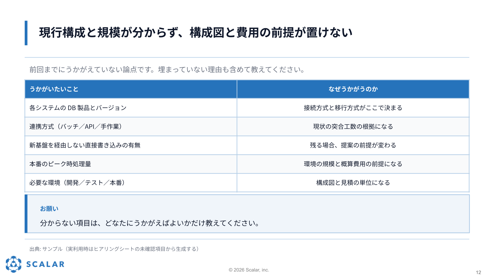

Puts the open points on the table up front, each with the reason you are asking

**Answers**: What do we need to be told in this meeting?

**figures**: `governing_message`, `lead_in`, `table`, `so_what`, `source_note`  
**Inference level**: Descriptive (organizing facts)  
**status**: experimental

Guardrails:

- **Customer-facing.** No judgement about an individual's influence, stance or internal politics, and no competitor weaknesses
- If you cannot say why you are asking, leave it off. Questions are decided by order, not by volume
- Do not arrive with the blanks filled in by guesswork. You ask because it is blank
- Five items at most. Do not exceed what one meeting can answer

### Checking Our Understanding (`hypothesis-check`)

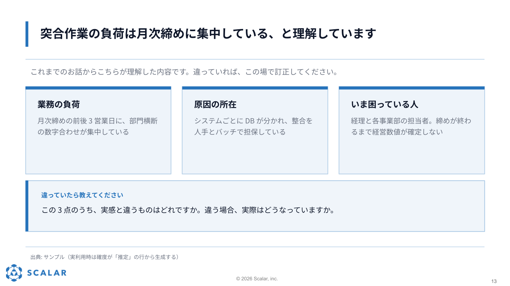

Puts your reading up as a hypothesis so the customer can correct what is wrong

**Answers**: Where is our understanding wrong?

**figures**: `governing_message`, `lead_in`, `cards`, `so_what`, `source_note`  
**Inference level**: Diagnostic (identifying factors and structure)  
**status**: experimental

Guardrails:

- **Customer-facing.** No judgement about an individual's influence, stance or internal politics, and no competitor weaknesses
- **Do not assert.** Only rows whose confidence is 推定 belong here; listing confirmed ones checks nothing
- The point is to be corrected. Always end with 'tell us if we have this wrong'
- No figure without a source

### Blanks to Fill in Here (`fill-in-sheet`)

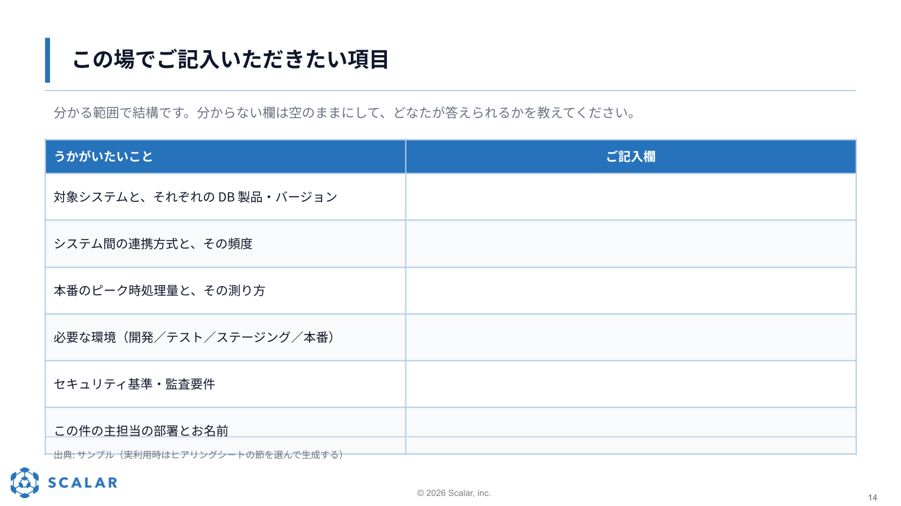

Blank rows to write on during the meeting, on screen or on paper

**Answers**: What do we want filled in while we are in the room?

**figures**: `governing_message`, `lead_in`, `table`, `source_note`  
**Inference level**: Descriptive (organizing facts)  
**status**: experimental

Guardrails:

- **Customer-facing.** No judgement about an individual's influence, stance or internal politics, and no competitor weaknesses
- Leave the blanks blank. **Do not pre-fill a guess and call it 'please confirm'**
- Six items at most. Keep it to what there is time to write
- For anything they cannot answer now, ask who could

### Does Any of This Apply to You? (`event-poll`)

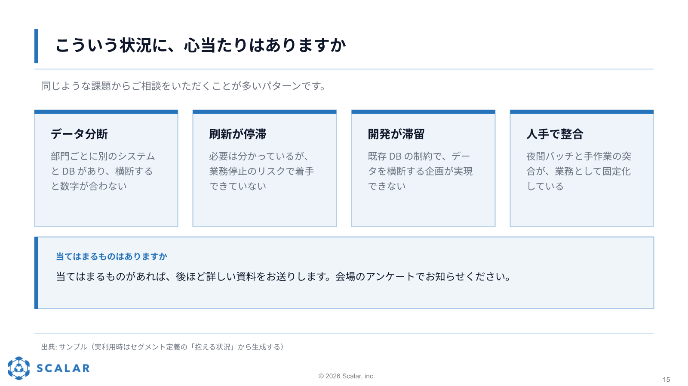

Lets an audience at a seminar or talk say which situation they are in

**Answers**: Which situation is this audience in?

**figures**: `governing_message`, `lead_in`, `cards`, `so_what`, `source_note`  
**Inference level**: Descriptive (organizing facts)  
**status**: experimental

Guardrails:

- **For a general audience.** Nothing from which a particular company or person can be inferred
- Write the options as buyer situations. **Do not make them choose by product name** — that is a product pitch, not collection
- Aggregate the answers as types. Do not keep who chose what in the material
- If you ask for an answer, say what comes back for it (a deck, a follow-up conversation)

### Where to Send the Answers (`collect-cta`)

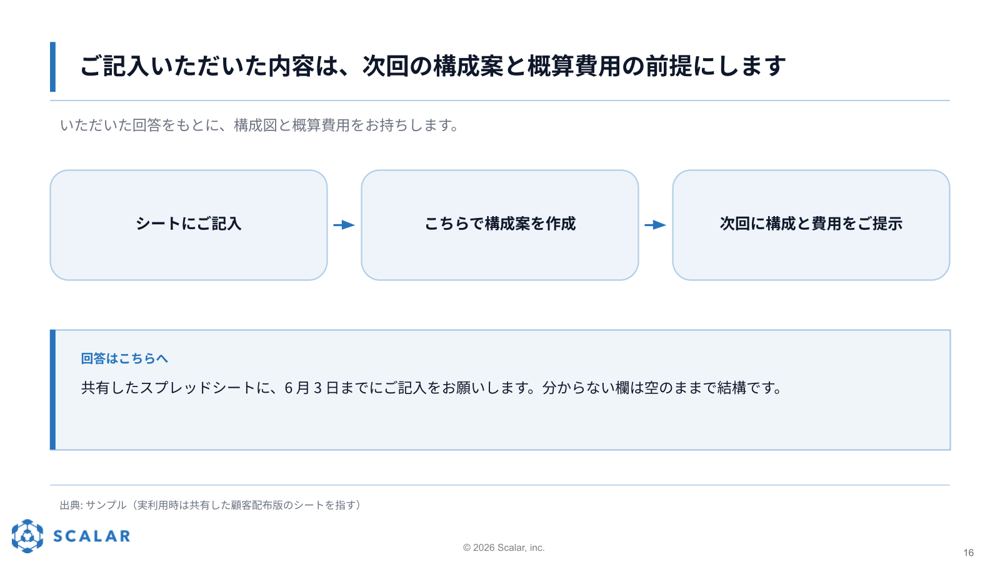

Says where answers go, and what the customer gets back for sending them

**Answers**: Who sends the answers, where, and by when?

**figures**: `governing_message`, `lead_in`, `flow`, `so_what`, `source_note`  
**Inference level**: Descriptive (organizing facts)  
**status**: experimental

Guardrails:

- **Customer-facing.** No judgement about an individual's influence, stance or internal politics, and no competitor weaknesses; check who the answer URL may be shared with before putting it on the page
- **Say what happens once they answer.** Collecting without returning anything teaches people not to answer
- Give a date and an owner. A request with neither does not move

### Answer Form (QR) (`collect-qr`)


Shows the QR for the answer destination large, for the end of a talk or a hand-off in person

**Answers**: Where do I go to answer this right now?

**figures**: `governing_message`, `lead_in`, `image`, `so_what`, `source_note`  
**Inference level**: Descriptive (organizing facts)  
**status**: experimental

Guardrails:

- **Customer-facing.** No judgement about an individual's influence, stance or internal politics, and no competitor weaknesses; confirm who can see what the QR points at before putting it up
- **Always spell the URL out as well.** There is always a seat where the QR will not scan
- If it points at a shared sheet, point at the customer version (internal columns and sections removed)

<a id="case-studies"></a>

## Case Study Pack (`case-studies`)

Pages that carry published customer cases into a deck: several in brief, one in depth, and why a case applies to the customer in front of you. Consent and dated sources are managed in templates/marketing/case-study.ja.md.

### Cases in Brief (three) (`case-study-card`)

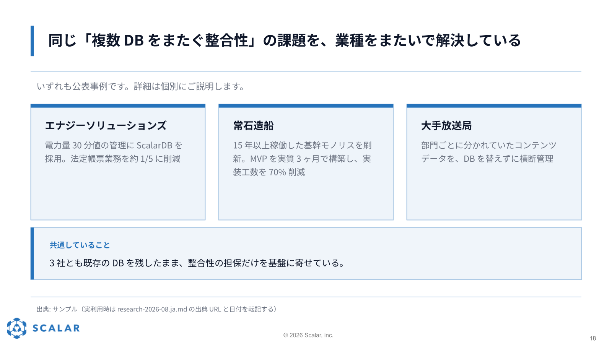

Three published cases, one line each — the page that reinforces trust after interest is there

**Answers**: How have other companies solved a problem like this?

**figures**: `governing_message`, `lead_in`, `cards`, `so_what`, `source_note`  
**Inference level**: Descriptive (organizing facts)  
**status**: experimental

Guardrails:

- **Only published cases.** No unpublished customer name or figure
- Use the figures as the published material states them, and **always put the source (outlet and date) in source**
- Cases and figures fall under the 3-month rule. **Re-check anything past its last-confirmed date before using it**
- Name a customer only within what was agreed with them (the deal side records the promise in stage 5 §6 / stage 6 §5)
- Three at most. **The more you line up, the weaker the impression.** Choose the ones closest to this audience

### One Case in Depth (`case-study-detail`)

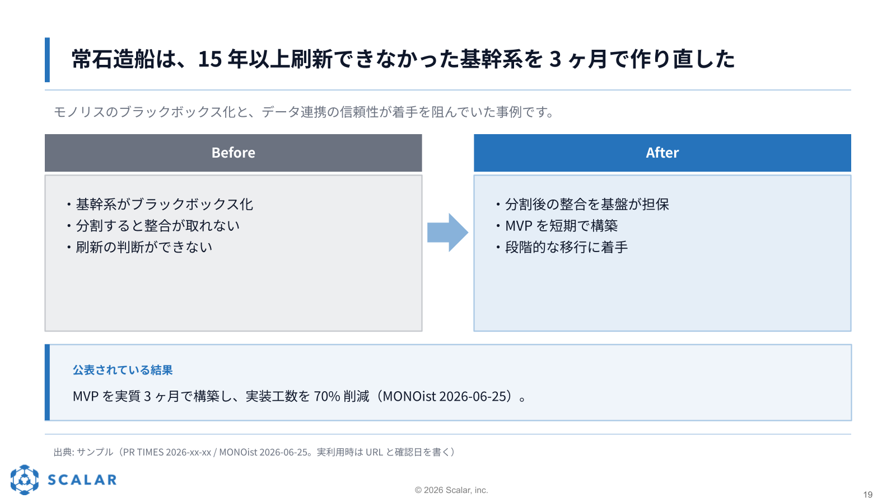

One customer, in the order problem -> what was done -> result, with published figures only

**Answers**: What was that company stuck on, what did they do, and what happened?

**figures**: `governing_message`, `lead_in`, `before_after`, `so_what`, `source_note`  
**Inference level**: Descriptive (organizing facts)  
**status**: experimental

Guardrails:

- **Only published cases.** No unpublished customer name or figure
- Use the figures as the published material states them, and **always put the source (outlet and date) in source**
- Cases and figures fall under the 3-month rule. **Re-check anything past its last-confirmed date before using it**
- Name a customer only within what was agreed with them (the deal side records the promise in stage 5 §6 / stage 6 §5)
- **Put before and after on the same dimension.** A before/after on shifting dimensions is not a comparison
- One headline figure. **Several at once leaves no impression of which one is the effect**

### Why This Case Applies to You (`case-fit`)

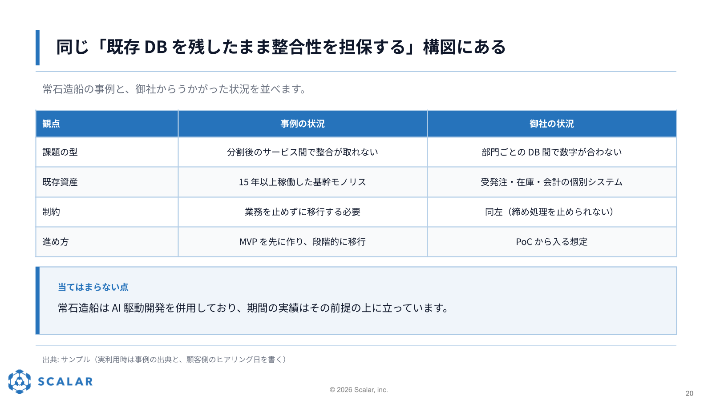

Sets the case's situation beside the customer's, showing why it is worth their attention

**Answers**: How far does that case actually apply to us?

**figures**: `governing_message`, `lead_in`, `table`, `so_what`, `source_note`  
**Inference level**: Diagnostic (identifying factors and structure)  
**status**: experimental

Guardrails:

- **Only published cases.** No unpublished customer name or figure
- Use the figures as the published material states them, and **always put the source (outlet and date) in source**
- Cases and figures fall under the 3-month rule. **Re-check anything past its last-confirmed date before using it**
- Name a customer only within what was agreed with them (the deal side records the promise in stage 5 §6 / stage 6 §5)
- **Always name one thing that does not apply** (caveat). No case applies entirely, and hiding it surfaces during the PoC
- The customer's column carries only facts from the hearing. **Do not fill it with inference**

<a id="proposal"></a>

## Proposal Pack (`proposal`)

The sections of a problem-solving proposal that had no reusable page: the structure beneath the visible problems, the challenge-to-solution mapping, what is in and out of scope, how the work changes, the PoC and its pass criteria, and the next step.

### Challenge to Solution Mapping (`challenge-solution-map`)

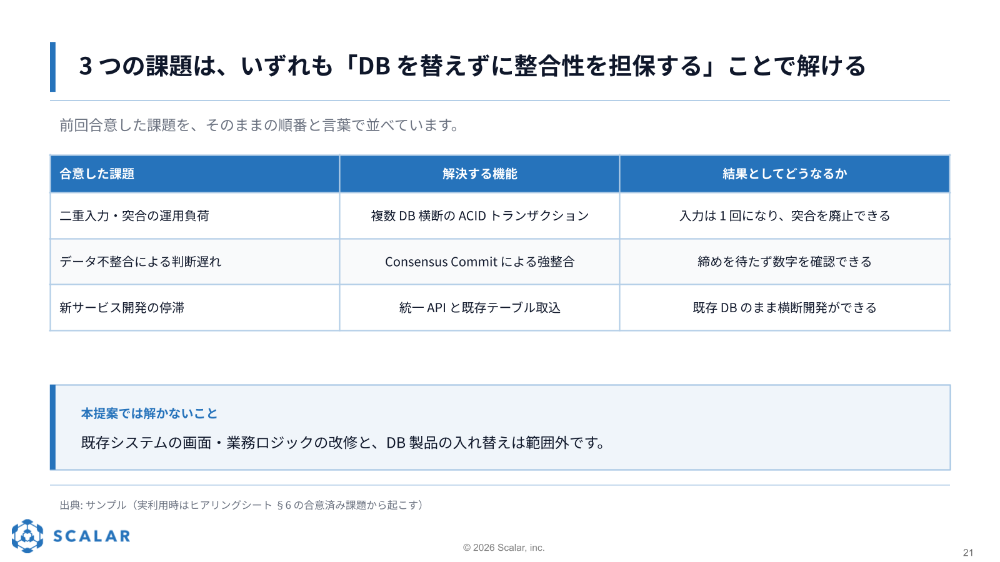

Sets each agreed challenge against what solves it and what changes as a result — the core of the proposal

**Answers**: Which challenge is solved by what, and how?

**figures**: `governing_message`, `lead_in`, `table`, `so_what`, `source_note`  
**Inference level**: Causal (asserting causes)  
**status**: experimental

Guardrails:

- **Customer-facing.** No judgement about an individual's influence, stance or internal politics, and no competitor weaknesses
- **Match the challenge slide in both order and wording.** Rephrased, it reads as a different subject
- One challenge per row. **Do not claim one capability solves three** (it breaks down under verification)
- A challenge you cannot solve gets no row; put it below as out of scope. **Do not force the fit**
- Write the result as what happens to the work, not as a restatement of the capability

### In Scope and Out of Scope (`scope-in-out`)

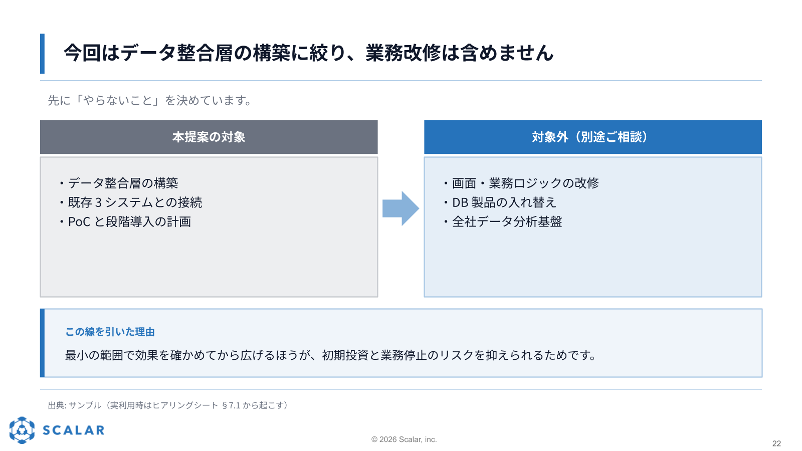

Sets what is in against what is not, so expectations line up

**Answers**: How much of this is today's subject, and where does another conversation begin?

**figures**: `governing_message`, `lead_in`, `before_after`, `so_what`, `source_note`  
**Inference level**: Descriptive (organizing facts)  
**status**: experimental

Guardrails:

- **Customer-facing.** No judgement about an individual's influence, stance or internal politics, and no competitor weaknesses
- **Decide what is out first.** A proposal with an empty out-of-scope grows afterwards
- Say why something is out. **'We won't' alone reads as 'we can't'**
- State the ranges another vendor or project already owns

### PoC Objective and Pass Criteria (`poc-plan`)

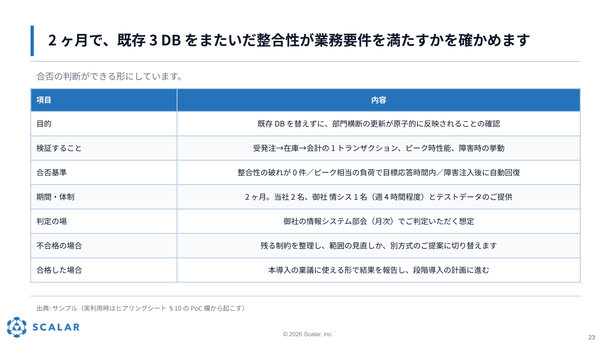

What has to be confirmed for feasibility, and what happens after — as far as what follows a pass

**Answers**: What does the PoC confirm, and what happens if it passes?

**figures**: `governing_message`, `lead_in`, `table`, `source_note`  
**Inference level**: Descriptive (organizing facts)  
**status**: experimental

Guardrails:

- **Customer-facing.** No judgement about an individual's influence, stance or internal politics, and no competitor weaknesses
- **Pass criteria are numeric or answerable yes/no.** 'It works well' is not a criterion
- **Always state what happens on a pass.** A PoC the customer cannot answer that for has not been designed yet
- Say what happens on a fail. A one-way PoC is not a verification
- State the people, effort and data needed from the customer. **Do not say 'no special burden'**

### Expected Outcome (how the work changes) (`outcome-before-after`)

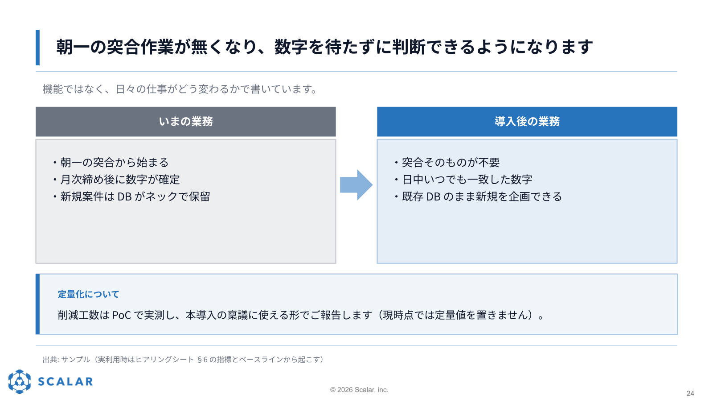

States the effect as a change in daily work rather than as a set of capabilities

**Answers**: What actually changes for the people doing the work?

**figures**: `governing_message`, `lead_in`, `before_after`, `so_what`, `source_note`  
**Inference level**: Predictive (projecting future values)  
**status**: experimental

Guardrails:

- **Customer-facing.** No judgement about an individual's influence, stance or internal politics, and no competitor weaknesses
- **Write work, not capability.** Not 'it becomes ACID' but 'the reconciliation goes away'
- **Only quantified figures with a stated basis.** Without one, state it qualitatively and say it will be measured in the PoC
- Put before and after on the same dimension. A shifted comparison is no comparison
- Do not present a published case's figure as this customer's effect. Cases belong on their own page

### What to Decide Today, and the Next Step (`next-step-customer`)

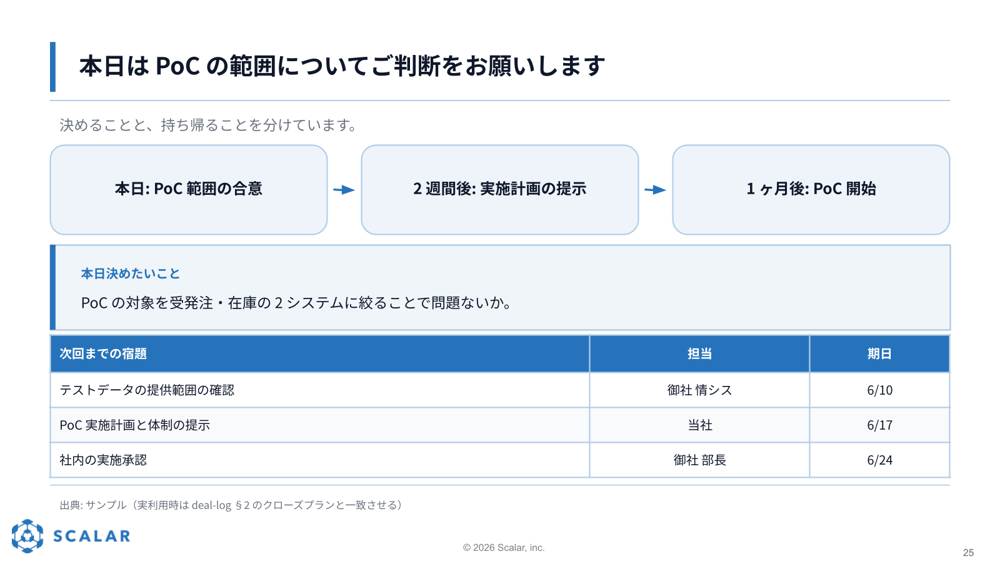

Separates what is decided in the room from the homework each side takes away

**Answers**: What is being decided today, and who does what before the next meeting?

**figures**: `governing_message`, `lead_in`, `flow`, `so_what`, `table`, `source_note`  
**Inference level**: Descriptive (organizing facts)  
**status**: experimental

Guardrails:

- **Customer-facing.** No judgement about an individual's influence, stance or internal politics, and no competitor weaknesses
- **One thing to decide today.** With several, none of them get decided
- Homework carries an owner and a date. **Without both it does not move**
- Always include something on our side. Not a page that only hands the customer homework

### Structure Beneath the Problems (`iceberg-challenge`)

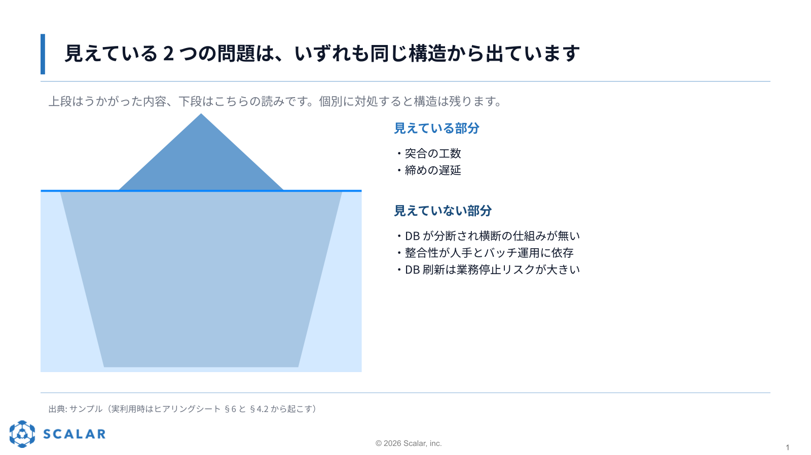

Separates the problems on the surface from the structure underneath, distinguishing the proposal from a symptomatic fix

**Answers**: What sits beneath the problems we can see?

**figures**: `governing_message`, `lead_in`, `iceberg`, `source_note`  
**Inference level**: Causal (asserting causes)  
**status**: experimental

Guardrails:

- **Customer-facing.** No judgement about an individual's influence, stance or internal politics, and no competitor weaknesses
- The top is **what the customer actually said**; the bottom is our reading of the structure. **Do not mix them**
- The top takes **two short noun phrases** (10 characters each); only two lines fit above the waterline. Wanting three means the surface problems are not narrowed down yet
- Three at most below. **The more root causes you list, the less any of them looks like the root**
- Leave room for this reading to be wrong. Do not assert it before it is agreed

<a id="marketing"></a>

## Marketing Pack (`marketing`)

Pages aimed at people who are not yet in a deal: event and talk announcements, the value message for someone who does not yet see a problem, a single use case, and the abstract of a technical paper.

### Event and Seminar Announcement (`event-announce`)

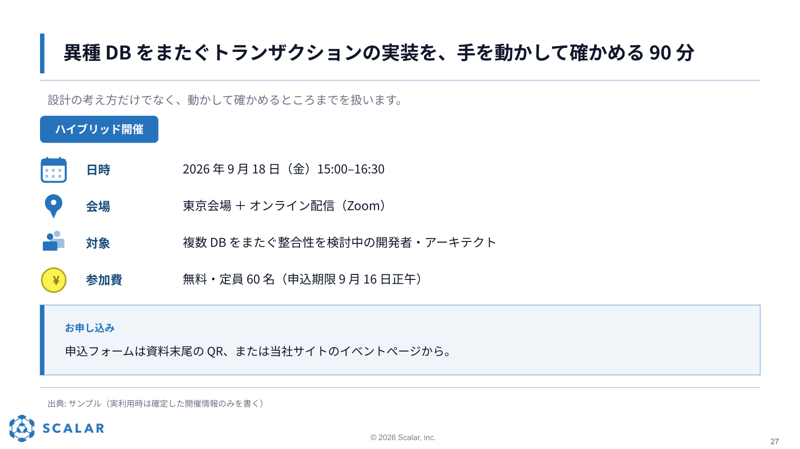

The essentials of an event — date, format, audience, price, how to register — on one page

**Answers**: When and where is this, who is it for, and how do I register?

**figures**: `governing_message`, `lead_in`, `event_mode_badge`, `event_overview`, `so_what`, `source_note`  
**Inference level**: Descriptive (organizing facts)  
**status**: experimental

Guardrails:

- **For a general audience.** Nothing from which a particular company or person can be inferred
- **Only confirmed information.** Speakers, venue and time go on once they are settled, not before
- **Name the audience.** 'Anyone welcome' reaches nobody (and leaves the nurture stage undecided)
- Do not drop price, capacity or the registration deadline. **If they will not fit in four rows, combine them into one** (extra rows push out the registration line)
- mode is one of online / offline / hybrid
- The first column of rows is a pictogram name. Only the ones listed by scripts/illustrations.py --list exist (date=calendar, venue=pin, audience=people, price=coin, deadline=clock)

### Session Programme (`session-agenda`)

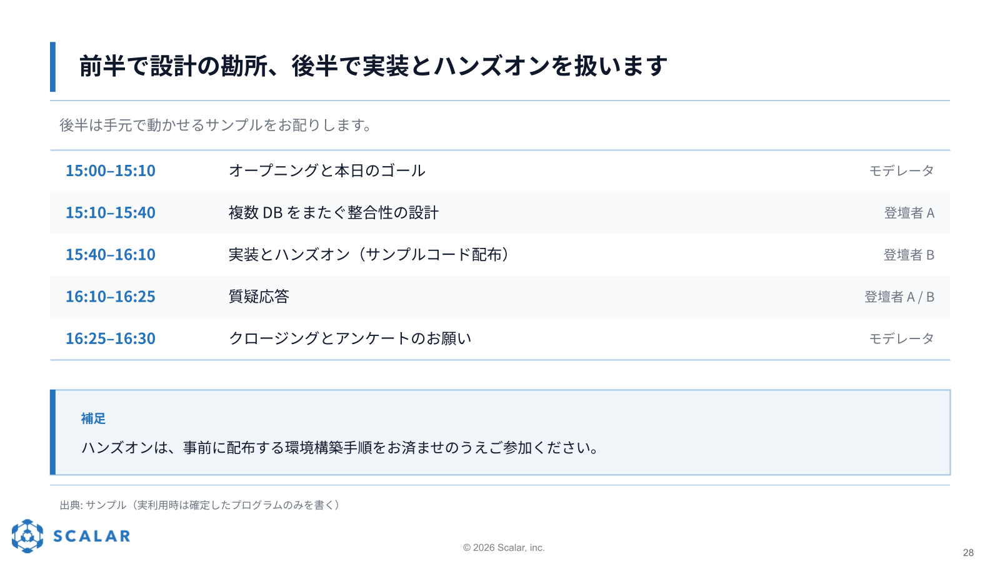

The running order, by time, subject and speaker

**Answers**: What is covered on the day, in what order, and by whom?

**figures**: `governing_message`, `lead_in`, `event_timetable`, `so_what`, `source_note`  
**Inference level**: Descriptive (organizing facts)  
**status**: experimental

Guardrails:

- **For a general audience.** Nothing from which a particular company or person can be inferred
- **Only confirmed times.** An unsettled slot says 'to be confirmed'; it is not left blank
- Six slots at most. Beyond that, split across two pages (do not shrink to fit)
- Always include time for questions. **Without it, nothing you needed to hear gets collected**

### Speakers (`speaker-intro`)

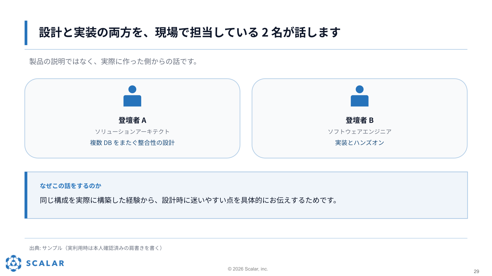

Who is speaking, and why this talk comes from them

**Answers**: Whose position does this talk come from?

**figures**: `governing_message`, `lead_in`, `event_speakers`, `so_what`, `source_note`  
**Inference level**: Descriptive (organizing facts)  
**status**: experimental

Guardrails:

- **For a general audience.** Nothing from which a particular company or person can be inferred
- **Only confirmed details about real speakers.** Check the job title with the person
- Do not list a career. It is enough to convey why this person gives this talk
- A speaker from a customer company is handled like a case study: confirm the scope of their consent

### Improvement and Benefit (stages 0-1) (`value-message`)

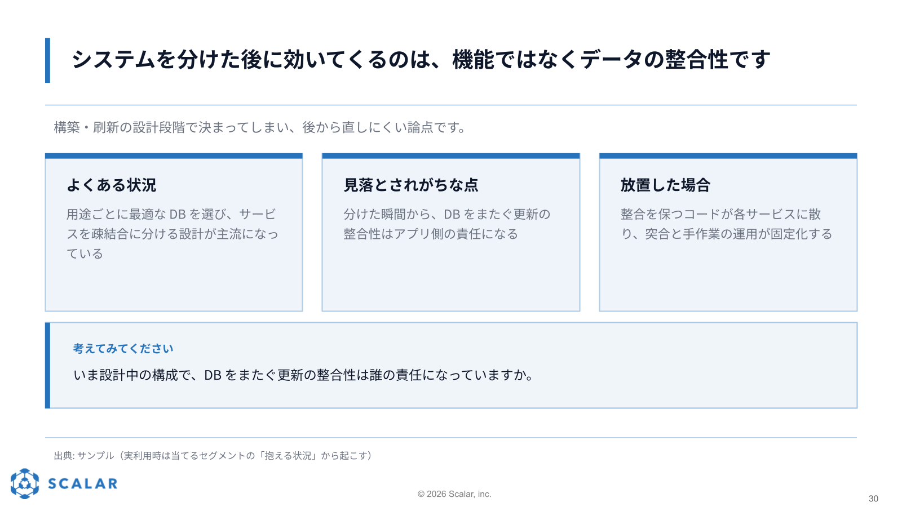

Shows someone who does not yet see a problem what is worth settling at build or replacement time, and why it is worth it

**Answers**: What is worth fixing now so that something else does not happen later?

**figures**: `governing_message`, `lead_in`, `cards`, `so_what`, `source_note`  
**Inference level**: Diagnostic (identifying factors and structure)  
**status**: experimental

Guardrails:

- **For a general audience.** Nothing from which a particular company or person can be inferred
- **Stages 0-1 are the Why Change? stages. Do not load them with product detail** (nurture-map.md §1)
- Fix the three cards in the order situation -> the drawback they have not noticed -> what happens if left alone
- **Write in the buyer's words.** A sentence that opens with a product name is not read at this stage
- Do not assert. End with a question to the reader

### Use Case on One Page (stages 1-2) (`use-case-one-pager`)

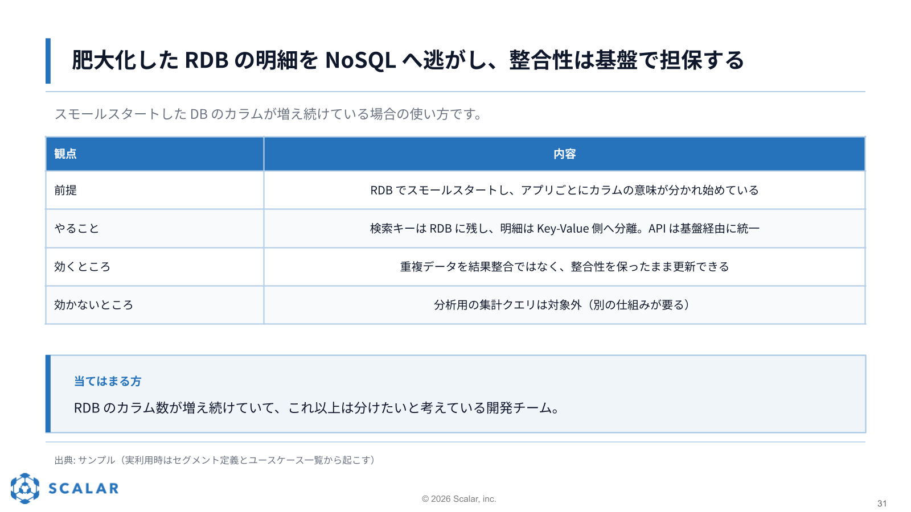

One way of using the product, in the order preconditions -> what you do -> where it helps

**Answers**: What does using this concretely look like?

**figures**: `governing_message`, `lead_in`, `table`, `so_what`, `source_note`  
**Inference level**: Descriptive (organizing facts)  
**status**: experimental

Guardrails:

- **For a general audience.** Nothing from which a particular company or person can be inferred
- **One page, one use case.** The more general it reads, the less it is anyone's
- Always state the preconditions this use holds under. **A use case without them becomes a sales story**
- **Do not mix it with a case study.** A use case is a way of using; a case study is a record. They need different sourcing
- Do not present a preview capability as an available way of using it

### Technical Paper Abstract (stage 3) (`whitepaper-abstract`)

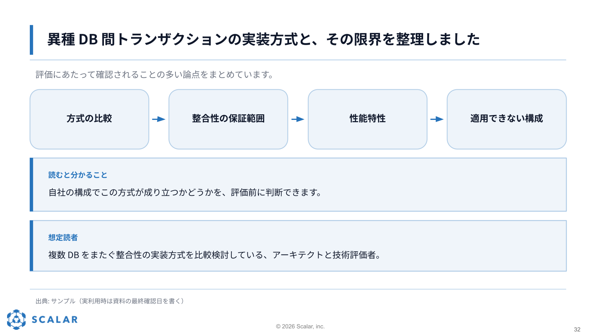

The cover page that lets a reader judge, before reading, what the paper settles

**Answers**: What is in this paper, and what will I know after reading it?

**figures**: `governing_message`, `lead_in`, `flow`, `so_what`, `source_note`  
**Inference level**: Descriptive (organizing facts)  
**status**: experimental

Guardrails:

- **For a general audience.** Nothing from which a particular company or person can be inferred
- **Say what the reader will know afterwards.** A cover with only a table of contents gives nothing to decide on
- **Name the intended reader.** Stage 3 is the technical-proof stage, and the reader is an evaluator
- No unverified claim in the abstract. Hypotheses are handled as hypotheses in the body
- Performance figures, prices and editions fall under the 3-month rule. Put the last-confirmed date in source

<a id="partner"></a>

## Partner Pack (`partner`)

The two partner-facing materials the playbook defines but had no template for: what a partner gains by carrying the product, and the joint-proposal policy that settles RACI, the route to market, the estimate boundary and where responsibility sits.

### Partner Value and Shape of the Collaboration (`partner-value`)

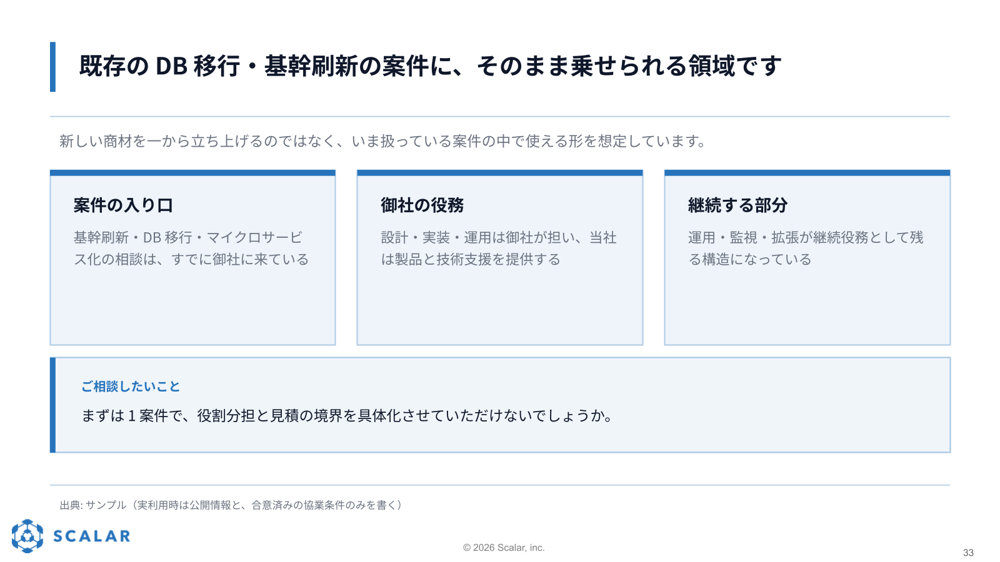

What a partner gains and what they carry — a page to show a partner

**Answers**: What does a partner get out of carrying this product?

**figures**: `governing_message`, `lead_in`, `cards`, `so_what`, `source_note`  
**Inference level**: Descriptive (organizing facts)  
**status**: experimental

Guardrails:

- **Partner-facing.** Keep customer-specific confidential detail to a minimum (playbook §3)
- **Write it as standard, reusable information.** Mixing in one deal's circumstances makes it unusable elsewhere
- State what is in it for the partner (deal size, services, recurring work). **Not only what suits us**
- Do not name a competitor's weakness. Partners trade with the competition too
- Treat prices as list price (excl. tax) reference-estimate material; discounts and multi-year terms stay off (they route to the AE)

### Joint Proposal Policy (`joint-proposal-policy`)

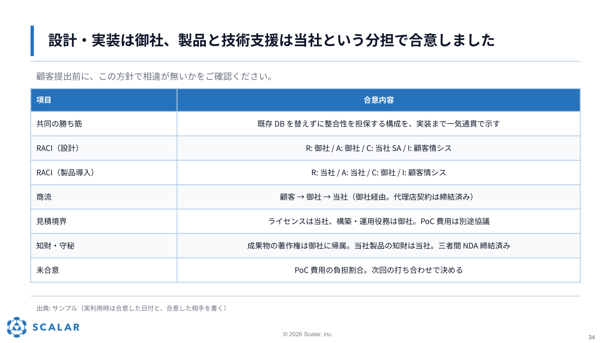

Settles the joint win theme, RACI, route to market, estimate boundary, IP and confidentiality, and contractual responsibility on one page

**Answers**: Who is responsible for what on this deal, and where does the estimate divide?

**figures**: `governing_message`, `lead_in`, `table`, `source_note`  
**Inference level**: Descriptive (organizing facts)  
**status**: experimental

Guardrails:

- **Partner proposal material.** Do not present an unagreed item as agreed
- **Always state the estimate boundary.** Left vague until it reaches the customer, it will be disputed later
- Do not omit where IP, confidentiality and contractual responsibility sit (required by playbook §3)
- An unagreed item stays as a row marked 未合意. **Do not ship it blank**
- Before naming the customer or their terms, confirm the NDA is in place
